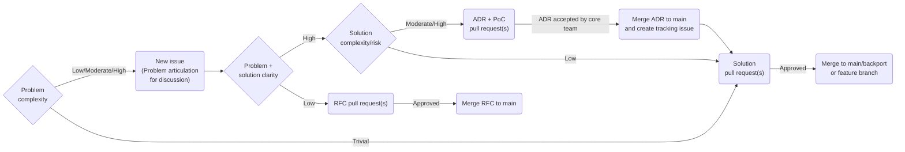

# Contributing

Thank you for your interest in contributing to CometBFT! Before contributing, it
may be helpful to understand the goal of the project. The goal of CometBFT is to
develop a BFT consensus engine robust enough to support permissionless
value-carrying networks. While all contributions are welcome, contributors
should bear this goal in mind in deciding if they should target the main
CometBFT project or a potential fork.

## Overview

When targeting the main CometBFT project, following the processes outlined in
this document will lead to the best chance of landing changes in a release.

### Core team responsibility

The CometBFT core team is responsible for stewarding this
project over time. This means that the core team needs to understand the nature
of, and agree to maintain, all of the changes that land on `main` or a backport
branch. It may cost a few days/weeks' worth of time to _submit_ a
particular change, but _maintaining_ that change over the years has a
much higher cost that the core team will bear.

### Ease of reviewing

The fact that the core team needs to be able to deeply understand the short-,
medium- and long-term consequences of incoming changes means that changes need
to be **easily reviewed**.

What makes a change easy to review, and more likely to land in an upcoming
release?

1. **Each pull request must do _one thing_**. It must be very clear what that
   one thing is when looking at the pull request title, description, and linked
   issues. It must also be very clear what value it ultimately aims to deliver,
   and to which user(s). A single pull request that does multiple things, or
   without a clear articulation of the problem it attempts to solve, may be
   rejected immediately.

2. **Each pull request must be at most 300 lines of code changes**. Larger
   changes must be structured as a series of pull requests of at most 300 lines
   of code changes each, each building upon the previous one, all ideally
   tracked in a tracking issue.

   If a single PR absolutely has to be larger, it _must_ be structured such that
   it can be reviewed commit by commit, with each commit doing _one logical
   thing_ (with a good description of what it aims to achieve in the Git
   commit), and each commit ideally being no larger than 300 lines of code
   changes. Poorly structured pull requests may be rejected immediately with a
   request to restructure them.

   This does not necessarily apply to documentation-related changes or
   automatically generated code (e.g. generated from Protobuf definitions). But
   automatically generated code changes should occur within separate commits, so
   they are easily distinguishable from manual code changes.

## Workflow

The following diagram summarizes the general workflow used by the core team to
make changes, with a full description of the workflow below the diagram.
Exceptions to this process will naturally occur (e.g. in the case of urgent
security fixes), but this is rare.

Each stage of the process is aimed at creating feedback cycles which align
contributors and maintainers to make sure:

- Contributors don’t waste their time implementing/proposing features which
  won't land in `main`.
- Maintainers have the necessary context in order to support and review
  contributions.



### GitHub issues

All non-trivial work on the code base should be motivated by a [GitHub
Issue][gh-issues]. [Search][search-issues] is a good place to start when looking
for places to contribute. If you would like to work on an issue which already
exists, please indicate so by leaving a comment. If someone else is already
assigned to that issue and you would like to contribute to it or take it over,
please coordinate with the existing assignee(s) and only start work on it once
you have been assigned to it. Unsolicited pull requests relating to issues
assigned to other users may be rejected immediately.

All new contributions should start with a [GitHub Issue][new-gh-issue]. The
issue helps capture the **problem** being solved and allows for early feedback.
Problems must be captured in terms of the **impact** that they have on specific
users. Once the issue is created the process can proceed in different directions
depending on how well defined the problem and potential solution are. If the
change is simple and well understood, maintainers will indicate their support
with a heartfelt emoji.

### Request for comments (RFCs)

If the issue would benefit from thorough discussion, maintainers may request
that you create a [Request For Comment][rfcs] in the CometBFT repo. Discussion
at the RFC stage will build collective understanding of the dimensions of the
problems and help structure conversations around trade-offs.

### Architecture decision records (ADRs)

When the problem is well understood but the solution leads to
large/complex/risky structural changes to the code base, these changes should be
proposed in the form of an [Architectural Decision Record
(ADR)](./docs/architecture/). The ADR will help build consensus on an overall
strategy to ensure the code base maintains coherence in the larger context. If
you are not comfortable with writing an ADR, you can open a less-formal issue
and the maintainers will help you turn it into an ADR. Sometimes the best way to
demonstrate the value of an ADR is to build a proof-of-concept (PoC) along with
the ADR - in this case, link to the PoC from the ADR PR.

**How does one pick a number for an new ADR?**

Find the largest existing ADR number (between those in `./docs/architecture/`
and those that may be open as issues or pull requests) and bump it by 1.

### Pull requests

When the problem as well as proposed solution are well understood and low-risk,
changes should start with a **pull request**.

Please adhere to the guidelines in the [Ease of reviewing](#ease-of-reviewing)
section above when submitting pull requests.

### Draft pull requests

One can optionally submit a [draft pull request][gh-draft-prs] against `main`,
in which case this signals that work is underway and is not ready for review.
Only users that are familiar with the issue, or those that the author explicitly
requested a review from are expected to write comments at this point. When the
work is ready for feedback, hitting "Ready for Review" will signal to the
maintainers to take a look, and to the rest of the community that feedback is
welcome.

**The team may opt to ignore unsolicited comments/feedback on draft PRs**, as
having to respond to feedback on work that is not marked as "Ready for Review"
interferes with the process of getting the work to the point that it is ready to
review.

## Forking

Please note that Go requires code to live under absolute paths, which
complicates forking. While my fork lives at
`https://github.com/ebuchman/cometbft`, the code should never exist at
`$GOPATH/src/github.com/ebuchman/cometbft`. Instead, we use `git remote` to add
the fork as a new remote for the original repo,
`$GOPATH/src/github.com/cometbft/cometbft`, and do all the work there.

For instance, to create a fork and work on a branch of it, I would:

- Create the fork on GitHub, using the fork button.
- Go to the original repo checked out locally (i.e.
  `$GOPATH/src/github.com/cometbft/cometbft`)
- `git remote rename origin upstream`
- `git remote add origin git@github.com:ebuchman/basecoin.git`

Now `origin` refers to my fork and `upstream` refers to the CometBFT version. So
I can `git push -u origin main` to update my fork, and make pull requests to
CometBFT from there. Of course, replace `ebuchman` with your git handle.

To pull in updates from the origin repo, run

- `git fetch upstream`
- `git rebase upstream/main` (or whatever branch you want)

## Dependencies

We use [Go modules] to manage dependencies.

That said, the `main` branch of every CometBFT repository should just build with
`go get`, which means they should be kept up-to-date with their dependencies so
we can get away with telling people they can just `go get` our software.

Since some dependencies are not under our control, a third party may break our
build, in which case we can fall back on `go mod tidy`. Even for dependencies
under our control, go helps us to keep multiple repos in sync as they evolve.
Anything with an executable, such as apps, tools, and the core, should use dep.

Run `go list -u -m all` to get a list of dependencies that may not be
up-to-date.

When updating dependencies, please only update the particular dependencies you
need. Instead of running `go get -u=patch`, which will update anything, specify
exactly the dependency you want to update.

## Logging

Operators, consensus engine and application developers all need information from
the system while it is running. One avenue through which they get that
information is via the logs. Whenever making contributions, please think
carefully about what each of those groups of users would want to know about the
operation of the system and try to adhere to the following guidelines as far as
reasonably possible.

### To log, or not to log

Whether or not to log something at all should take into consideration how
frequently the log message will appear. Users hate being spammed by large
quantities of useless log messages. If you anticipate that a particular log
message will occur frequently (e.g. a few times per minute), try to find ways to
either eliminate that message or reduce its frequency (e.g. only logging every
Nth message, or a summary message every minute or hour).

### Log levels

Different log levels should target different groups of users. At present, only
**Debug**, **Info** and **Error** levels are supported.

- **Debug**: Should primarily target consensus engine developers (i.e. core team
  members and developers working on CometBFT forks).
- **Info** and **Error**: Should primarily target operators and application
  developers.

### Sensitive information

It should go without saying, but sensitive information (passwords/tokens,
private keys, etc.) should **never** be logged. If one needs to inspect such
information while debugging, rather use a [debugger][delve] or even a
_temporary_ `fmt.Printf` statement.

The logging infrastructure in CometBFT does not automatically scrub such
sensitive information from the logs, so it is up to developers to ensure that
they do not log such information.

### Log messages

Log messages should always be tailored to the intended target audience. Unlike
Go errors, **log messages must have the first letter of the message
capitalized**. Only _errors_ in Go should start with a lowercase letter because
they may end up being chained/embedded, but log messages are not chained in this
same way.

### Logging parameters

In general, log messages should contain the **bare minimum** amount of
information for those messages to be actionable by the target audience. So
instead of dumping large quantities of raw data into the logs (e.g. RPC
responses, transactions, block data), include lightweight references to the data
that users can go look up via the RPC, CLI tools, etc. if they are genuinely
interested in the details.

When outputting variables, also keep in mind **concurrency concerns** of doing
so. If outputting a pointer, understand that the value associated with that
pointer at the time of calling the log function may differ to its value at the
time it is finally serialized into the log message. Perhaps consider creating a
temporary copy of the specific value you want to output and logging that
temporary value. Also keep in mind potential data races when doing so.

Finally, **use expensive operations like `fmt.Sprintf` sparingly**, as this can
have a meaningful performance impact on a running production system. Consider an
example where one may call `fmt.Sprintf` when logging something at **debug**
level: even though an operator has configured their system to only log at
**info** level and above, the expensive `fmt.Sprintf` calls will still take
place, potentially slowing the system down. In such instances, consider printing
values [lazily][log-lazy].

### Examples of good log messages

```golang
// Operators generally wouldn't care whether an internal construct, like module
// construction, has executed successfully.
logger.Debug("Starting reactor", "module", "consensus")

logger.Info("Committed block", "height", height, "appHash", appHash)

// Include information about the error.
logger.Error("Failed to execute important operation", "err", err)
```

### Examples of bad log messages

```golang
// Message starts with a lowercase letter, and will probably be called very
// frequently, effectively spamming operators.
logger.Info("connected to peer", "peerID", peerID)

// Potentially prints huge quantities of data (unnecessary) in a single message,
// and at info level, spamming operators.
logger.Info("Committed block", "block", fmt.Sprintf("%v", block))

// Just as bad as the info-level message above because the (expensive)
// fmt.Sprintf is always called, regardless of the operator's configured log
// level, potentially creating a meaningful performance hit.
logger.Debug("Committed block", "block", fmt.Sprintf("%v", block))
```

## Protobuf

We use [Protocol Buffers] along with [`gogoproto`] to generate code for use
across CometBFT.

To generate proto stubs, lint, and check protos for breaking changes, you will
need to install [buf] and `gogoproto`. Then, from the root of the repository,
run:

```bash
# Lint all of the .proto files
make proto-lint

# Check if any of your local changes (prior to committing to the Git repository)
# are breaking
make proto-check-breaking

# Generate Go code from the .proto files
make proto-gen
```

To automatically format `.proto` files, you will need [`clang-format`]
installed. Once installed, you can run:

```bash
make proto-format
```

### Visual Studio Code

If you are a VS Code user, you may want to add the following to your
`.vscode/settings.json`:

```json
{
  "protoc": {
    "options": [
      "--proto_path=${workspaceRoot}/proto",
    ]
  }
}
```

## Changelog

To manage and generate our changelog, we currently use [unclog].

Every fix, improvement, feature, or breaking change should be made in a
pull-request that includes a file
`.changelog/unreleased/${category}/${issue-or-pr-number}-${description}.md`,
where:

- `category` is one of `improvements`, `breaking-changes`, `bug-fixes`,
  `features` and if multiple apply, create multiple files;
- `description` is a short (4 to 6 word), hyphen separated description of the
  fix, starting the component changed; and,
- `issue or PR number` is the CometBFT issue number, if one exists, or the PR
  number, otherwise.

For examples, see the [.changelog](.changelog) folder.

A feature can also be worked on a feature branch, if its size and/or risk
justifies it (see [below](#branching-model-and-release)).

### What does a good changelog entry look like?

Changelog entries should answer the question: "what is important about this
change for users to know?" or "what problem does this solve for users?". It
should not simply be a reiteration of the title of the associated PR, unless the
title of the PR _very_ clearly explains the benefit of a change to a user.

Some good examples of changelog entry descriptions:

```md
- `[consensus]` Small transaction throughput improvement (approximately 3-5\%
  from preliminary tests) through refactoring the way we use channels
  ([\#1111](https://github.com/cometbft/cometbft/issues/1111))
- `[mempool]` Refactor Go API to be able to easily swap out the current mempool
  implementation in CometBFT forks
  ([\#1112](https://github.com/cometbft/cometbft/issues/1112))
- `[p2p]` Automatically ban peers when their messages are unsolicited or are
  received too frequently
  ([\#1113](https://github.com/cometbft/cometbft/issues/1113))
```

Some bad examples of changelog entry descriptions:

```md
- `[consensus]` Refactor channel usage
- `[mempool]` Make API generic
- `[p2p]` Ban for PEX message abuse
```

For more on how to write good changelog entries, see:

- <https://keepachangelog.com>
- <https://docs.gitlab.com/ee/development/changelog.html#writing-good-changelog-entries>
- <https://depfu.com/blog/what-makes-a-good-changelog>

### Changelog entry format

Changelog entries should be formatted as follows:

```md
- `[module]` Some description of the change
  ([\#1234](https://github.com/cometbft/cometbft/issues/1234): @contributor)
```

Here, `module` is the part of the code that changed (typically a top-level Go
package), `1234` is the pull-request number, and `contributor` is the author/s
of the change (only necessary if you are not a member of the CometBFT core
team).

It's also acceptable for `1234` to refer to the relevant issue number, but
pull-request numbers are preferred. Note this means pull-requests should be
opened first so the changelog can then be updated with the pull-request's
number.

Changelog entries should be ordered alphabetically according to the `module`,
and numerically according to the pull-request number.

Changes with multiple classifications should be doubly included (e.g. a bug fix
that is also a breaking change should be recorded under both).

Breaking changes are further subdivided according to the APIs/users they impact.
Any change that affects multiple APIs/users should be recorded multiply - for
instance, a change to the `Blockchain Protocol` that removes a field from the
header should also be recorded under `CLI/RPC/Config` since the field will be
removed from the header in RPC responses as well.

## Branching Model and Release

The main development branch is `main`.

Every release is maintained in a release branch named according to its major
release number (e.g. `v0.38.x` or `v1.x`).

Pending minor releases have long-lived release candidate ("RC") branches. Minor
release changes should be merged to these long-lived RC branches at the same
time that the changes are merged to `main`.

If a feature's size is big and/or its risk is high, it can be implemented in a
feature branch. While the feature work is in progress, pull requests are open
and squash merged against the feature branch. Branch `main` is periodically
merged (merge commit) into the feature branch, to reduce branch divergence. When
the feature is complete, the feature branch is merged back (merge commit) into
`main`. The moment of the final merge can be carefully chosen so as to land
different features in different releases.

Note, all pull requests should be squash merged except for merging to a release
branch. This keeps the commit history clean and makes it easy to reference the
pull request where a change was introduced.

### Development Procedure

The latest state of development is on `main`, which must never fail `make test`.
_Never_ force push `main`, unless fixing broken git history (which we rarely do
anyways).

To begin contributing, create a development branch either on
`github.com/cometbft/cometbft`, or your fork (using `git remote add origin`).

Make changes, and before submitting a pull request, update the changelog to
record your change. Also, run either `git rebase` or `git merge` on top of the
latest `main`. (Since pull requests are squash-merged, either is fine!)

Update the `UPGRADING.md` if the change you've made is breaking and the
instructions should be in place for a user on how he/she can upgrade its
software (ABCI application, CometBFT blockchain, light client, wallet).

Sometimes (often!) pull requests get out-of-date with `main`, as other people
merge different pull requests to `main`. It is our convention that pull request
authors are responsible for updating their branches with `main`. (This also
means that you shouldn't update someone else's branch for them; even if it seems
like you're doing them a favor, you may be interfering with their git flow in
some way!)

#### Merging Pull Requests

It is also our convention that authors merge their own pull requests, when
possible. External contributors may not have the necessary permissions to do
this, in which case, a member of the core team will merge the pull request once
it's been approved.

Before merging a pull request:

- Ensure pull branch is up-to-date with a recent `main` (GitHub won't let you
  merge without this!)
- Run `make test` to ensure that all tests pass
- [Squash][git-squash] merge pull request

### Git Commit Style

We follow the [Go style guide on commit messages][go-git-commit-style]. Write
concise commits that start with the package name and have a description that
finishes the sentence "This change modifies CometBFT to...". For example,

```sh
cmd/debug: execute p.Signal only when p is not nil

[potentially longer description in the body]

Fixes #nnnn
```

Each PR should have one commit once it lands on `main`; this can be accomplished
by using the "squash and merge" button on GitHub. Be sure to edit your commit
message, though!

## Testing

### Unit tests

Unit tests are located in `_test.go` files as directed by [the Go testing
package][go-testing]. If you're adding or removing a function, please check
there's a `TestType_Method` test for it.

Run: `make test`

### Integration tests

Integration tests are also located in `_test.go` files. What differentiates them
is a more complicated setup, which usually involves setting up two or more
components.

Run: `make test_integrations`

### End-to-end tests

End-to-end tests are used to verify a fully integrated CometBFT network.

See [README](./test/e2e/README.md) for details.

Run:

```sh
cd test/e2e && \
  make && \
  ./build/runner -f networks/ci.toml
```

### Fuzz tests (ADVANCED)

*NOTE: if you're just submitting your first PR, you won't need to touch these
most probably (99.9%)*.

[Fuzz tests] can be found inside the `./test/fuzz` directory. See
[README.md](./test/fuzz/README.md) for details.

Run: `cd test/fuzz && make fuzz-{PACKAGE-COMPONENT}`

### RPC Testing

**If you contribute to the RPC endpoints it's important to document your changes
in the [OpenAPI file](./rpc/openapi/openapi.yaml)**.

[gh-issues]: https://github.com/cometbft/cometbft/issues
[search-issues]: https://github.com/cometbft/cometbft/issues?q=is%3Aopen+is%3Aissue+label%3A%22good+first+issue%22
[new-gh-issue]: https://github.com/cometbft/cometbft/issues/new/choose
[rfcs]: https://github.com/cometbft/cometbft/tree/main/docs/rfc
[gh-draft-prs]: https://github.blog/2019-02-14-introducing-draft-pull-requests/
[Go modules]: https://github.com/golang/go/wiki/Modules
[Protocol Buffers]: https://protobuf.dev/
[`gogoproto`]: https://github.com/cosmos/gogoproto
[buf]: https://buf.build/
[`clang-format`]: https://clang.llvm.org/docs/ClangFormat.html
[unclog]: https://github.com/informalsystems/unclog
[git-squash]: https://stackoverflow.com/questions/5189560/squash-my-last-x-commits-together-using-git
[go-git-commit-style]: https://tip.golang.org/doc/contribute.html#commit_messages
[go-testing]: https://golang.org/pkg/testing/
[Fuzz tests]: https://en.wikipedia.org/wiki/Fuzzing
[delve]: https://github.com/go-delve/delve
[log-lazy]: https://github.com/cometbft/cometbft/blob/main/libs/log/lazy.go
