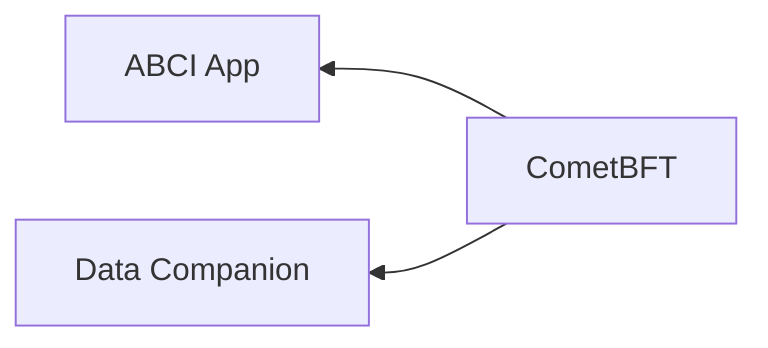
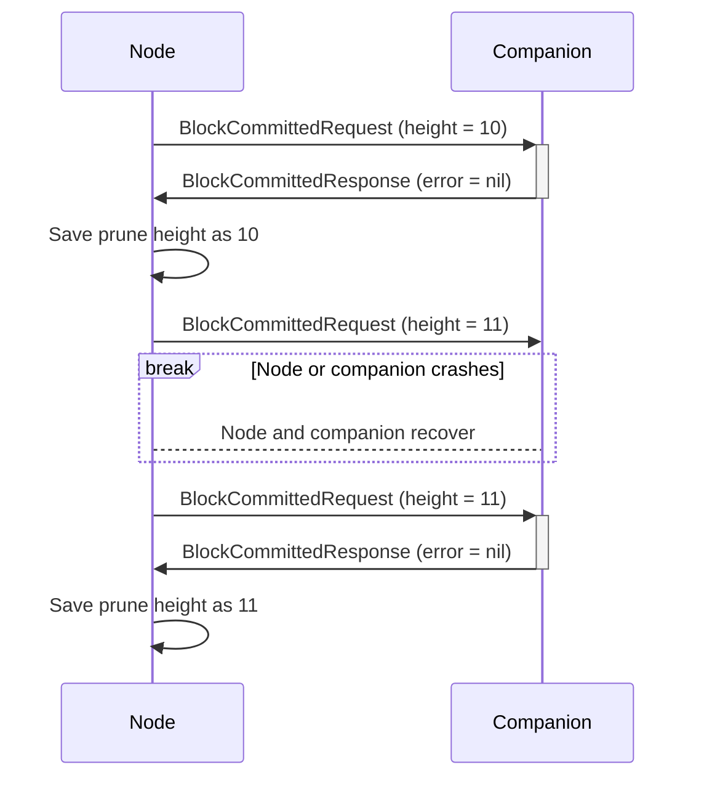

# ADR 100: Data Companion Push API

## Changelog

- 2023-05-03: Mark as rejected in favour of ADR-101 (@thanethomson)
- 2023-04-04: Update based on review feedback (@thanethomson)
- 2023-02-28: Renumber from 082 to 100 (@thanethomson)
- 2022-01-05: Sync requirements with those of [ADR 101][adr-101] (@thanethomson)
- 2022-12-18: Renamed proposal to "Data Companion Push API" (@thanethomson)
- 2022-11-26: Clarify user stories and alternatives, allow for selective
  publishing of data via the companion API, buffer on disk instead of in memory
  (@thanethomson)
- 2022-09-10: First draft (@thanethomson)

## Status

Rejected

## Context

At present, CometBFT handles a mixture of application- and consensus-related
concerns, which results in code bloat and scope creep into territory that should
technically be taken care of by the application. Some major examples of this
right now are **event and block execution result data**, with CometBFT being
responsible for:

1. Storing event/execution result data.
   1. For some applications, this results in dramatic storage growth, leading to
      high operational costs for operators, as application-specific pruning is
      not feasible to implement within the consensus engine.
   2. Storing application-specific data also means that multiple underlying
      databases need to be supported (via [cometbft-db]) in order to cater to
      different applications' needs, which substantially increases the project's
      maintenance costs and complexity.
2. Facilitating complex querying of this data, including providing real-time
   notifications of complex updates.
   1. This has resulted in needing to provide query mechanisms such as
      `/block_search` and `/tx_search`, which are not really optimal to provide
      via some of the databases supported by cometbft-db, and therefore result
      in problems like [\#517].
   2. This has also resulted in having to maintain multiple indexers and our own
      custom, database-independent indexing scheme, and having to turn down
      users' requests for even more indexers that would work better for their
      use cases, since this imposes a substantial maintenance burden on the core
      team.
   3. The current (somewhat unreliable) event subscription implementation can
      cause back-pressure into consensus and affect IBC relayer stability (see
      [\#6729] and [\#7156])

Ultimately the core team, whose focus is providing a high quality consensus
engine, has finite resources. Having to take care of both consensus- and
application-related concerns means that neither will be taken care of
effectively.

It then starts to become clearer that, in order to address these problems in the
long run, event and execution results data need to be handled in application
territory. But what does the trajectory look like to facilitate this evolution
over time?

### Roadmap

This ADR proposes the following path to eventually separating these concerns:

1. Provide an API explicitly dedicated to facilitating offloading of this data
   to a **single data companion** ("sidecar") service - this is the focus of
   this ADR. The primary function of such a companion is effectively to act as
   an _ingest_ of sorts, translating block and block result data (including
   events) into application-specific data. **Single** is emphasized here, as we
   anticipate that attaching more than one companion service to a node may slow
   it down and affect its operations.
2. Provide a reference implementation of a data companion which facilitates
   offering most of the current RPC endpoints from a service _external_ to the
   node. Beyond serving as an example for the community as to how to implement a
   data companion, this will potentially:
   1. Allow for horizontal scalability of the RPC independently of the
      associated full node, reducing operational costs for operators who want to
      provide RPC services for their user base (who, in some cases, have to run
      multiple full nodes in order to facilitate a highly available RPC
      service).
   2. Address some of the problems outlined in [RFC-006][rfc-006] relating to
      event subscription.
   3. Address more general problems in the RPC, such as its inherent
      susceptibility to DDoS attacks.
3. Once the community has mostly migrated to using this data companion API, we
   can mark many of the node-based RPC endpoints as deprecated, and eventually
   remove them from the node.
4. In parallel, start an effort to design a future where event and execution
   result data are handled exclusively in the application domain. Once these
   changes are ready to be rolled out, the ingest components of data companions
   are the only parts of the ecosystem that will need to be migrated to interact
   directly with the application instead of the node (e.g. by way of RPC
   endpoints exposed by the application, instead of the consensus engine).
5. Once the ingests are migrated to rely on the application, it will be safe to
   entirely remove any notion of event data storage and retrieval, as well as
   indexing from the consensus engine, dramatically simplifying the consensus
   engine.

## Alternative Approaches

1. One clear alternative to this would be the approach outlined in [ADR
   075][adr-075] (specifically, implementing it in isolation). This approach:

   1. Still leaves CometBFT responsible for maintaining a query interface and
      event indexing functionality, increasing the long-term maintenance burden of,
      and the possibility of feature sprawl in, that subsystem. To overcome this,
      we could remove the query interface altogether and just always publish all
      data.
   2. Only keeps track of a sliding window of events (and does so in-memory), and
      so does not provide reliable guaranteed delivery of this data. Even just
      persisting this data will not solve this problem: if we prioritize
      continued operation of the node over guaranteed delivery of this data, we
      may eventually run out of disk storage. So here we would need to persist the
      data _and_ we would need to panic if the sliding window of events fills up.
   3. Allows for multiple consumers. While desirable from typical web services,
      CometBFT is a consensus engine and, as such, we should prioritize consensus
      over providing similar guarantees to a scalable RPC interface (especially
      since we know this does not scale, and if such a job could just be
      outsourced). If we have a single consumer, we can easily automatically prune
      data that was already sent. We could overcome this by limiting the API to a
      single consumer and single event window.

   Making the requisite modifications to ADR-075 basically converges on the
   solution outlined in this ADR, except that ADR-075 publishes data via JSON over
   HTTP while this solution proposes gRPC.

   Technically, however, ADR-075 is orthogonal to the solution proposed in this
   ADR, and could be implemented as part of an "RPC companion" to provide better
   delivery guarantees to subscribers.

2. Another alternative is proposed in [ADR 101][adr-101], which has the same
   requirements as this proposed approach, except it implements a "pull" model
   instead.

3. We could pick a database that provides real-time notifications of inserts to
   consumers and just dump the requisite data into that database. Consumers
   would then need to connect to that database, listen for updates, and then
   transform/process the data as needed.

   This approach could also inevitably lead to feature sprawl in people wanting
   us to support multiple different databases. It is also not clear which
   database would be the best option here, as that would most likely be
   influenced by integrators' use cases.

   Beyond this, if we exclusively support one database but integrators needed
   another for their use case, they would be forced to perform some kind of
   continuous ETL operation to transfer the data from the one database to the
   other, potentially doubling their storage capacity requirements and therefore
   their storage-related costs. This would also increase pruning complexity.

## Decision

> TODO(thane)

## Detailed Design

The model proposed in this ADR is one where the node is a client, and the data
companion is a server. This model is inverted in ADR-101 (the "pull" companion).
The model in this ADR provides strong guarantees as to reliable delivery, but
also potentially facilitates halting of consensus if the interaction with the
companion is unreliable.

The model proposed in ADR-101 offers much weaker delivery guarantees, allowing
the companion to lag significantly behind consensus, but offers the greatest
potential uptime for the consensus engine.

### Use Cases

1. Integrators could provide standalone RPC services that would be able to scale
   independently of the CometBFT node. They would also be able to present the
   data in whatever format and by whichever protocol they want.
2. Block explorers could make use of this data to provide real-time information
   about the blockchain.
3. IBC relayer nodes could use this data to filter and store only the data they
   need to facilitate relaying without putting additional pressure on the
   consensus engine (until such time that a decision is made on whether to
   continue providing event data from CometBFT).

### Requirements

1. A node _must_ support at most one data companion.

2. All or part of the following data _must_ be obtainable by the companion:
   1. Committed block data
   2. Block execution results (including event data) for blocks that have been
      committed

3. The companion _must_ be able to establish the earliest height for which the
   node has all of the requisite data.

4. The API _must_ be (or be able to be) appropriately shielded from untrusted
   consumers and abuse. Note that the companion is considered a **trusted**
   consumer of this API. Critical control facets of the API (e.g. those that
   influence the node's pruning mechanisms) _must_ be implemented in such a way
   as to eliminate the possibility of accidentally exposing those endpoints to
   the public internet unprotected.

5. The node _must_ know, by way of signals from the companion, which heights'
   associated data are safe to automatically prune.

6. The API _must_ be opt-in. When off or not in use, it _should_ have no impact
   on system performance.

7. It _must_ not slow down consensus operations without halting the node.

8. It _must_ not cause unbounded memory growth.

9. It _must_ provide one or more ways for operators to control storage growth.

10. It _must_ provide insight to operators (e.g. by way of logs/metrics) to
    assist in dealing with possible failure modes.

### Entity Relationships

The following simple diagram shows the proposed relationships between
CometBFT, a socket-based ABCI application, and the proposed data companion
service.



As can be seen in this diagram, CometBFT (client) connects out to both the ABCI
application (server) and data companion service (server) based on the CometBFT
node's configuration.

The fact that CometBFT connects out to the companion service instead of the
other way around provides a natural constraint on the number of consumers of the
API. This also implies that the data companion is a trusted external service,
just like an ABCI application, as it would need to be configured within the
CometBFT configuration file.

### gRPC API

The following gRPC API is proposed:

```protobuf
import "tendermint/abci/types.proto";
import "tendermint/types/block.proto";

// DataCompanionService allows CometBFT to publish certain data generated by
// the consensus engine to a single external consumer with specific reliability
// guarantees.
//
// Note that implementers of this service must take into account the possibility
// that CometBFT may re-send data that was previously sent. Therefore
// the service should simply ignore previously seen data instead of responding
// with errors to ensure correct functioning of the node, as responding with an
// error is taken as a signal to CometBFT that it must crash and await
// operator intervention.
service DataCompanionService {
    // BlockCommitted is called after a block has been committed. This method is
    // also called on CometBFT startup to ensure that the service received the
    // last committed block, in case there was previously a transport failure.
    //
    // If an error is returned, CometBFT will crash.
    rpc BlockCommitted(BlockCommittedRequest) returns (BlockCommittedResponse) {}
}

// BlockCommittedRequest contains at least the data for the block that was just
// committed. If enabled, it also contains the ABCI FinalizeBlock response data
// related to the block in this request.
message BlockCommittedRequest {
    // The block data for the block that was just committed.
    tendermint.types.Block                         block = 1;
    // The FinalizeBlockResponse related to the block in this request. This
    // field is optional, depending on the CometBFT node's configuration.
    optional tendermint.abci.FinalizeBlockResponse finalize_block_response = 2;
}

// BlockCommittedResponse is either empty upon success, or returns one or more
// errors. Note that returning any errors here will cause CometBFT to crash.
message BlockCommittedResponse {
    // If an error occurred during the companion's processing of the request.
    optional Error error = 1;
}

// Error can be one of several different types of errors.
message Error {
    oneof error {
        UnexpectedBlockError unexpected_block_err = 1;
        UnexpectedFieldError unexpected_field_err = 2;
        ExpectedFieldError   expected_field_err   = 3;
    }
}

// UnexpectedBlockError is returned by the server when CometBFT sent it a
// block that is ahead of the block expected by the server.
message UnexpectedBlockError {
    // The height of the block expected by the server.
    int64 expected_height = 1;
}

// UnexpectedFieldError is returned by the server when CometBFT sent it a
// message containing an unexpected field. For instance, if the companion
// expects only the `block` field but not `finalize_block_response`, but somehow
// the companion receives a value for `finalize_block_response`, it should
// return this error because it indicates that either CometBFT or the data
// companion are most likely incorrectly configured.
message UnexpectedFieldError {
    // The name of the field whose value was expected to be empty, but was not.
    string field_name = 1;
}

// ExpectedFieldError is returned by the server when CometBFT sent it a
// message containing an empty field value for a field it was expecting to be
// populated. If this occurs, it indicates that either CometBFT or the data
// companion are most likely incorrectly configured.
message ExpectedFieldError {
    // The name of the field whose value was expected to be populated, but was
    // empty.
    string field_name = 1;
}
```

### Request Buffering

In order to ensure reliable delivery, while also catering for intermittent
faults, we should facilitate buffering of data destined for the companion
service. This data would need to be stored on disk to ensure that CometBFT
could attempt to resubmit all unsubmitted data upon CometBFT startup.

At present, this data is already stored on disk, and so practically we would
need to implement some form of background pruning mechanism to remove the data
we know has been shared with the companion service.

In order to not allow disk storage to grow unbounded, _and_ ensure that we do
not lose any critical data, we need to impose some kind of limit on the number
of requests we will buffer before crashing the CometBFT node. In case there is
manual intervention needed to restore the companion service, CometBFT should
attempt to flush this buffer upon startup before continuing normal operations.

### Crash Recovery

In order to ensure that the companion has the latest data, if CometBFT does not
have confirmation that the companion has received the data for a particular
height, it should resend all data from the last height for which it has
confirmation.

An example where the companion saves all data up to and including height 10, but
crashes before confirming receipt of data for height 11:



In such a case, it is possible for the companion to receive the same height's
data multiple times (at-least-once delivery). It is up to the companion to
handle this correctly.

### Configuration

The following configuration file update is proposed to support the data
companion API.

```toml
[data_companion]
# By default, the data companion service interaction is disabled. It is
# recommended that this only be enabled on full nodes and not validators so as
# to minimize the possibility of network instability.
enabled = false

# Address at which the gRPC companion service server is hosted. It is
# recommended that this companion service be co-located at least within the same
# data center as the CometBFT node to reduce the risk of network latencies
# interfering in node operation.
addr = "http://localhost:26659"

# Controls the BlockCommitted gRPC call.
[data_companion.block_committed]
# Enable the BlockCommitted gRPC call. Only relevant if the data companion is
# enabled.
enabled = true
# Additional fields to publish in each BlockCommittedRequest sent to the
# companion. Available options:
# - "finalize_block_response": Also publish the FinalizeBlock response related
#                              to the block in the BlockCommittedRequest.
additionally_publish = ["finalize_block_response"]
```

### Monitoring

To monitor the health of the interaction between CometBFT and the companion
service, the following additional Prometheus metrics are proposed:

- `data_companion_send_time` - A gauge that indicates the maximum time, in
  milliseconds, taken to send a single request to the companion service take
  from a rolling window of tracked send times (e.g. the maximum send time over
  the past minute).
- `data_companion_send_bytes` - A counter indicating the number of bytes sent to
  the data companion since node startup.
- `data_companion_buffer_size` - A gauge indicating the number of requests
  currently being buffered on disk on behalf of the companion service for each
  kind of request.
- `data_companion_buffer_size_bytes` - A gauge indicating how much data is being
  buffered by CometBFT on disk, in bytes, on behalf of the companion service,
  for each kind of request.

## Implications

1. We will be able to mark the following RPC APIs as deprecated and schedule
   them for removal in a future release:
   1. The [WebSocket subscription API][websocket-api]
   2. [`/tx_search`]
   3. [`/block_search`]
   4. [`/block_results`]

   We may eventually be able to remove the [`/broadcast_tx_commit`] endpoint,
   but this is often useful during debugging and development, so we may want to
   keep it around.

2. We will be able to remove all event indexing from CometBFT once we remove
   the above APIs.

3. Depending on the implementation approach chosen, we will still need to store
   some quantity of data not critical to consensus. This data can automatically
   be pruned once CometBFT has successfully transmitted it to the companion
   service.

### Release Strategy

As captured in the [requirements](#requirements), we should be able to release
this as an additive, opt-in change, thereby not impacting existing APIs. This
way we can evolve this API until such time that consumers are satisfied with
removal of the old APIs mentioned in [implications](#implications).

## Follow-Up Work

If implemented, we should consider releasing our own RPC companion server with
easy deployment instructions for people to test it out and compare the
performance with directly connecting to the CometBFT node.

This RPC companion server could easily implement an interface like that outlined
in [ADR-075](adr-075), providing the same HTTP- and cursor-based subscription
mechanism, but storing data to and pulling data from a different database (e.g.
PostgreSQL).

## Consequences

### Positive

- Integrators can expose CometBFT data in whatever format/protocol they want
  (e.g. JSON-RPC or gRPC).
- Integrators can index data in whatever way suits them best.
- All users eventually benefit from faster changes to CometBFT because the core
  team has less, and less complex, code to maintain (implementing this ADR would
  add more code in the short-term, but would pave the way for significant
  reductions in complexity in future).
- Can be rolled out as experimental and opt-in in a non-breaking way.
- The broad nature of what the API publishes lends itself to reasonable
  long-term stability.

### Negative

- Keeping existing CometBFT functionality would involve operators having to
  run an additional process, which increases operational complexity.
- It is unclear at present as to the impact of the requirement to publish large
  quantities of block/result data on the speed of block execution. This should
  be quantified in production networks as soon as this feature can be rolled out
  as experimental. If the impact is meaningful, we should either remove the
  feature or develop mitigation strategies (e.g. allowing for queries to be
  specified via the configuration file, or supporting a specific subset of use
  cases' data).
- Requires a reasonable amount of coordination work across a number of
  stakeholders across the ecosystem in order to ensure their use cases are
  addressed effectively and people have enough opportunity to migrate.

### Neutral

## References

- [\#6729]: Tendermint emits events over WebSocket faster than any clients can
  pull them if tx includes many events
- [\#7156]: Tracking: PubSub performance and UX improvements
- [RFC 003: Taxonomy of potential performance issues in Tendermint][rfc-003]
- [RFC 006: Event Subscription][rfc-006]
- [\#7471] Deterministic Events
- [ADR 075: RPC Event Subscription Interface][adr-075]

[cometbft-db]: https://github.com/cometbft/cometbft-db
[\#517]: https://github.com/cometbft/cometbft/issues/517
[\#6729]: https://github.com/tendermint/tendermint/issues/6729
[\#7156]: https://github.com/tendermint/tendermint/issues/7156
[PostgreSQL indexer]: https://github.com/tendermint/tendermint/blob/0f45086c5fd79ba47ab0270944258a27ccfc6cc3/state/indexer/sink/psql/psql.go
[\#7471]: https://github.com/tendermint/tendermint/issues/7471
[rfc-003]: ../rfc/tendermint-core/rfc-003-performance-questions.md
[rfc-006]: ../rfc/tendermint-core/rfc-006-event-subscription.md
[adr-075]: ./tendermint-core/adr-075-rpc-subscription.md
[websocket-api]: https://docs.cometbft.com/v0.34/rpc/#/Websocket
[`/tx_search`]: https://docs.cometbft.com/v0.34/rpc/#/Info/tx_search
[`/block_search`]: https://docs.cometbft.com/v0.34/rpc/#/Info/block_search
[`/broadcast_tx_commit`]: https://docs.cometbft.com/v0.34/rpc/#/Tx/broadcast_tx_commit
[`/block_results`]: https://docs.cometbft.com/v0.34/rpc/#/Info/block_results
[adr-101]: https://github.com/cometbft/tendermint/pull/82
