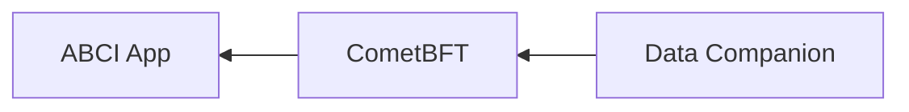

# ADR 101: Data Companion Pull API

## Changelog

- 2023-05-03: Update based on synchronous feedback from team (@thanethomson)
- 2023-04-04: Update based on review feedback (@thanethomson)
- 2023-02-28: Renumber from 084 to 101 (@thanethomson)
- 2022-12-18: First draft (@thanethomson)

## Status

Accepted

## Context

See the [context for the Data Companion Push API (ADR-100)][adr-100-context].

The primary novelty introduced in this ADR is effectively a new gRPC API
that allows an external application to influence which data the node prunes.
Otherwise, existing and planned RPC interfaces (such as the planned gRPC
interface) in addition to this pruning API should, in theory, deliver the same
kind of value as the solution proposed in ADR-100.

Even though the pruning API could be useful to operators outside the context of
the usage of a data companion (e.g. it could provide operators with more control
over node pruning behaviour), it is presented as part of the data companion
discussion to illustrate its initial intended use case.

## Alternative Approaches

[ADR-100][adr-100], as well as the [alternatives][adr-100-alt] outlined in
ADR-100, are all alternative approaches.

## Decision

To implement ADR-101 instead of ADR-100.

## Detailed Design

The model proposed in this ADR inverts that proposed in ADR-100, with the node
being the server and the data companion being the client. Here, the companion
"pulls" data from the node.

This provides much weaker data delivery guarantees than the "push" model of
ADR-100. In this "pull" model, the companion can lag behind consensus, but the
node does not crash if the companion is unavailable.

### Requirements

The requirements for ADR-101 are the same as the [requirements for
ADR-100][adr-100-req].

### Entity Relationships

The following model shows the proposed relationships between CometBFT, a
socket-based ABCI application, and the proposed data companion service.



In this diagram, it is evident that CometBFT (as a client) connects out to the
ABCI application (a server), and the companion (a client) connects to the
CometBFT node (a server).

### Pruning Behaviour

Two parameters are proposed as a necessary part of the pruning API:

- **Pruning service block retain height**, which influences the height to which
  the node will retain blocks. This is different to the **application block
  retain height**, which is set by the application in its response to each ABCI
  `Commit` message.

  The node will prune blocks to whichever is lower between the pruning service
  and application block retain heights.

- **Pruning service block results retain height**, which influences the height
  to which the node will retain block results.

These parameters need to be durable (i.e. stored on disk).

### gRPC API

At the time of this writing, it is proposed that CometBFT implement a full gRPC
interface ([\#81]). As such, we have several options when it comes to
implementing the data companion pull API:

1. Extend the proposed gRPC API from [\#81] to simply provide the additional
   data companion-specific endpoints. In order to meet the
   [requirements](#requirements), however, some of the endpoints will have to be
   protected by default. This is simpler for clients to interact with though,
   because they only need to interact with a single endpoint for all of their
   needs.
2. Implement a separate gRPC API on a different port to the standard gRPC
   interface. This allows for a clearer distinction between the standard and
   data companion-specific gRPC interfaces, but complicates the server and
   client interaction models.

Due to past experience of operators exposing _all_ RPC endpoints on a specific
port to the public internet, option 2 will be chosen here to minimize the
chances of this happening in future, even though it offers a slightly more
complicated experience for operators.

#### Block Service

The following `BlockService` will be implemented as part of [\#81], regardless
of whether or not this ADR is implemented. This API, therefore, needs to be more
generally useful than just for the purposes of the data companion. The minimal
API to support a data companion, however, is presented in this ADR.

```protobuf
syntax = "proto3";

package tendermint.services.block.v1;

import "tendermint/abci/types.proto";
import "tendermint/types/types.proto";
import "tendermint/types/block.proto";

// BlockService provides information about blocks.
service BlockService {
    // GetLatestHeight returns a stream of the latest block heights committed by
    // the network. This is a long-lived stream that is only terminated by the
    // server if an error occurs. The caller is expected to handle such
    // disconnections and automatically reconnect.
    rpc GetLatestHeight(GetLatestHeightRequest) returns (stream GetLatestHeightResponse) {}

    // GetByHeight attempts to retrieve the block at a particular height.
    rpc GetByHeight(GetByHeightRequest) returns (GetByHeightResponse) {}
}

message GetLatestHeightRequest {}

// GetLatestHeightResponse provides the height of the latest committed block.
message GetLatestHeightResponse {
    // The height of the latest committed block. Will be 0 if no data has been
    // committed yet.
    uint64 height = 1;
}

message GetByHeightRequest {
    // The height of the block to get. Set to 0 to return the latest block.
    uint64 height = 1;
}

message GetByHeightResponse {
    // The ID associated with the relevant block.
    tendermint.types.BlockID block_id = 1;
    // Block data for the requested height.
    tendermint.types.Block block = 2;
}
```

#### Block Results Service

The following `BlockResultsService` service is proposed _separately_ to the
`BlockService`. There are several reasons as to why there are two separate gRPC
services to meet the companion's needs as opposed to just one:

1. The quantity of data stored by each is application-dependent, and coalescing
   the two types of data could impose significant overhead in some cases (this
   is primarily a justification for having separate RPC calls for each type of
   data).
2. Operators can enable/disable these services independently of one another.
3. The existing JSON-RPC API distinguishes between endpoints providing these two
   types of data (`/block` and `/block_results`), so users are already
   accustomed to this distinction.
4. Eventually, when we no longer need to store block results at all, we can
   simply deprecate the `BlockResultsService` without affecting clients who rely
   on `BlockService`.

```protobuf
syntax = "proto3";

package tendermint.services.block_results.v1;

// BlockResultsService provides information about the execution results for
// specific blocks.
service BlockResultsService {
    // GetByHeight attempts to retrieve the execution results associated with a
    // block of a certain height.
    rpc GetByHeight(GetByHeightRequest) returns (GetByHeightResponse) {}
}

message GetByHeightRequest {
    // The height of the block whose results are to be retrieved. Set to 0 to
    // return the latest block's results.
    uint64 height = 1;
}

message GetByHeightResponse {
    // The height associated with the block results.
    uint64 height = 1;

    // The contents of the FinalizeBlock response, which contain block execution
    // results.
    tendermint.abci.ResponseFinalizeBlock finalize_block_response = 2;
}
```

#### Pruning Service

This gRPC service is the only novel service proposed in this ADR, and
effectively gives a single external caller (e.g. a data companion) a say in how
the node prunes its data.

```protobuf
syntax = "proto3";

package tendermint.services.pruning.v1;

// PruningService provides privileged access to specialized pruning
// functionality on the CometBFT node to help control node storage.
service PruningService {
    // SetBlockRetainHeightRequest indicates to the node that it can safely
    // prune all block data up to the specified retain height.
    //
    // The lower of this retain height and that set by the application in its
    // Commit response will be used by the node to determine which heights' data
    // can be pruned.
    rpc SetBlockRetainHeight(SetBlockRetainHeightRequest) returns (SetBlockRetainHeightResponse);

    // GetBlockRetainHeight returns information about the retain height
    // parameters used by the node to influence block retention/pruning.
    rpc GetBlockRetainHeight(GetBlockRetainHeightRequest) returns (GetBlockRetainHeightResponse);

    // SetBlockResultsRetainHeightRequest indicates to the node that it can
    // safely prune all block results data up to the specified height.
    //
    // The node will always store the block results for the latest height to
    // help facilitate crash recovery.
    rpc SetBlockResultsRetainHeight(SetBlockResultsRetainHeightRequest) returns (SetBlockResultsRetainHeightResponse);

    // GetBlockResultsRetainHeight returns information about the retain height
    // parameters used by the node to influence block results retention/pruning.
    rpc GetBlockResultsRetainHeight(GetBlockResultsRetainHeightRequest) returns (GetBlockResultsRetainHeightResponse);
}

message SetBlockRetainHeightRequest {
    uint64 height = 1;
}

message SetBlockRetainHeightResponse {}

message GetBlockRetainHeightRequest {}

message GetBlockRetainHeightResponse {
    // The retain height set by the application.
    uint64 app_retain_height = 1;

    // The retain height set via the pruning service (e.g. by the data
    // companion) specifically for blocks.
    uint64 pruning_service_retain_height = 2;
}

message SetBlockResultsRetainHeightRequest {
    uint64 height = 1;
}

message SetBlockResultsRetainHeightResponse {}

message GetBlockResultsRetainHeightRequest {}

message GetBlockResultsRetainHeightResponse {
    // The retain height set by the pruning service (e.g. by the data
    // companion) specifically for block results.
    uint64 pruning_service_retain_height = 1;
}
```

##### Indexer pruning service

This gRPC service can be used to instruct CometBFT to prune the transaction and
block events indexed by CometBFT. 

To support this, the above described pruning service is extended as follows:

```protobuf

// PruningService provides privileged access to specialized pruning
// functionality on the CometBFT node to help control node storage.
service PruningService {


    // SetTxIndexerRetainHeightRequest indicates to the node that it can safely
    // prune all tx indices up to the specified retain height.
    rpc SetTxIndexerRetainHeight(SetTxIndexerRetainHeightRequest) returns (SetTxIndexerRetainHeightResponse);

    // GetTxIndexerRetainHeight returns information about the retain height
    // parameters used by the node to influence TxIndexer pruning
    rpc GetTxIndexerRetainHeight(GetTxIndexerRetainHeightRequest) returns (GetTxIndexerRetainHeightResponse);

    // SetBlockIndexerRetainHeightRequest indicates to the node that it can safely
    // prune all block indices up to the specified retain height.
    rpc SetBlockIndexerRetainHeight(SetBlockIndexerRetainHeightRequest) returns (SetBlockIndexerRetainHeightResponse);

    // GetBlockIndexerRetainHeight returns information about the retain height
    // parameters used by the node to influence BlockIndexer pruning
    rpc GetBlockIndexerRetainHeight(GetBlockIndexerRetainHeightRequest) returns (GetBlockIndexerRetainHeightResponse);


}

message SetTxIndexerRetainHeightRequest {
    uint64 height = 1;
}

message SetTxIndexerRetainHeightResponse {}

message GetTxIndexerRetainHeightRequest {}

message GetTxIndexerRetainHeightResponse {
    uint64 height = 1;
}

message SetBlockIndexerRetainHeightRequest {
    uint64 height = 1;
}

message SetBlockIndexerRetainHeightResponse {}

message GetBlockIndexerRetainHeightRequest {}

message GetBlockIndexerRetainHeightResponse {
    uint64 height = 1;
}

```

With this API design, it is technically possible for an integrator to attach
multiple data companions to the node, but only one of their retain heights will
be considered by the node.

### Configuration

The following configuration file (`config.toml`) update is proposed to support the data
companion API.

```toml
[storage]

#
# Storage pruning configuration relating only to the data companion.
#
[storage.pruning.data_companion]

# Whether automatic pruning respects values set by the data companion. Disabled
# by default. All other parameters in this section are ignored when this is
# disabled.
#
# If disabled, only the application retain height will influence block pruning
# (but not block results pruning). Only enabling this at a later stage will
# potentially mean that blocks below the application-set retain height at the
# time will not be available to the data companion.
enabled = false

# The initial value for the data companion block retain height if the data
# companion has not yet explicitly set one. If the data companion has already
# set a block retain height, this is ignored.
initial_block_retain_height = 0

# The initial value for the data companion block results retain height if the
# data companion has not yet explicitly set one. If the data companion has
# already set a block results retain height, this is ignored.
initial_block_results_retain_height = 0

#
# This is the envisaged configuration section for the gRPC API that will be
# introduced as part of https://github.com/cometbft/cometbft/issues/81
# (Still a WIP)
#
[grpc]

# The host/port on which to expose non-privileged gRPC endpoints.
laddr = "tcp://localhost:26654"

#
# Configuration for privileged gRPC endpoints, which should **never** be exposed
# to the public internet.
#
[grpc.privileged]
# The host/port on which to expose privileged gRPC endpoints.
laddr = "tcp://localhost:26655"

#
# Configuration specifically for the gRPC pruning service, which is considered a
# privileged service.
#
[grpc.privileged.pruning_service]

# Only controls whether the pruning service is accessible via the gRPC API - not
# whether a previously set pruning service retain height is honoured by the
# node. That is controlled by settings in the [storage.pruning] section.
#
# Disabled by default.
enabled = false
```

### Metrics

The following metrics are proposed to be added to monitor the health of the
interaction between a node and its data companion:

- `pruning_service_block_retain_height` - The current block retain height as
  requested by the pruning service.
- `pruning_service_block_results_retain_height` - The current block results
  retain height as requested by the pruning service.
- `application_block_retain_height` - The current block retain height as set by
  the application.
- `block_store_base_height` - The actual base height of the block store, which
  is influenced by the application and pruning service block retain heights.
- `abci_results_base_height` - The actual base height of stored block results,
  which is influenced by the pruning service block results retain height.
- `block_indexer_retain_height` -  The current block indexer retain height 
   requested by the pruning service.
- `tx_indexer_retain_height` -  The current tx indexer retain height 
  requested by the pruning service.
- `block_indexer_base_height` -  The minimum height at which we have block events 
   (should demonstrate the effects of pruning the block indexer)
- `tx_indexer_base_height`  - The minimum height at which we have transaction events 
   (should demonstrate the effects of pruning the tx indexer)

Other metrics may be proposed as part of the non-privileged gRPC API that could
assist operators in understanding the health of the interaction with the data
companion, but only if the data companion is the exclusive user of those APIs.

## Consequences

### Positive

- Facilitates offloading of data to an external service, which can be scaled
  independently of the node
  - Potentially reduces load on the node itself
  - Paves the way for eventually reducing the surface area of a node's exposed
    APIs
- Allows the data companion more leeway in reading the data it needs than the
  approach in [ADR 100][adr-100]
- Simpler implementation and fewer changes within the node than [ADR
  100][adr-100]

### Negative

- Increases system complexity slightly in the short-term
- If data companions are not correctly implemented and deployed (e.g. if a
  companion is attached to the same storage as the node, and/or if its retain
  height signalling is poorly handled), this could result in substantially
  increased storage usage

### Neutral

- Expands the overall API surface area of a node in the short-term

## References

- [ADR 100 - Data Companion Push API][adr-100]
- [\#81 - rpc: Add gRPC support][\#81]
- [Documentation on current implementation of ADR-101][dc-docs]

[adr-100-context]: ./adr-100-data-companion-push-api.md#context
[adr-100]: ./adr-100-data-companion-push-api.md
[adr-100-req]: ./adr-100-data-companion-push-api.md#requirements
[adr-100-alt]: ./adr-100-data-companion-push-api.md#alternative-approaches
[\#81]: https://github.com/cometbft/cometbft/issues/81
[abci-commit]: ../../spec/abci/abci++_methods.md#commit
[dc-docs]: https://github.com/cometbft/cometbft/tree/main/docs/data-companion