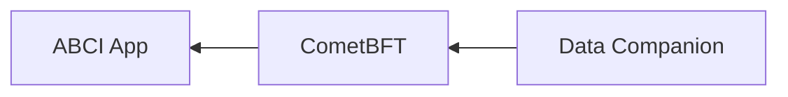

# ADR 101: Data Companion Pull API

## Changelog

- 2023-04-04: Update based on review feedback (@thanethomson)
- 2023-02-28: Renumber from 084 to 101 (@thanethomson)
- 2022-12-18: First draft (@thanethomson)

## Status

Accepted | Rejected | Deprecated | Superseded by

## Context

See the [context for ADR-100][adr-100-context].

## Alternative Approaches

[ADR-100][adr-100], as well as the [alternatives][adr-100-alt] outlined in
ADR-100, are all alternative approaches.

## Decision

> This section records the decision that was made.

## Detailed Design

The model proposed in this ADR inverts that proposed in ADR-100, with the node
being the server and the data companion being the client. Here, the companion
"pulls" data from the node.

This provides much weaker data delivery guarantees than the "push" model of
ADR-100. In this "pull" model, the companion can lag behind consensus, but the
node does not crash if the companion is unavailable.

### Requirements

The requirements for ADR-101 are the same as the [requirements for
ADR-100][adr-100-req].

### Entity Relationships

The following model shows the proposed relationships between CometBFT, a
socket-based ABCI application, and the proposed data companion service.



In this diagram, it is evident that CometBFT (as a client) connects out to the
ABCI application (a server), and the companion (a client) connects to the
CometBFT node (a server).

### Pruning Behaviour

There are two "modes" of pruning that need to be supported by the node:

1. **Data companion disabled**: Here, the node prunes as per normal based on the
   `retain_height` parameter supplied by the application via the
   [`Commit`][abci-commit] ABCI response.
2. **Data companion enabled**: Here, the node prunes _blocks_ based on the minimum
   among the retain heights specified by the application and the data companion,
   and the node prunes _block results_ based on the retain height set by the
   data companion.

Enabling the `discard_abci_responses` flag under the `[storage]` section in the
configuration is incompatible with enabling a data companion. If
`storage.discard_abci_responses` and `data_companion.enabled` are both `true`,
then the node _must_ fail to start.

### gRPC API

At the time of this writing, it is proposed that CometBFT implement a full
gRPC interface ([\#81]). As such, we have several options when it comes to
implementing the data companion pull API:

1. Extend the proposed gRPC API from [\#81] to simply provide the additional
   data companion-specific endpoints. In order to meet the
   [requirements](#requirements), however, some of the endpoints will have to be
   protected by default. This is simpler for clients to interact with though,
   because they only need to interact with a single endpoint for all of their
   needs.
2. Implement a separate gRPC API on a different port to the standard gRPC
   interface. This allows for a clearer distinction between the standard and
   data companion-specific gRPC interfaces, but complicates the server and
   client interaction models.

Due to the poorer operator experience in option 2, it would be preferable to
implement option 1, but have certain endpoints be
[access-controlled](#access-control) by default.

With this in mind, the following gRPC API is proposed, where the CometBFT node
will implement these services.

#### Block Service

The following `BlockService` will be implemented as part of [\#81], regardless
of whether or not this ADR is implemented.

```protobuf
syntax = "proto3";

package tendermint.block_service.v1;

import "tendermint/abci/types.proto";
import "tendermint/types/types.proto";
import "tendermint/types/block.proto";

// BlockService provides information about blocks.
service BlockService {
    // GetLatestHeight returns a stream of the latest block heights committed by
    // the network. This is a long-lived stream that is only terminated by the
    // server if an error occurs. The companion is expected to handle such
    // disconnections and automatically reconnect.
    rpc GetLatestHeight(GetLatestHeightRequest) returns (stream GetLatestHeightResponse) {}

    // GetBlock attempts to retrieve the block at a particular height.
    rpc GetBlock(GetBlockRequest) returns (GetBlockResponse) {}

    // GetBlockResults attempts to retrieve the results of block execution for a
    // particular height.
    rpc GetBlockResults(GetBlockResultsRequest) returns (GetBlockResultsResponse) {}
}

message GetLatestHeightRequest {}

// GetLatestHeightResponse provides the height of the latest committed block.
message GetLatestHeightResponse {
    // The height of the latest committed block. Will be 0 if no data has been
    // committed yet.
    int64 height = 1;
}

message GetBlockRequest {
    // The height of the block to get. Set to 0 to return the latest block.
    int64 height = 1;
}

message GetBlockResponse {
    // Block data for the requested height.
    tendermint.types.Block block = 1;
}

message GetBlockResultsRequest {
    // The height of the block results to get. Set to 0 to return the latest
    // block.
    int64 height = 1;
}

message GetBlockResultsResponse {
    // The height of the block whose results are provided in the remaining
    // fields.
    int64 height = 1;

    // All events produced by the ABCI FinalizeBlock call.
    repeated tendermint.abci.Event events = 2;

    // All transaction results (and their associated events) produced by block
    // execution.
    repeated tendermint.abci.ExecTxResult tx_results = 3;

    // Validator updates during block execution.
    repeated tendermint.abci.ValidatorUpdate validator_updates = 4;

    // Consensus parameter updates during block execution.
    tendermint.types.ConsensusParams consensus_param_updates = 5;

    // The app hash returned by the application after execution of all of the
    // transactions in the block.
    bytes app_hash = 6;
}
```

There are several reasons as to why there are two separate gRPC calls for this
data as opposed to just one:

1. The quantity of data stored by each is application-dependent, and coalescing
   the two types of data could impose significant overhead in some cases.
2. The existing JSON-RPC API distinguishes between endpoints providing these two
   types of data (`/block` and `/block_results`), and the `BlockService` should
   simply provide a gRPC alternative to these two endpoints.
3. Eventually, when we no longer need to store block results at all, we can
   simply deprecate the `GetBlockResults` API call without affecting clients who
   rely on `GetBlock`.

#### Data Companion Service

This gRPC service is the only novel service proposed for the data companion API,
and effectively gives the data companion a say in how the node prunes its data.

```protobuf
syntax = "proto3";

package tendermint.data_companion_service.v1;

// DataCompanionService provides privileged access to specialized pruning
// functionality on the CometBFT node to help optimize node storage.
service DataCompanionService {
    // SetRetainHeight notifies the node of the minimum height whose data must
    // be retained by the node. This data includes block data and block
    // execution results.
    //
    // Setting a retain height lower than a previous setting will result in an
    // error.
    //
    // The lower of this retain height and that set by the application in its
    // Commit response will be used by the node to determine which heights' data
    // can be pruned.
    rpc SetRetainHeight(SetRetainHeightRequest) returns (SetRetainHeightResponse) {}

    // GetRetainHeight returns the retain height set by the companion and that
    // set by the application. This can give the companion an indication as to
    // which heights' data are currently available.
    rpc GetRetainHeight(GetRetainHeightRequest) returns (GetRetainHeightResponse) {}
}

message SetRetainHeightRequest {
    int64 height = 1;
}

message SetRetainHeightResponse {}

message GetRetainHeightRequest {}

message GetRetainHeightResponse {
    // The retain height as set by the data companion.
    int64 data_companion_retain_height = 1;
    // The retain height as set by the ABCI application.
    int64 app_retain_height = 2;
}
```

With this API design, it is technically possible for an integrator to attach
multiple data companions to the node, but only one of their retain heights will
be applied.

### Access Control

As covered in the [gRPC API section](#grpc-api), it would be preferable to
implement some form of access control for sensitive, data companion-specific
APIs. Two main possibilities are considered here for access control:

1. Only allow the `DataCompanionService` to be exposed via a gRPC endpoint bound
   to `localhost`. This, however, only caters for deployments run on VMs, and
   not for those running in Docker containers. In general, in a containerized
   environment, it would be preferable to have the companion run in a separate
   container to the node, such that it fails and recovers independently of the
   node.

2. Implement **basic HTTP authentication** on the `DataCompanionService`, where
   credentials should be obtained from an `.htpasswd` file, using the same
   format as [Apache `.htpasswd` files][htpasswd], whose location is set in the
   CometBFT configuration file.

   `.htpasswd` files are relatively standard and are supported by many web
   servers. bcrypt encryption for passwords stored in `.htpasswd` files is
   strongly recommended here.

### Configuration

The following configuration file update is proposed to support the data
companion API.

```toml
# A data companion, if enabled, is intended to offload the storage of certain
# types of data from the node. Specifically:
# 1. Block data, including transactions.
# 2. Block results, including events, transaction results, validator and
#    consensus parameter updates.
#
# A data companion can influence the pruning height of the node, and therefore
# the data companion gRPC service is considered to be a sensitive endpoint that
# is password-protected by default.
[data_companion]

# Is the data companion gRPC API enabled at all? Default: false
enabled = false

# Authentication configuration for the data companion.
[data_companion.authentication]

# The authentication method to use. At present, the only supported method is
# "basic" (i.e. basic HTTP authentication).
method = "basic"

# Path to the file containing basic authentication credentials to access the
# data companion service. If the data companion is enabled and this password
# file is not supplied, or the file does not exist, or the file is of an invalid
# format, the node will fail to start.
#
# See https://httpd.apache.org/docs/current/programs/htpasswd.html for details
# on how to create/configure this file.
password_file = "/path/to/.htpasswd"
```

### Metrics

The following metrics are proposed to be added to monitor the health of the
interaction between a node and its data companion:

- `data_companion_retain_height` - The current retain height as requested by the
  data companion. This can give operators insight into how the data companion is
  affecting pruning.
- `data_companion_block_response_height` - The highest height for block response
  data sent to the companion since node startup. This can give operators insight
  into whether the data companion is significantly lagging behind the node.
- `data_companion_block_results_response_height` - The highest height for block
  result response data sent to the companion since node startup. This can give
  operators insight into whether the data companion is significantly lagging
  behind the node.
- `data_companion_block_response_count` - The total number of block responses
  sent to the data companion since node startup.
- `data_companion_block_result_response_count` - The total number of block
  results responses sent to the data companion since node startup.
- `data_companion_block_response_bytes` - The total number of bytes sent to the
  data companion since startup for block response data. This can potentially
  alert operators to bottlenecks in communication between the node and the data
  companion.
- `data_companion_block_results_response_bytes` - The total number of bytes sent
  to the data companion since startup for block results response data. This can
  potentially alert operators to bottlenecks in communication between the node
  and the data companion.

## Consequences

### Positive

- Facilitates offloading of data to an external service, which can be scaled
  independently of the node
  - Potentially reduces load on the node itself
  - Paves the way for eventually reducing the surface area of a node's exposed
    APIs
- Allows the data companion more leeway in reading the data it needs than the
  approach in [ADR 100][adr-100]
- Simpler implementation than [ADR 100][adr-100]

### Negative

- Increases system complexity slightly in the short-term
- If data companions are not correctly implemented and deployed (e.g. if a
  companion is attached to the same storage as the node, and/or if its retain
  height signalling is poorly handled), this could result in substantially
  increased storage usage

### Neutral

- Expands the overall API surface area of a node in the short-term

## References

- [ADR 100 - Data Companion Push API][adr-100]
- [\#81 - rpc: Add gRPC support][\#81]
- [`.htpasswd`][htpasswd]

<!--
TODO(thane): Replace GitHub links with relative Markdown file links once ADR-100 is merged.
-->
[adr-100-context]: https://github.com/cometbft/cometbft/blob/thane/adr-082-data-companion-api/docs/architecture/adr-100-data-companion-push-api.md#context
[adr-100]: https://github.com/cometbft/cometbft/blob/thane/adr-082-data-companion-api/docs/architecture/adr-100-data-companion-push-api.md
[adr-100-req]: https://github.com/cometbft/cometbft/blob/thane/adr-082-data-companion-api/docs/architecture/adr-100-data-companion-push-api.md#requirements
[adr-100-alt]: https://github.com/cometbft/cometbft/blob/thane/adr-082-data-companion-api/docs/architecture/adr-100-data-companion-push-api.md#alternative-approaches
[\#81]: https://github.com/cometbft/cometbft/issues/81
[htpasswd]: https://httpd.apache.org/docs/current/programs/htpasswd.html
[abci-commit]: ../../spec/abci/abci++_methods.md#commit
