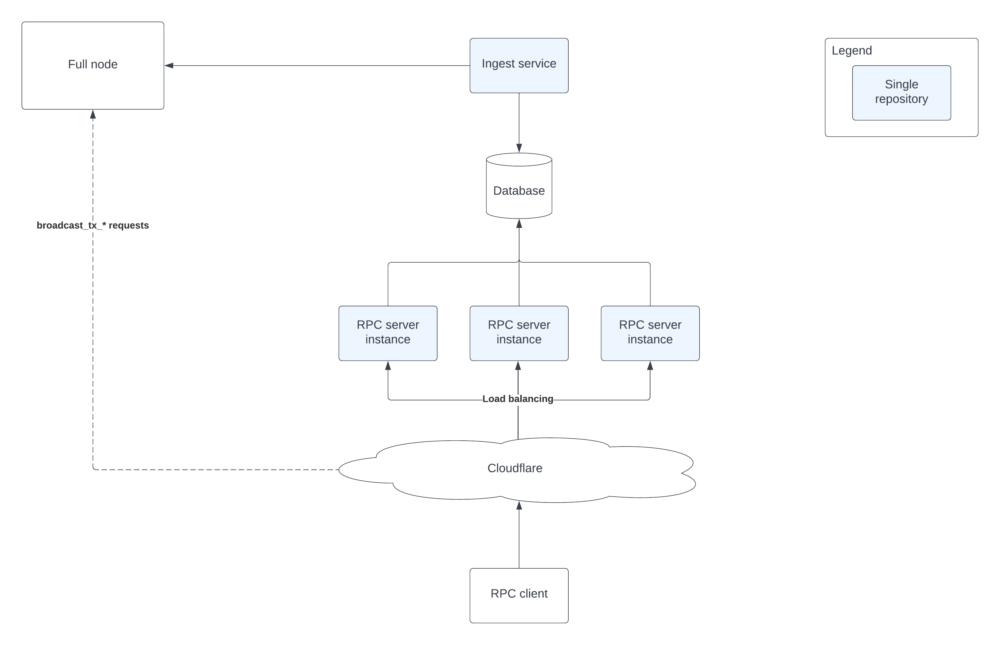

# ADR-102: RPC Companion

## [**Work In Progress**]
Please wait until this section is removed to provide feedback or add comments.

## Changelog

- 2022-03-27: First draft (@andynog)

## Status

Accepted | Rejected | Deprecated | Superseded by

## Context

This ADR proposes an architecture of a ***Standalone RPC*** solution implemented based on the proposed [ADR-101 Data Companion Pull API](https://github.com/cometbft/cometbft/blob/thane/adr-084-data-companion-pull-api/docs/architecture/adr-101-data-companion-pull-api.md). This solution can run as a sidecar concurrently with the full node, and it is optional.

This ADR provides a reference implementation of a system that can be used to offload queryable data from a CometBFT
full node to a database and offering a service that exposes the same endpoints as the regular RPC endpoints of a full CometBFT node,
which makes it easier for integrators of RPC clients such as client libraries and applications to switch to this
***Standalone RPC*** with as minimum effort as possible.

This architecture also make it possible to scale horizontally the querying capacity of a full node by running multiple
copies of the ***Standalone RPC*** server instances that can be behind a scalable load-balancer (e.g. Cloudflare)  and can serve
the data in a more reliable way.

## Alternative Approaches

Currently, there aren't any alternative solutions that are based on a data companion architecture. It is
expected that integrators and operators propose and design their own solutions based on their specific use-cases.

This ADR provides a reference implementation that can be used and adapted for individual use-cases.

## Decision

TBD

## Detailed Design

### Requirements

The target audience for this solution are operators and integrators that want to alleviate the load on their nodes by offloading
the queryable data requests to the **Standalone RPC**.

This solution shall meet the following requirements in order to provide real benefits to these users.

The **Standalone RPC** solution shall:

1. Provide an **ingestion service** implemented as a data companion that can pull data from the node and store it on
its own storage (database)
2. Provide its own storage (database) that can handle a high-load of reads and also have a good performance on inserting data.
3. Implement a schema that needs to be backwards compatible with the current CometBFT RPC.
4. Do not enforce any breaking changes to the existing RPC.
5. Ensure the responses returned by the RPC v1 endpoints are wire compatible with the existing CometBFT endpoints.
6. Implement tests to verify backwards compatibility.
7. Be able to handle multiple concurrent requests and return idempotent responses.
8. Do not crash or panic if the querying demand is very high or large responses are returned.
9. Storage optimized for an access pattern of faster read throughput than write.
10. Provide metrics to allow operators to properly monitor the services and infrastructure.

It is ***NOT*** in the scope of the **Standalone RPC**:

1. To provide RPC endpoints that are of a "write" nature, for example `broadcast_tx_*` endpoints should not be supported due to the complexity
  of the race conditions that might occur in a load balanced Standalone RPC environment.
2. Provide an authentication mechanism for the RPC query endpoints

### API (v1)

These are the initial API endpoints to be implemented for the RPC Companion (v1) are:

- /block
- /block_results

[TBD] Implement the "search" endpoints (tx_search and block_search)

> NOTE: The RPC Companion server instances should not implement endpoints that can modify state in the blockchain such as
the `/broadcast_tx_*` endpoints. Since there might be many load balanced RPC server instances, this might cause issues with
transactions, for example sequential transactions might be relayed in the wrong order causing the full node to reject some
transactions with sequence mismatch errors. It is expected that RPC clients have logic to forward these requests directly
to the full node.

### High-level architecture



This diagram shows all the required components for a full Standalone RPC solution. The solution implementation contains
many parts and each one is described below:

### Ingest Service

The **ingest service** pulls the data from the full node via its RPC endpoints and store the information retrieved in
the database. In the future, if a gRPC interface is implemented in the full node this might be used to pull the data
from the server.

The **ingest service** can control the pruning on the full node via a mechanism to track a `retain height`. Once the ingest service
pulls the data from the full node and is able to process it and it gets an acknowledgement from the database that the data was inserted,
the **ingest service** can communicate with the full node notifying it that a specific height has been processed and set the processed
height as the `retain height` on the full node signaling this way to the node that this height can be pruned.

If the **ingest service** becomes unavailable (e.g. stops), then it should resume synchronization with the full node when it is back online.
The **ingest service** should query the full node for the last `retain height` and the **ingest service** should request
and process all the heights missing on the database until it catches up with the full node latest height.

In case the **ingest service** becomes unavailable for a long time and there are a lot of height be caught up, it is
important for the **ingest service** to do it in a throttled way in order not to stress the full node and cause issues in its consensus processing.

### Database

The database stores the data retrieved from the full node and provide this data for the RPC server instance. Since the frequency
that blocks are generated on the chain are in the range from 5 seconds to 7 seconds on average, the _write_ back pressure is not
very high from a modern database perspective. While the frequency and number of requests for reading the data from the database will
be much larger due to the fact that the RPC service instance can be scaled. Therefore, a database that provides a high read
throughput should be favored.

For this is initial solution implementation it is proposed that the relational database [Postgresql](https://www.postgresql.org/) should be used in order to support
the RPC scalability and this will also provide more flexibility when implementing the RPC v2 endpoints that can return data
in different forms and custom indexers might also be crated to boost the performance.

The data needs to be available both for the ingest service (writes) and the RPC server instance (reads) so an embedded database
is not recommended in this case since accessing the data remotely might not be optimal for an embedded key-value database. Also
since the RPC might have many server instances (or processes) running that will need to retrieve data concurrently it is recommended to use
a well-known robust database engine that can support such a load.

Also, a database that can support ACID transactions is important to provide more guarantees that
the data was successfully inserted in the database and that an acknowledgement can be sent back to the ingest service to notify the
full node to prune the inserted data.

#### Database Schema

One of the challenges when implementing this solution is how to design a database schema that can be suitable to return responses that are
equivalent to the existing endpoints but at the same time offers flexibility in returning customized responses in the future.

Currently, CometBFT uses an abstraction layer from [cometbft-db](https://github.com/cometbft/cometbft-db) in order to support multiple embedded databases. These databases store
data as key-value pairs using a byte array datatype, for example to set a value for a key:

```go
func (db *GoLevelDB) Set(key []byte, value []byte) error {
	if len(key) == 0 {
		return errKeyEmpty
	}
	if value == nil {
		return errValueNil
	}
	if err := db.db.Put(key, value, nil); err != nil {
		return err
	}
	return nil
}
```

##### Data types

This solution will implement a data schema in the database using its built-in datatypes. By using a relation database, there's a possibility
to better normalize the data structures, this might provide savings in storage but might add to the complexity of returning a particular
dataset because the data joins that will be required. Also, it would be important ensure the referential integrity is not violated since
this can cause issues to the clients consuming the data.

##### Schema migration

Another point to consider is when the data structures change across CometBFT releases. There are a couple of way to provide a solution to this
problem.

One way is to support a mechanism to migrate the old data to the new data structures. This would require additional logic for the migration process
that would need to be run before ingesting data from an upgraded full node that contains the new data structures. But this approach might also
cause some issues, for example, if the new data structure has a new field that there's no corresponding value in the "old" data structure, probably
the value would need to be set to `[null]` but this can have unintended consequences.

Another potential solution for this scenario is to find a way in the database that can support "versioning" of data structures. For example, let's
assume there's a `Block` structure, let's call it `v1`. If in the future there's a need to modify this structure that is not compatible with the
previous data structure, then the database would support a `v2` schema for `Block` and an `index` table could determine the criteria on which
data structure should be used for inserting or querying data.

There's also a possibility that the data structure could be stored in parallel with the normalized data but in one blob, e.g. in a jsonb field
that contains all the information needed to return the client, this could be an optimized way to serve the data but could add to the storage
requirements. This could improve the performance for reading data from the database. An alternative approach to this problem that can offer
similar results would be to use a "caching" layer.

Here is the schema definition for a `Block` data structure:

[TBD]

### RPC server instance

The **RPC server instance** is a node that runs the RPC API process for the data companion. This server instance provide an RPC API (v1) with
the same endpoints as the full node. The Standalone RPC service will expose the same endpoints and will accept the same request types and
return wire compatible responses (should match the same response as the equivalent full node RPC endpoint).

The **RPC server instance**, when serving a particular request, retrieves the required data from the database in order to
fulfill the request. The data should be serialized in a way that makes it wire compatible with the CometBFT RPC endpoint.

Identical requests should return idempotent responses, no side effects should cause the RPC service to return different responses.

The RPC service endpoints should be exposes through an external load-balancer service such as Cloudflare or AWS ELB, or
a server running its own load balancer mechanism (e.g. nginx).

The RPC clients should make requests to the **RPC Companion** server instances through this load balancer.

The **RPC Companion** should support the `https` protocol in order to support secure endpoints access. It's recommended that
the `https` support is provided by the load balancer but in case there's a single **RPC Companion** server instance, having an
option to use `https` is important and it's backwards compatible with the existing CometBFT RPC that supports that.


## Consequences

### Positive

- Alternative and optional **RPC Companion** that is more scalable and reliable with a higher query throughput.
- Less backpressure on the full node that is running consensus.
- Possibility for future additional endpoints (v2).
- Allow users to create better and faster indexers and analytics solutions.

### Negative

- Additional infrastructure complexity to set up and maintain.
- Additional infrastructure cost.

### Neutral

- Optional feature, users will only use it if needed.
- No privacy / security issues should arise since the data returned by the **RPC Companion** will be the same
as the current RPC.

## References

- [Improve experience for integrators](https://github.com/cometbft/cometbft/issues/40)
- [ADR-101: Data Companions Pull API (tracking issue)](https://github.com/cometbft/cometbft/issues/574)
- [ADR-101: Data Companions Pull API (PR)](https://github.com/cometbft/cometbft/pull/82)
- [CometBFT documentation - RPC](https://docs.cometbft.com/v0.37/rpc/)


