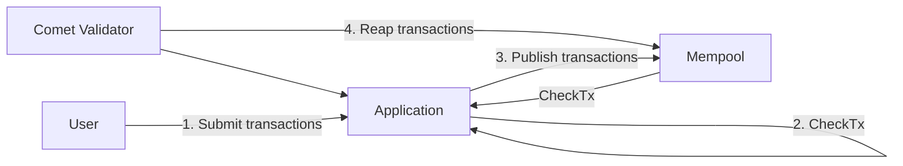
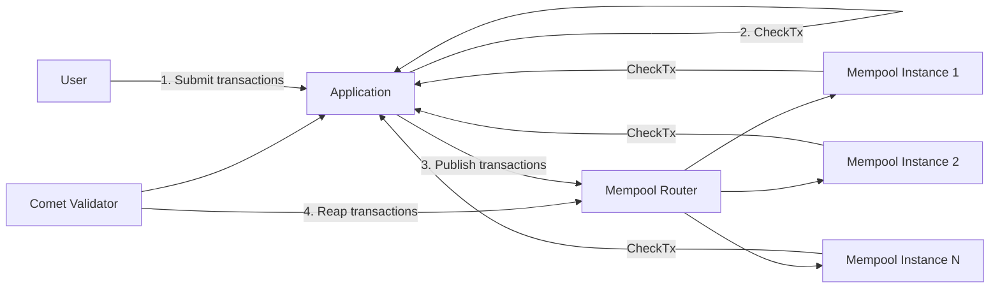

# ADR 110: Remote mempool

## Changelog

- 2023-11-13: Marked as rejected in favour of ADR 111 (@thanethomson)
- 2023-11-13: Updated with feedback (@thanethomson)
- 2023-11-04: Renamed ADR to "Remote mempool" instead of "External mempool" to
  align with gRPC service definition (@thanethomson)
- 2023-11-03: First draft (@thanethomson)

## Status

Rejected in favour of ADR 111

## Context

Over time it has become apparent that the generic mempool provided by Tendermint
Core and Comet is not sufficient to meet evolving application needs. In fact, it
appears as though the choice of what kind of mempool to use is inherently
application-specific. The mempool within Comet is also not scalable
independently of Comet, which can become a DoS vector for certain types of
networks (especially those that allow low- or zero-fee transactions).

As such, and as part of a broader effort to modularize Comet and separate
consensus- and application-related concerns, this ADR proposes a mechanism
whereby Comet can interact with an **external mempool**. This involves
implementing a mempool variant in Comet which is effectively just a client for
an external mempool process or set of processes.

This approach changes the way that validators obtain transactions, and implies
that full nodes are not necessary as sentries for receiving transactions (in
fact, in this model, full nodes are not intended to interact with the mempool at
all). DDoS mitigation mechanisms, however, are left to those who implement
remote mempools.

## Alternative Approaches

The current alternatives considered are:

1. Do nothing, which does not seem sustainable.
2. Extend ABCI to allow external processes direct access to the P2P layer of the
   consensus engine, as per [\#1112]. This, however, is a much more complex
   solution that will require more in-depth discussion and design prior to
   implementation, as it requires ABCI to allow for _bidirectional_ initiation
   of requests. This will also require substantial breaking changes to ABCI
   (primarily for remote applications, since a new transport layer will be
   required that allows bidirectional initiation of requests, as per [\#1117]).
3. Provide multiple mempool implementations. This does not seem feasible due to
   the varying requirements of different applications, including the possibility
   that different applications need different types of gossip protocols. It is
   unfeasible capacity-wise for the current CometBFT team to maintain different
   mempool implementations for specific applications, especially since this
   falls outside of the purview of maintaining public goods for the _entire_
   ecosystem as opposed to specific networks.

## Decision

N/A

## Detailed Design

### High-level architecture

#### Single-process mempool

The simplest possible architecture for a Comet validator with an external
mempool is as follows.



In this flow:

1. Users submit transactions directly to some form of RPC in the application. It
   is up to operators to secure this RPC endpoint and implement measures to
   prevent DDoS attacks.
2. The application validates incoming transactions internally in a similar way
   to how `CheckTx` currently works.
3. Transactions that the application deems valid are then sent to the mempool by
   the application, e.g. through some form of RPC mechanism. The mempool is then
   expected to propagate these transactions to the rest of the network using its
   own communication layer, independent of the CometBFT P2P layer.
4. During `PrepareProposal`, a Comet validator will reap transactions from the
   mempool by way of an RPC call.

Additionally, when transactions are received by a remote mempool instance from
foreign remote mempool instances, it is expected that the mempool instance will
send the transaction to the application for validation (similar to how `CheckTx`
currently functions) prior to inclusion.

#### Scalable mempool

The recommended high-level architecture for a modular Comet validator with an
externalized, scalable mempool, is as follows.



Here the interaction is the same as the simple variant discussed earlier, but
instead of interacting directly with the mempool, all interactions are with some
form of routing mechanism. For example, this could be a reverse proxy like nginx
configured to deliver requests to mempool instances in a round-robin fashion.

This configuration would be application-specific, and would need to be set up
correctly by the operator for the specific application.

### Configuration

The following change to the `config.toml` file is envisaged:

```toml
[mempool]
# The type of mempool for this CometBFT node to use.
#
# Valid types of mempools supported by CometBFT:
# - "local"  : Default clist mempool with flooding gossip protocol
# - "remote" : Remote mempool in a separate process
type = "remote"

#
# Configuration specific to the remote mempool. If mempool.type is not "remote",
# this section will be ignored.
#
# A remote mempool is only usable by a validator node. Turning on the remote
# mempool for a full node will simply disable any mempool-related functionality
# on that full node, and the full node will not interact with any mempool at
# all.
#
[mempool.remote]
# The base URL for the gRPC interface to the remote mempool.
url = "http://localhost:28880"

# The timeout for reaping (removing) transaction data after a block has been
# committed.
timeout_reap = "1s"

# The timeout for initiating the TxsAvailable call.
timeout_txs_available = "1s"
```

### RPC API

At the time of this writing, it is recommended to implement a gRPC-based RPC
standard for interacting with the remote mempool (which uses Protobuf encoding
over HTTP/2) because:

- gRPC, as a standard, is well-established and code generation technologies are
  widely available for many different programming languages, allowing mempool
  developers more flexibility in how they build those mempools.
- Comet is moving toward making more extensive use of gRPC in future.
- Load balancing technologies for HTTP/2 using reverse proxies such as nginx are
  relatively well-established, making routing of requests to scaled-out mempool
  clusters relatively straightforward.

An alternative here would be to implement a RESTful HTTP/3 API (using QUIC), but
HTTP/3 support in reverse proxies is still in its early stages. Such a protocol
can be considered in a future iteration of the interface if it provides
substantial performance/latency benefits.

The following gRPC API is proposed.

```protobuf
syntax = "proto3";
package tendermint.services.remote_mempool.v1;

// RemoteMempoolService is implemented by a remote mempool instance. A CometBFT
// validator makes use of a client generated from this interface definition to
// interact with the remote mempool.
//
// It is up to the implementer of the remote mempool to define transaction
// submission mechanisms/interfaces.
service RemoteMempoolService {
    // Fetch allows a CometBFT validator to obtain the next batch of
    // transactions to be included during PrepareProposal when the current node
    // is a proposer.
    rpc Fetch(FetchRequest) returns (FetchResponse);

    // Remove takes a set of transaction keys and removes the corresponding
    // transactions from the mempool.
    //
    // This will only be called after the block is committed by consensus.
    rpc Remove(RemoveRequest) returns (RemoveResponse);

    // TxsAvailable streams notifications back to the client that new
    // transactions are available in the mempool.
    //
    // The mempool is expected to stream a TxsAvailableResponse as it has
    // transactions available. A response, however, is only expected in two
    // cases:
    //
    // 1. Once for each newly encountered height (as supplied to the mempool via
    //    the Remove request).
    //
    // 2. Upon initiation of the TxsAvailable call. This caters for instances
    //    where the consensus engine may have failed and restarted.
    //
    // The consensus engine will only ever make one call to TxsAvailable and
    // will attempt to keep the connection alive.
    rpc TxsAvailable(TxsAvailableRequest) returns (stream TxsAvailableResponse);
}

message FetchRequest {
    // Fetch as many transactions as possible that cumulatively take up at most
    // this number of bytes. Setting this value to -1 implies no limit (this
    // implies that the remote mempool is fully in control of this value).
    int64 max_bytes = 1;
}

message FetchResponse {
    // Transactions to be included in the proposal.
    repeated bytes txs = 1;
}

message RemoveRequest {
    // The current height of the chain.
    uint64 height = 1;

    // A list of IDs of transactions to be removed from the mempool. At present
    // this is a list of SHA256 hashes of the transactions.
    repeated bytes tx_ids = 2;
}

message RemoveResponse {}

message TxsAvailableRequest {}

// TxsAvailableResponse is to be sent once upon initiation of the TxsAvailable
// request, as well as once for each new height, iff new transactions are
// available to be fetched by the consensus engine.
//
// If a TxsAvailableResponse is sent more than once per height, the consensus
// engine is expected to ignore the extra messages.
message TxsAvailableResponse {
    // Supplied for informational purposes to the consensus engine to indicate
    // the height seen by the mempool during the last call to Remove.
    uint64 last_reap_height = 1;
}
```

**Notes**:

- The terminology used in the gRPC interface is different to that used in the
  [`Mempool`] interface. The term "reap" technically implies removal from the
  mempool, but the [`Mempool`] interface incorrectly uses this term to imply
  fetching a batch of transactions. The combination of `Fetch` and `Remove` can
  be thought of as a "reap" operation.

- The gRPC interface purposefully does not facilitate limiting fetched
  transactions by gas in an effort to separate consensus- and
  application-related concerns (as per [RFC 011]). Should remote mempool
  developers want to limit returned transactions by gas, this should be
  implemented as part of the configuration of the remote mempool.

### Impact and properties

A new mempool that implements the [`Mempool`] interface will be created, and
when enabled it will have the following impacts/properties:

1. The mempool-related ABCI methods will not be called.
2. The following methods will do nothing:
   - `CheckTx`, since transaction validation is assumed to happen prior to
     transaction insertion in the mempool.
   - `FlushAppConn`, which is only relevant for use via ABCI.
   - `RemoveTxByKey`, which is only used in the callback in the context of ABCI.
   - `ReapMaxTxs`, which is only used internally and by the `unconfirmed_txs`
     RPC endpoint.
   - `Flush`, which is only ever used via the `unsafe_flush_mempool` RPC
     endpoint.
   - `Size` and `SizeBytes`, since these are only used for informational
     purposes in the RPC.
3. Reaping of transactions will result in network calls to the remote mempool
   instance.
4. The following RPC endpoints will be disabled, returning relevant errors when
   users attempt to call them:
   - `broadcast_tx_*`
   - `unconfirmed_txs`
   - `num_unconfirmed_txs`
   - `unsafe_flush_mempool`
5. All P2P-based transaction broadcast functionality will be disabled. It will
   be up to the mempool developer to implement connectivity to other mempool
   instances and the relevant broadcast/gossip mechanisms to disseminate
   incoming transactions.

### Startup and failure modes

- When a CometBFT-based validator starts up with `mempool.type` set to `remote`,
  it will expect to be able to connect to the remote mempool. If it cannot, it
  will log an error and continue retrying to connect.

- When a validator attempts to call any of the `Fetch` or `Remove` methods and
  the call fails for whatever reason, it will log an error.

- It must be kept in mind that transactions will persist in the mempool between
  CometBFT node restarts. This implies a different set of assumptions as
  compared to when using the default mempool, as when a node fails with the
  default mempool, the contents of the mempool are automatically flushed.

### Rollout plan

The remote mempool will initially land in CometBFT v1.0, and will potentially be
considered for backporting to the `v0.38.x-experimental` branch.

## Consequences

### Positive

- Application developers can provide their own mempools that live in a separate
  process to the validator in which they can implement properties that benefit
  their application specifically.
- Transactions can be submitted to processes outside of a validator without
  needing to run a full node or sentry, potentially reducing operational costs.
- Separating the mempool out into its own process, if the mempool is built
  correctly, can allow it to scale independently of the consensus engine.

### Negative

- Application developers would need to potentially build their own mempools,
  which involves a substantial amount of effort.
- In some cases, application-specific remote mempools would currently need to
  implement their own gossip mechanism (until an interface such as [\#1112] is
  available).

[\#1112]: https://github.com/cometbft/cometbft/discussions/1112
[\#1117]: https://github.com/cometbft/cometbft/issues/1117
[`Mempool`]: ../../mempool/mempool.go
[RFC 011]: ../rfc/tendermint-core/rfc-011-delete-gas.md
