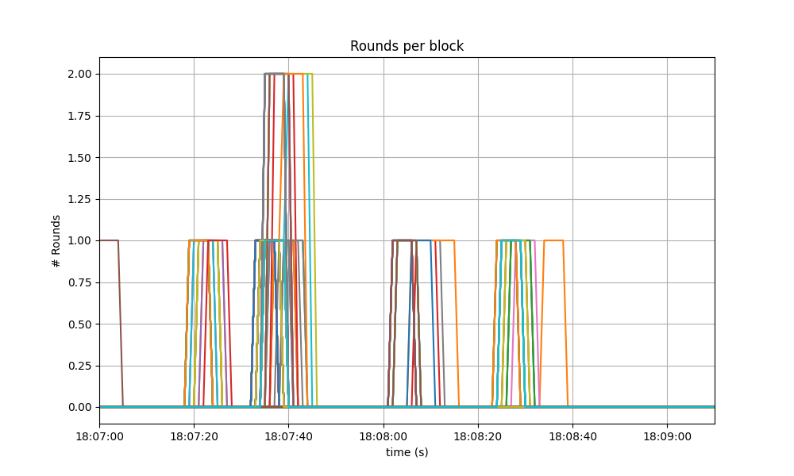
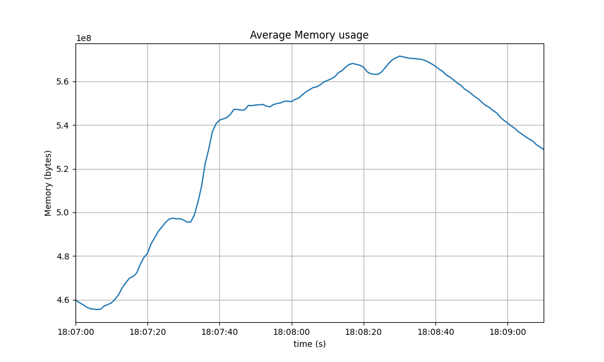

# CometBFT QA Results v0.34.x

## v0.34.x - From Tendermint Core to CometBFT

This section reports on the QA process we followed before releasing the first `v0.34.x` version
from our CometBFT repository.

The changes with respect to the last version of `v0.34.x`
(namely `v0.34.26`, released from the Informal Systems' Tendermint Core fork)
are minimal, and focus on rebranding our fork of Tendermint Core to CometBFT at places
where there is no substantial risk of breaking compatibility
with earlier Tendermint Core versions of `v0.34.x`.

Indeed, CometBFT versions of `v0.34.x` (`v0.34.27` and subsequent) should fulfill
the following compatibility-related requirements.

* Operators can easily upgrade a `v0.34.x` version of Tendermint Core to CometBFT.
* Upgrades from Tendermint Core to CometBFT can be uncoordinated for versions of the `v0.34.x` branch.
* Nodes running CometBFT must be interoperable with those running Tendermint Core in the same chain,
  as long as all are running a `v0.34.x` version.

These QA tests focus on the third bullet, whereas the first two bullets are tested using our _e2e tests_.

It would be prohibitively time consuming to test mixed networks of all combinations of existing `v0.34.x`
versions, combined with the CometBFT release candidate under test.
Therefore our testing focuses on the last Tendermint Core version (`v0.34.26`) and the CometBFT release
candidate under test.

We run the _200 node test_, but not the _rotating node test_. The effort of running the latter
is not justified given the amount and nature of the changes we are testing with respect to the
full QA cycle run previously on `v0.34.x`.
Since the changes to the system's logic are minimal, we are interested in these performance requirements:

* The CometBFT release candidate under test performs similarly to Tendermint Core (i.e., the baseline)
    * when used at scale (i.e., in a large network of CometBFT nodes)
    * when used at scale in a mixed network (i.e., some nodes are running CometBFT
      and others are running an older Tendermint Core version)

Therefore we carry out a complete run of the _200-node test_ on the following networks:

* A homogeneous 200-node testnet, where all nodes are running the CometBFT release candidate under test.
* A mixed network where 1/2 (99 out of 200) of the nodes are running the CometBFT release candidate under test,
  and the rest (101 out of 200) are running Tendermint Core `v0.34.26`.
* A mixed network where 1/3 (66 out of 200) of the nodes are running the CometBFT release candidate under test,
  and the rest (134 out of 200) are running Tendermint Core `v0.34.26`.
* A mixed network where 2/3 (133 out of 200) of the nodes are running the CometBFT release candidate under test,
  and the rest (67 out of 200) are running Tendermint Core `v0.34.26`.

## Configuration and Results
In the following sections we provide the results of the _200 node test_.
Each section reports the baseline results (for reference), the homogeneous network scenario (all CometBFT nodes),
and the mixed networks with 1/2, 1/3 and 2/3 of Tendermint Core nodes.

### Saturation Point

As the CometBFT release candidate under test has minimal changes
with respect to Tendermint Core `v0.34.26`, other than the rebranding changes,
we can confidently reuse the results from the `v0.34.x` baseline test regarding
the [saturation point](TMCore-QA-34.md#finding-the-saturation-point).

Therefore, we will simply use a load of (`r=200,c=2`)
(see the explanation [here](TMCore-QA-34.md#finding-the-saturation-point)) on all experiments.

We also include the baseline results for quick reference and comparison.

### Experiments

On each of the three networks, the test consists of 4 experiments, with the goal of
ensuring the data obtained is consistent across experiments.

On each of the networks, we pick only one representative run to present and discuss the
results.

## Examining latencies
For each network the figures plot the four experiments carried out with the network.
We can see that the latencies follow comparable patterns across all experiments.

Unique identifiers, UUID, for each execution are presented on top of each graph.
We refer to these UUID to indicate to the representative runs.

### CometBFT Homogeneous network

### 1/2 Tendermint Core - 1/2 CometBFT

### 1/3 Tendermint Core - 2/3 CometBFT

### 2/3 Tendermint Core - 1/3 CometBFT

## Prometheus Metrics

This section reports on the key Prometheus metrics extracted from the following experiments.

* Baseline results: `v0.34.x`, obtained in October 2022 and reported [here](TMCore-QA-34.md).
* CometBFT homogeneous network: experiment with UUID starting with `be8c`.
* Mixed network, 1/2 Tendermint Core `v0.34.26` and 1/2 running CometBFT: experiment with UUID starting with `04ee`.
* Mixed network, 1/3 Tendermint Core `v0.34.26` and 2/3 running CometBFT: experiment with UUID starting with `fc5e`.
* Mixed network, 2/3 Tendermint Core `v0.34.26` and 1/3 running CometBFT: experiment with UUID starting with `4759`.

We make explicit comparisons between the baseline and the homogenous setups, but refrain from
commenting on the mixed network experiment unless they show some exceptional results.

### Mempool Size

For each reported experiment we show two graphs.
The first shows the evolution over time of the cumulative number of transactions
inside all full nodes' mempools at a given time.

The second one shows the evolution of the average over all full nodes.

#### Baseline

#### CometBFT Homogeneous network

The results for the homogeneous network and the baseline are similar in terms of outstanding transactions.

#### 1/2 Tendermint Core - 1/2 CometBFT

#### 1/3 Tendermint Core - 2/3 CometBFT

#### 2/3 Tendermint Core - 1/3 CometBFT

### Consensus Rounds per Height

The following graphs show the rounds needed to complete each height and agree on a block.

A value of `0` shows that only one round was required (with id `0`), and a value of `1` shows that two rounds were required.

#### Baseline
We can see that round 1 is reached with a certain frequency.

#### CometBFT Homogeneous network

Most heights finished in round 0, some nodes needed to advance to round 1 at various moments,
and a few nodes even needed to advance to round 2 at one point.
This coincides with the time at which we observed the biggest peak in mempool size
on the corresponding plot, shown above.

#### 1/2 Tendermint Core - 1/2 CometBFT

#### 1/3 Tendermint Core - 2/3 CometBFT

#### 2/3 Tendermint Core - 1/3 CometBFT

### Peers

The following plots show how many peers a node had throughtout the experiment.

The thick red dashed line represents the moving average over a sliding window of 20 seconds.

#### Baseline

The following graph shows the that the number of peers was stable throughout the experiment.
Seed nodes typically have a higher number of peers.
The fact that non-seed nodes reach more than 50 peers is due to
[#9548](https://github.com/tendermint/tendermint/issues/9548).

#### CometBFT Homogeneous network

The results for the homogeneous network are very similar to the baseline.
The only difference being that the seed nodes seem to loose peers in the middle of the experiment.
However this cannot be attributed to the differences in the code, which are mainly rebranding.

#### 1/2 Tendermint Core - 1/2 CometBFT

#### 1/3 Tendermint Core - 2/3 CometBFT

#### 2/3 Tendermint Core - 1/3 CometBFT

As in the homogeneous case, there is some variation in the number of peers for some nodes.
These, however, do not affect the average.

### Blocks Produced per Minute, Transactions Processed per Minute

The following plot show the rate of block production and the rate of transactions delivered, throughout the experiments.

In both graphs, rates are calculated over a sliding window of 20 seconds.
The thick red dashed line show the rates' moving averages.

#### Baseline

The average number of blocks/minute oscilate between 10 and 40.

The number of transactions/minute tops around 30k.

#### CometBFT Homogeneous network

The plot showing the block production rate shows that the rate oscillates around 20 blocks/minute,
mostly within the same range as the baseline.

The plot showing the transaction rate shows the rate stays around 20000 transactions per minute,
also topping around 30k.

#### 1/2 Tendermint Core - 1/2 CometBFT

#### 1/3 Tendermint Core - 2/3 CometBFT

#### 2/3 Tendermint Core - 1/3 CometBFT

### Memory Resident Set Size

The following graphs show the Resident Set Size (RSS) of all monitored processes and the average value.

#### Baseline

#### CometBFT Homogeneous network

This is the plot for the homogeneous network, which is slightly more stable than the baseline over
the time of the experiment.

And this is the average plot. It oscillates around 560 MiB, which is noticeably lower than the baseline.

#### 1/2 Tendermint Core - 1/2 CometBFT

#### 1/3 Tendermint Core - 2/3 CometBFT

#### 2/3 Tendermint Core - 1/3 CometBFT

### CPU utilization

The following graphs show the `load1` of nodes, as typically shown in the first line of the Unix `top`
command, and their average value.

#### Baseline

#### CometBFT Homogeneous network

The load in the homogenous network is, similarly to the baseline case, below 5 and, therefore, normal.

As expected, the average plot also looks similar.

#### 1/2 Tendermint Core - 1/2 CometBFT

#### 1/3 Tendermint Core - 2/3 CometBFT

#### 2/3 Tendermint Core - 1/3 CometBFT

## Test Results

The comparison of the baseline results and the homogeneous case show that both scenarios had similar numbers and are therefore equivalent.

The mixed nodes cases show that networks operate normally with a mix of compatible Tendermint Core and CometBFT versions.
Although not the main goal, a comparison of metric numbers with the homogenous case and the baseline scenarios show similar results and therefore we can conclude that mixing compatible Tendermint Core and CometBFT introduces not performance degradation.

A conclusion of these tests is shown in the following table, along with the commit versions used in the experiments.

| Scenario | Date | Version | Result |
|--|--|--|--|
|CometBFT Homogeneous network | 2023-02-08 | 3b783434f26b0e87994e6a77c5411927aad9ce3f | Pass
|1/2 Tendermint Core   1/2 CometBFT | 2023-02-14 | CometBFT: 3b783434f26b0e87994e6a77c5411927aad9ce3f  Tendermint Core: 66c2cb63416e66bff08e11f9088e21a0ed142790 | Pass|
|1/3 Tendermint Core   2/3 CometBFT | 2023-02-08 | CometBFT: 3b783434f26b0e87994e6a77c5411927aad9ce3f  Tendermint Core: 66c2cb63416e66bff08e11f9088e21a0ed142790 | Pass|
|2/3 Tendermint Core   1/3 CometBFT | 2023-02-08 | CometBFT: 3b783434f26b0e87994e6a77c5411927aad9ce3f  Tendermint Core: 66c2cb63416e66bff08e11f9088e21a0ed142790  | Pass |
