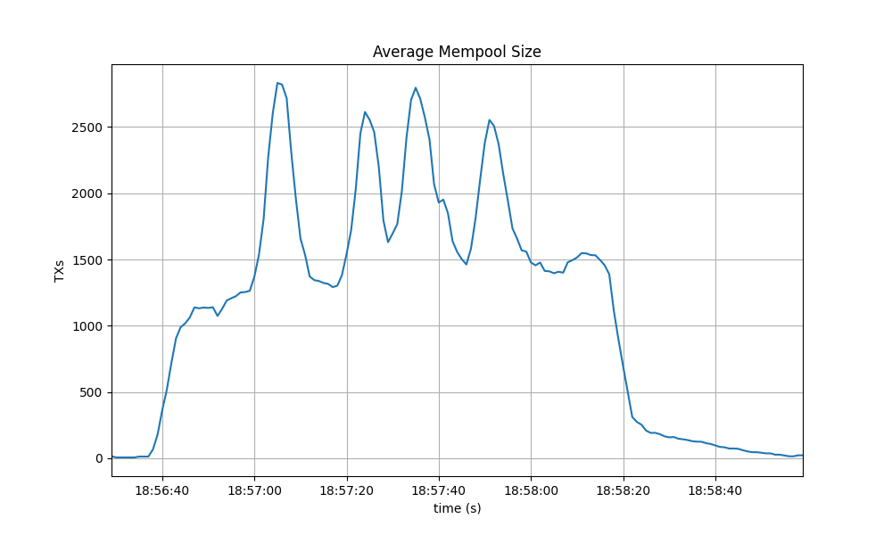
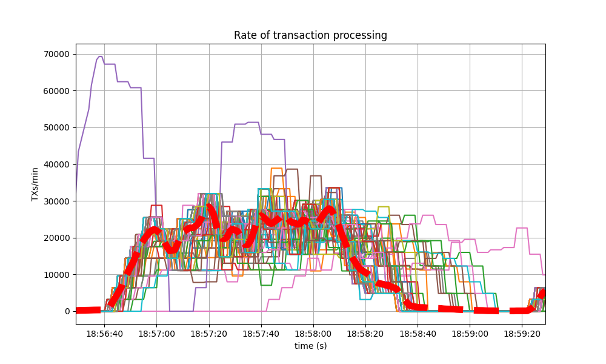

# CometBFT QA Results v0.38.x

This iteration of the QA was run on CometBFT `v0.38.0-alpha.2`, the second
`v0.38.x` version from the CometBFT repository.

The changes with respect to the baseline, `v0.37.0-alpha.3` from Feb 21, 2023,
include the introduction of the `FinalizeBlock` method to complete the full
range of ABCI++ functionality (ABCI 2.0), and other several improvements
described in the
[CHANGELOG](https://github.com/cometbft/cometbft/blob/v0.38.0-alpha.2/CHANGELOG.md).

## Issues discovered

* (critical, fixed) [\#539] and [\#546] - This bug causes the proposer to crash in
  `PrepareProposal` because it does not have extensions while it should.
  This happens mainly when the proposer was catching up.
* (critical, fixed) [\#562] - There were several bugs in the metrics-related
  logic that were causing panics when the testnets were started.

## 200 Node Testnet

As in other iterations of our QA process, we have used a 200-node network as
testbed, plus nodes to introduce load and collect metrics.

### Saturation point

As in previous iterations of our QA experiments, we first find the transaction
load on which the system begins to show a degraded performance. Then we run the
experiments with the system subjected to a load slightly under the saturation
point. The method to identify the saturation point is explained
[here](CometBFT-QA-34.md#saturation-point) and its application to the baseline
is described [here](TMCore-QA-37.md#finding-the-saturation-point). 

The following table summarizes the results for the different experiments
(extracted from
[`v038_report_tabbed.txt`](img38/200nodes/v038_report_tabbed.txt)). The X axis
(`c`) is the number of connections created by the load runner process to the
target node. The Y axis (`r`) is the rate or number of transactions issued per
second.

|        | c=1       | c=2       | c=4   |
| ------ | --------: | --------: | ----: |
| r=200  | 17800     | **33259** | 33259 |
| r=400  | **35600** | 41565     | 41384 |
| r=800  | 36831     | 38686     | 40816 |
| r=1600 | 40600     | 45034     | 39830 |

We can observe in the table that the system is saturated beyond the diagonal
defined by the entries `c=1,r=400` and `c=2,r=200`. Entries in the diagonal have
the same amount of transaction load, so we can consider them equivalent. For the
chosen diagonal, the expected number of processed transactions is `1 * 400 tx/s * 89 s = 35600`. 
(Note that we use 89 out of 90 seconds of the experiment because the last transaction batch
coincides with the end of the experiment and is thus not sent.) The experiments in the diagonal
below expect double that number, that is, `1 * 800 tx/s * 89 s = 71200`, but the
system is not able to process such load, thus it is saturated.

Therefore, for the rest of these experiments, we chose `c=1,r=400` as the
configuration. We could have chosen the equivalent `c=2,r=200`, which is the same
used in our baseline version, but for simplicity we decided to use the one with
only one connection.

Also note that, compared to the previous QA tests, we have tried to find the
saturation point within a higher range of load values for the rate `r`. In
particular we run tests with `r` equal to or above `200`, while in the previous
tests `r` was `200` or lower. In particular, for our baseline version we didn't
run the experiment on the configuration `c=1,r=400`.

For comparison, this is the table with the baseline version, where the
saturation point is beyond the diagonal defined by `r=200,c=2` and `r=100,c=4`.

|       | c=1   | c=2       | c=4       |
| ----- | ----: | --------: | --------: |
| r=25  | 2225  | 4450      | 8900      |
| r=50  | 4450  | 8900      | 17800     |
| r=100 | 8900  | 17800     | **35600** |
| r=200 | 17800 | **35600** | 38660     |

### Latencies

The following figure plots the latencies of the experiment carried out with the
configuration `c=1,r=400`.

.

For reference, the following figure shows the latencies of one of the
experiments for `c=2,r=200` in the baseline. 

As can be seen, in most cases the latencies are very similar, and in some cases,
the baseline has slightly higher latencies than the version under test. Thus,
from this small experiment, we can say that the latencies measured on the two
versions are equivalent, or at least that the version under test is not worse
than the baseline.

### Prometheus Metrics on the Chosen Experiment

This section further examines key metrics for this experiment extracted from
Prometheus data regarding the chosen experiment with configuration `c=1,r=400`.

#### Mempool Size

The mempool size, a count of the number of transactions in the mempool, was
shown to be stable and homogeneous at all full nodes. It did not exhibit any
unconstrained growth. The plot below shows the evolution over time of the
cumulative number of transactions inside all full nodes' mempools at a given
time.

The following picture shows the evolution of the average mempool size over all
full nodes, which mostly oscilates between 1000 and 2500 outstanding
transactions.

The peaks observed coincide with the moments when some nodes reached round 1 of
consensus (see below).

The behavior is similar to the observed in the baseline, presented next.

#### Peers

The number of peers was stable at all nodes. It was higher for the seed nodes
(around 140) than for the rest (between 20 and 70 for most nodes). The red
dashed line denotes the average value.

Just as in the baseline, shown next, the fact that non-seed nodes reach more
than 50 peers is due to [\#9548].

#### Consensus Rounds per Height

Most heights took just one round, that is, round 0, but some nodes needed to
advance to round 1.

The following specific run of the baseline required some nodes to reach round 1.

#### Blocks Produced per Minute, Transactions Processed per Minute

The following plot shows the rate in which blocks were created, from the point
of view of each node. That is, it shows when each node learned that a new block
had been agreed upon.

For most of the time when load was being applied to the system, most of the
nodes stayed around 20 blocks/minute.

The spike to more than 100 blocks/minute is due to a slow node catching up.

The baseline experienced a similar behavior.

The collective spike on the right of the graph marks the end of the load
injection, when blocks become smaller (empty) and impose less strain on the
network. This behavior is reflected in the following graph, which shows the
number of transactions processed per minute.

The following is the transaction processing rate of the baseline, which is
similar to above.

#### Memory Resident Set Size

The following graph shows the Resident Set Size of all monitored processes, with
maximum memory usage of 1.6GB, slightly lower than the baseline shown after.

A similar behavior was shown in the baseline, with even a slightly higher memory
usage.

The memory of all processes went down as the load is removed, showing no signs
of unconstrained growth.

#### CPU utilization

##### Comparison to baseline

The best metric from Prometheus to gauge CPU utilization in a Unix machine is
`load1`, as it usually appears in the [output of
`top`](https://www.digitalocean.com/community/tutorials/load-average-in-linux).

The load is contained below 5 on most nodes, as seen in the following graph.

The baseline had a similar behavior.

##### Impact of vote extension signature verification

It is important to notice that the baseline (`v0.37.x`) does not implement vote extensions,
whereas the version under test (`v0.38.0-alpha.2`) _does_ implement them, and they are
configured to be activated since height 1.
The e2e application used in these tests verifies all received vote extension signatures (up to 175)
twice per height: upon `PrepareProposal` (for sanity) and upon `ProcessProposal` (to demonstrate how
real applications can do it).

The fact that there is no noticeable difference in the CPU utilization plots of
the baseline and `v0.38.0-alpha.2` means that re-verifying up 175 vote extension signatures twice
(besides the initial verification done by CometBFT when receiving them from the network)
has no performance impact in the current version of the system: the bottlenecks are elsewhere.
Thus, we should focus on optimizing other parts of the system: the ones that cause the current
bottlenecks (mempool gossip duplication, leaner proposal structure, optimized consensus gossip).

### Test Results

The comparison against the baseline results show that both scenarios had similar
numbers and are therefore equivalent.

A conclusion of these tests is shown in the following table, along with the
commit versions used in the experiments.

| Scenario | Date       | Version                                                    | Result |
| -------- | ---------- | ---------------------------------------------------------- | ------ |
| 200-node | 2023-05-21 | v0.38.0-alpha.2 (1f524d12996204f8fd9d41aa5aca215f80f06f5e) | Pass   |

## Rotating Node Testnet

We use `c=1,r=400` as load, which can be considered a safe workload, as it was close to (but below)
the saturation point in the 200 node testnet. This testnet has less nodes (10 validators and 25 full nodes).

Importantly, the baseline considered in this section is `v0.37.0-alpha.2` (Tendermint Core),
which is **different** from the one used in the [previous section](#200-node-testbed).
The reason is that this testnet was not re-tested for `v0.37.0-alpha.3` (CometBFT),
since it was not deemed necessary.

Unlike in the baseline tests, the version of CometBFT used for these tests is _not_ affected by [\#9539],
which was fixed right after having run rotating testnet for `v0.37`.
As a result, the load introduced in this iteration of the test is higher as transactions do not get rejected.

### Latencies

The plot of all latencies can be seen here.

Which is similar to the baseline.

The average increase of about 1 second with respect to the baseline is due to the higher
transaction load produced (remember the baseline was affected by [\#9539], whereby most transactions
produced were rejected by `CheckTx`).

### Prometheus Metrics

The set of metrics shown here roughly match those shown on the baseline (`v0.37`) for the same experiment.
We also show the baseline results for comparison.

#### Blocks and Transactions per minute

This following plot shows the blocks produced per minute.

This is similar to the baseline, shown below.

The following plot shows only the heights reported by ephemeral nodes, both when they were blocksyncing
and when they were running consensus.
The second plot is the baseline plot for comparison. The baseline lacks the heights when the nodes were
blocksyncing as that metric was implemented afterwards.

We seen that heights follow a similar pattern in both plots: they grow in length as the experiment advances.

The following plot shows the transactions processed per minute.

For comparison, this is the baseline plot.

We can see the rate is much lower in the baseline plot.
The reason is that the baseline was affected by [\#9539], whereby `CheckTx` rejected most transactions
produced by the load runner.

#### Peers

The plot below shows the evolution of the number of peers throughout the experiment.

This is the baseline plot, for comparison.

The plotted values and their evolution are comparable in both plots.

For further details on these plots, see the [this section](./TMCore-QA-34.md#peers-1).

#### Memory Resident Set Size

The average Resident Set Size (RSS) over all processes is notably bigger on `v0.38.0-alpha.2` than on the baseline.
The reason for this is, again, the fact that `CheckTx` was rejecting most transactions submitted on the baseline
and therefore the overall transaction load was lower on the baseline.
This is consistent with the difference seen in the transaction rate plots
in the [previous section](#blocks-and-transactions-per-minute).

#### CPU utilization

The plots show metric `load1` for all nodes for `v0.38.0-alpha.2` and for the baseline.

In both cases, it is contained under 5 most of the time, which is considered normal load.
The load seems to be more important on `v0.38.0-alpha.2` on average because of the bigger
number of transactions processed per minute as compared to the baseline.

### Test Result

| Scenario | Date       | Version                                                    | Result |
| -------- | ---------- | ---------------------------------------------------------- | ------ |
| Rotating | 2023-05-23 | v0.38.0-alpha.2 (e9abb116e29beb830cf111b824c8e2174d538838) | Pass   |

[\#9539]: https://github.com/tendermint/tendermint/issues/9539
[\#9548]: https://github.com/tendermint/tendermint/issues/9548
[\#539]: https://github.com/cometbft/cometbft/issues/539
[\#546]: https://github.com/cometbft/cometbft/issues/546
[\#562]: https://github.com/cometbft/cometbft/issues/562
