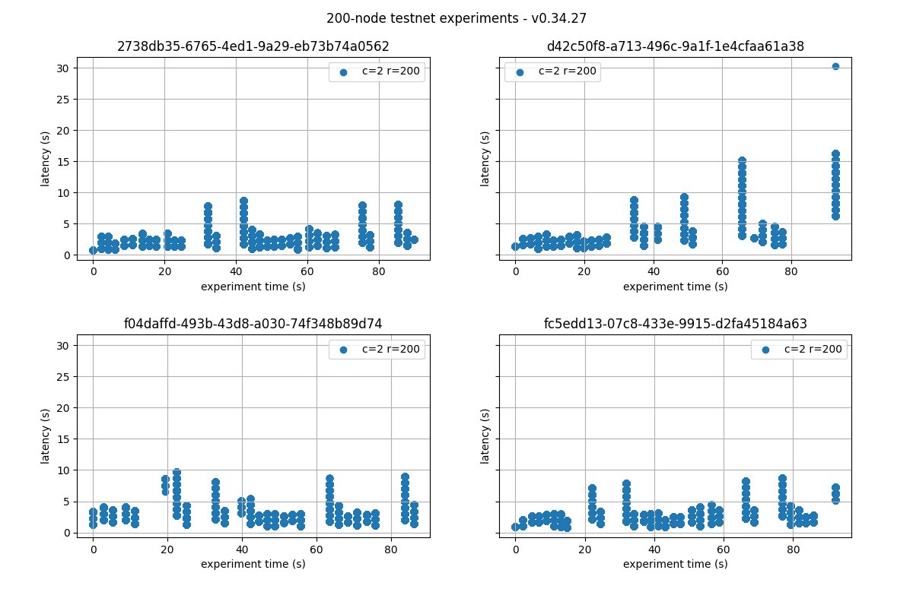
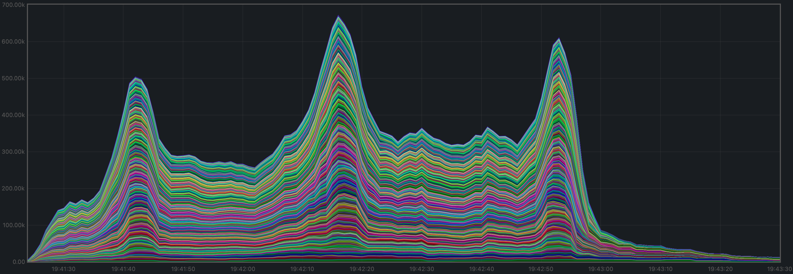
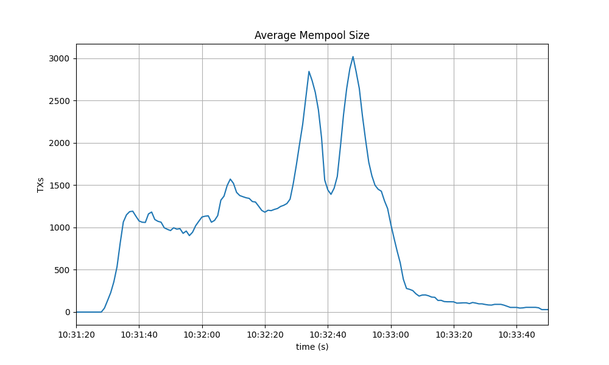
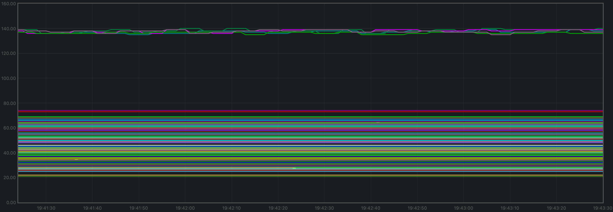
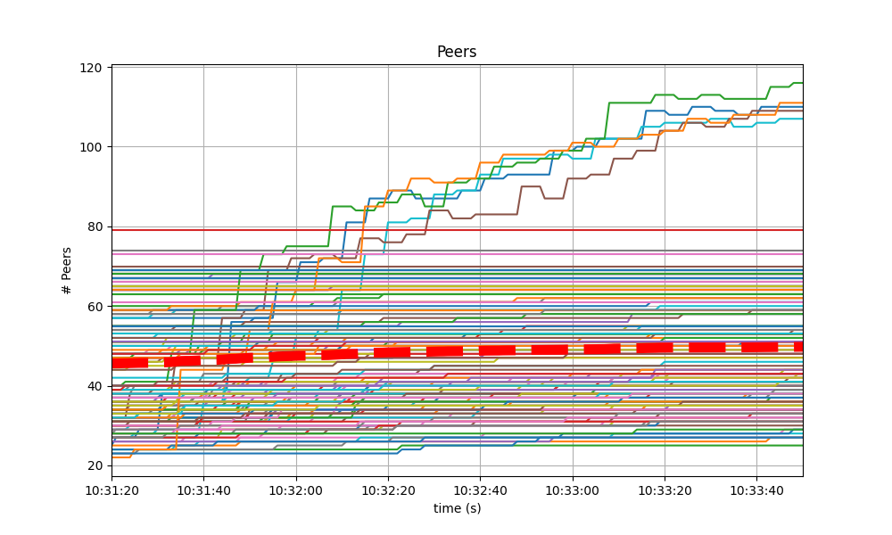
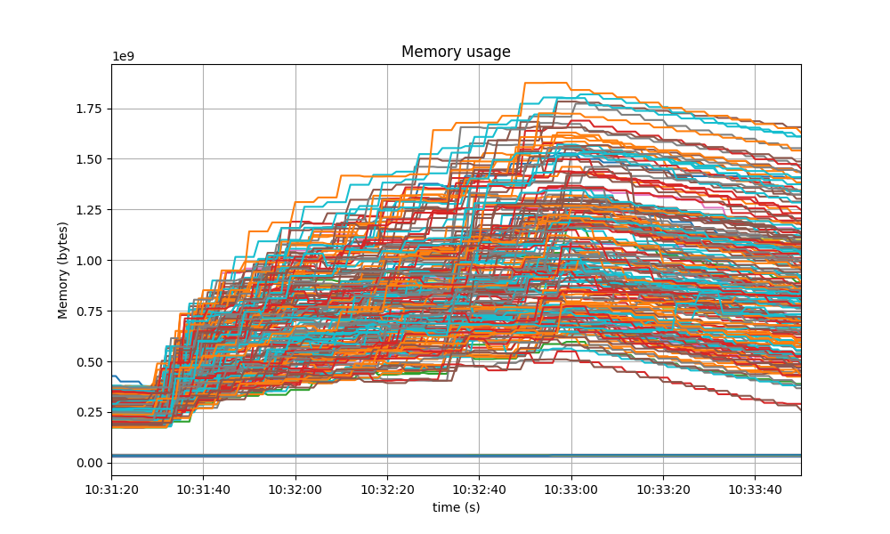
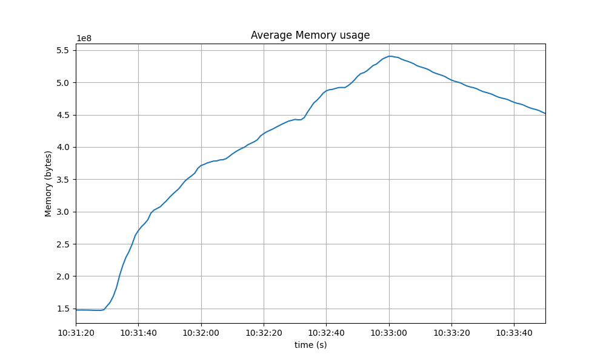
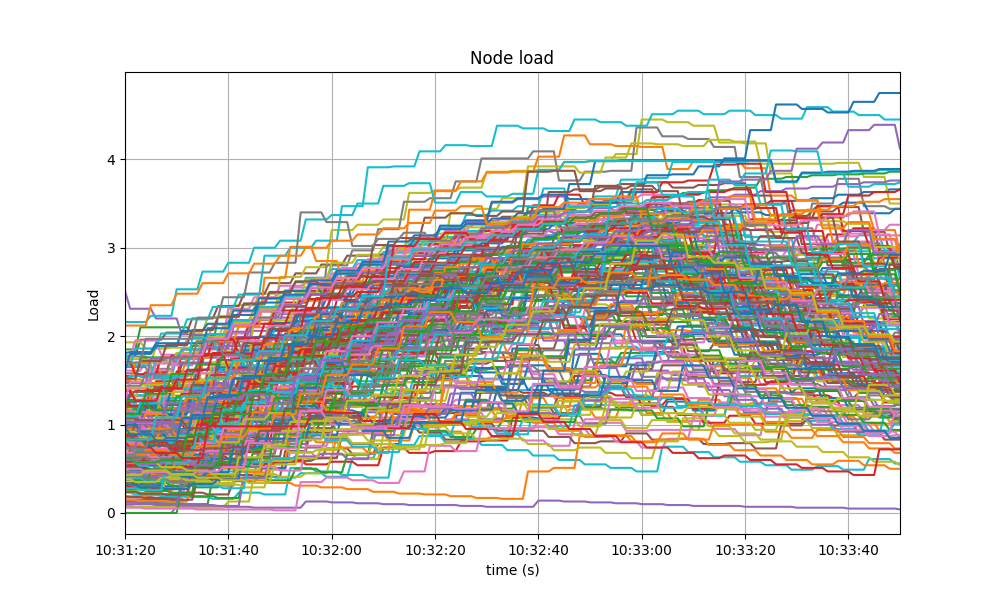

# v0.34.x - From Tendermint Core to CometBFT

This section reports on the QA process we followed before releasing the first `v0.34.x` version
from our CometBFT repository.

The changes with respect to the last version of `v0.34.x`
(namely `v0.34.26`, released from the Informal Systems' Tendermint Core fork)
are minimal, and focus on rebranding our fork of Tendermint Core to CometBFT at places
where there is no substantial risk of breaking compatibility
with earlier Tendermint Core versions of `v0.34.x`.

Indeed, CometBFT versions of `v0.34.x` (`v0.34.27` and subsequent) should fulfill
the following compatibility-related requirements.

* Operators can easily upgrade a `v0.34.x` version of Tendermint Core to CometBFT.
* Upgrades from Tendermint Core to CometBFT can be uncoordinated for versions of the `v0.34.x` branch.
* Nodes running CometBFT must be interoperable with those running Tendermint Core in the same chain,
  as long as all are running a `v0.34.x` version.

These QA tests focus on the third bullet, whereas the first two bullets are tested using our _e2e tests_.

It would be prohibitively time consuming to test mixed networks of all combinations of existing `v0.34.x`
versions, combined with the CometBFT release candidate under test.
Therefore our testing focuses on the last Tendermint Core version (`v0.34.26`) and the CometBFT release
candidate under test.

We only run the _200 node test_, and not the _rotating node test_. The effort of running the latter
is not justified given the amount and nature of the changes we are testing with respect to the
full QA cycle run previously on `v0.34.x`.
Since the changes to the system's logic are minimal, we are interested in these performance requirements:

* The CometBFT release candidate under test performs similarly to Tendermint Core (i.e., the baseline)
    * when used at scale (i.e., in a large network of CometBFT nodes)
    * when used at scale in a mixed network (i.e., some nodes are running CometBFT
      and others are running an older Tendermint Core version)

Therefore we carry out a complete run of the _200-node test_ on the following networks:

* A homogeneous 200-node testnet, where all nodes are running the CometBFT release candidate under test.
* A mixed network where 1/3 of the nodes are running the CometBFT release candidate under test,
  and the rest are running Tendermint Core `v0.34.26`.
* A mixed network where 2/3 of the nodes are running the CometBFT release candidate under test,
  and the rest are running Tendermint Core `v0.34.26`.

## Saturation Point

As the CometBFT release candidate under test has minimal changes
with respect to Tendermint Core `v0.34.26`, other than the rebranding changes,
we can confidently reuse the results from the `v0.34.x` baseline test regarding
the [saturation point](#finding-the-saturation-point).

Therefore, we will simply use a load of `r=200,c=2`
(see the explanation [here](#finding-the-saturation-point)).

## Examining latencies

In this section and the remaining, we provide the results of the _200 node test_.
Each section is divided into three parts,
reporting on the homogeneous network (all CometBFT nodes),
mixed network with 1/3 of Tendermint Core nodes,
and mixed network with 2/3 of Tendermint Core nodes.

On each of the three networks, the test consists of 4 experiments, with the goal
ensuring the data obtained is consistent across experiments.
On each of the networks, we pick only one representative run to present and discuss the results.

### CometBFT Homogeneous network

The figure below plots the four experiments carried out with this network.
We can see that the latencies follow a comparable pattern across experiments.

### 1/3 Tendermint Core - 2/3 CometBFT

### 2/3 Tendermint Core - 1/3 CometBFT

{width=250}

## Prometheus Metrics

This section reports on the key prometheus metrics extracted from the experiments.

* For the CometBFT homogeneous network, we choose to present the
  experiment with UUID starting with `be8c` (see the latencies section above),
  as its latency data is representative,
  and   it contains the maximum latency of all runs (worst case scenario).
* For the mixed network with 1/3 of nodes running Tendermint Core `v0.34.26`
  and 2/3 running CometBFT.
  TODO
* For the mixed network with 2/3 of nodes running Tendermint Core `v0.34.26`
  and 1/3 running CometBFT.
  TODO

### Mempool Size

For reference, the plots below correspond to the baseline results.
The first shows the evolution over time of the cumulative number of transactions
inside all full nodes' mempools at a given time.

The second one shows evolution of the average over all full nodes, which oscillates between 1500 and 2000
outstanding transactions.

#### CometBFT Homogeneous network

The mempool size was as stable at all full nodes as in the baseline.
These are the corresponding plots for the homogeneous network test.

#### 1/3 Tendermint Core - 2/3 CometBFT

#### 2/3 Tendermint Core - 1/3 CometBFT

### Peers

The plot below corresponds to the baseline results, for reference.
It shows the stability of peers throughout the experiment.
Seed nodes typically have a higher number of peers.
The fact that non-seed nodes reach more than 50 peers is due to
[#9548](https://github.com/tendermint/tendermint/issues/9548).

#### CometBFT Homogeneous network

The plot below shows the result for the homogeneous network.
It is very similar to the baseline. The only difference being that
the seed nodes seem to loose peers in the middle of the experiment.
However this cannot be attributed to the differences in the code,
which are mainly rebranding.

#### 1/3 Tendermint Core - 2/3 CometBFT

#### 2/3 Tendermint Core - 1/3 CometBFT

### Consensus Rounds per Height

TODO Move this under mempool as we refer to it

For reference, this is the baseline plot.

#### CometBFT Homogeneous network

Most heights took just one round, some nodes needed to advance to round 1 at various moments,
and a few nodes even needed to advance to the third round at one point.
This coincides with the time at which we observed the biggest peak in mempool size
on the corresponding plot, shown above.

#### 1/3 Tendermint Core - 2/3 CometBFT

#### 2/3 Tendermint Core - 1/3 CometBFT

### Blocks Produced per Minute, Transactions Processed per Minute

The following plot shows the rate of block creation, with a sliding window of 20 seconds,
throughout the experiment.

The next plot is the rate of transactions delivered, with a sliding window of 20 seconds,
throughout the experiment.

Both plots correspond to the baseline results.

#### CometBFT Homogeneous network

The plot for the homogeneous network shows the rate oscillates around 20 blocks/minute.

The plot showing the transaction rate shows the rate stays around 20000 transactions per minute.

#### 1/3 Tendermint Core - 2/3 CometBFT

Height rate

Transaction rate

#### 2/3 Tendermint Core - 1/3 CometBFT

In two minutes the height goes from 32 to 90 which gives an average of 29 blocks per minutes.

In 1 minutes and 30 seconds the system processes 35600 transactions which amounts to 23000 transactions per minute.

### Memory Resident Set Size

Reference plot for Resident Set Size (RSS) of all monitored processes.

And this is the baseline average plot.

#### CometBFT Homogeneous network

This is the plot for the homogeneous network, which slightly more stable than the baseline over
the time of the experiment.

And this is the average plot. It oscillates around 560 MiB, which is noticeably lower than the baseline.

#### 1/3 Tendermint Core - 2/3 CometBFT

Here

#### 2/3 Tendermint Core - 1/3 CometBFT

### CPU utilization

This is the baseline `load1` plot, for reference.

#### CometBFT Homogeneous network

Similarly to the baseline, it is contained in most cases below 5.

#### 1/3 Tendermint Core - 2/3 CometBFT

Total

Average

#### 2/3 Tendermint Core - 1/3 CometBFT

Average

## Test Results

| Scenario | Date | Version | Result |
|--|--|--|--|
|CometBFT Homogeneous network | 2023-02-08 | 3b783434f26b0e87994e6a77c5411927aad9ce3f | Pass
|1/3 Tendermint Core   2/3 CometBFT | 2023-02-08 | CometBFT: 3b783434f26b0e87994e6a77c5411927aad9ce3f  Tendermint Core: 66c2cb63416e66bff08e11f9088e21a0ed142790 | Pass|
|2/3 Tendermint Core   1/3 CometBFT | 2023-02-08 | CometBFT: 3b783434f26b0e87994e6a77c5411927aad9ce3f  Tendermint Core: 66c2cb63416e66bff08e11f9088e21a0ed142790  | Pass |
