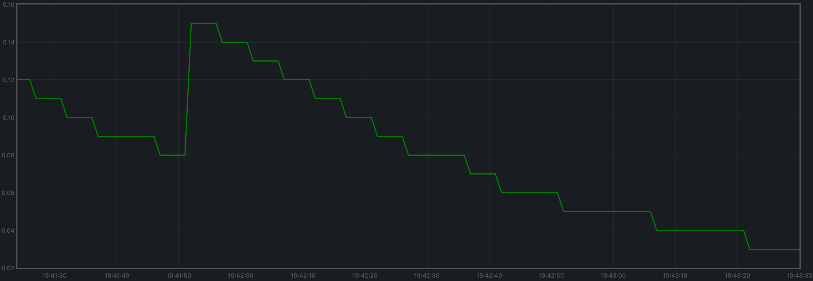
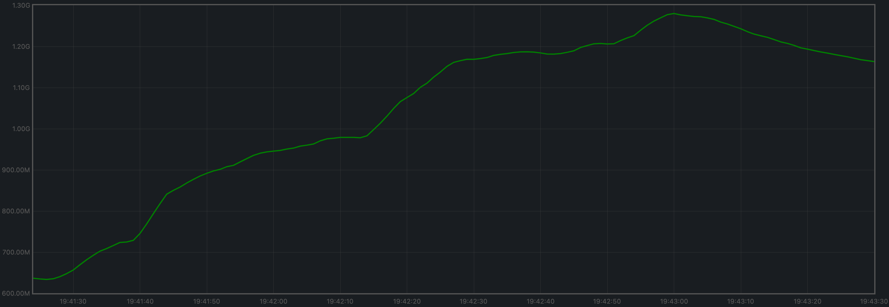
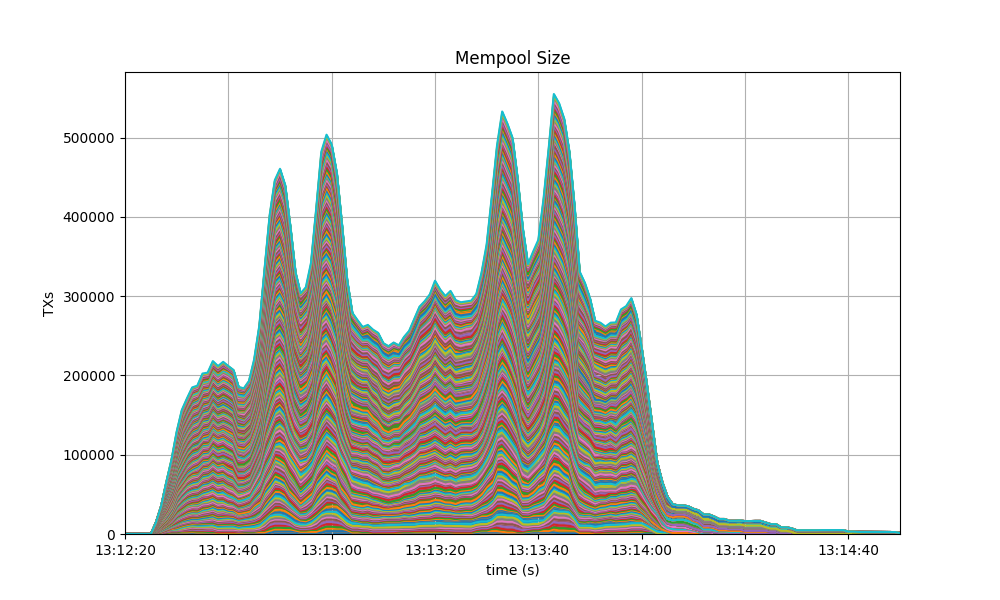
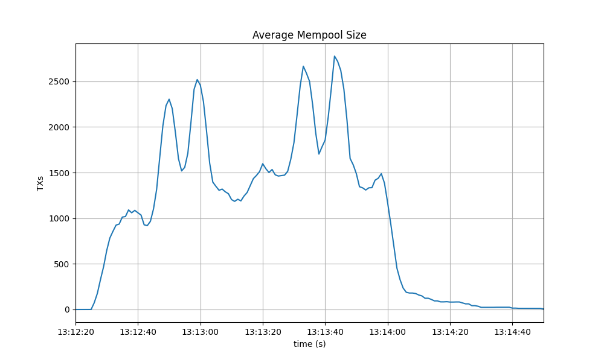
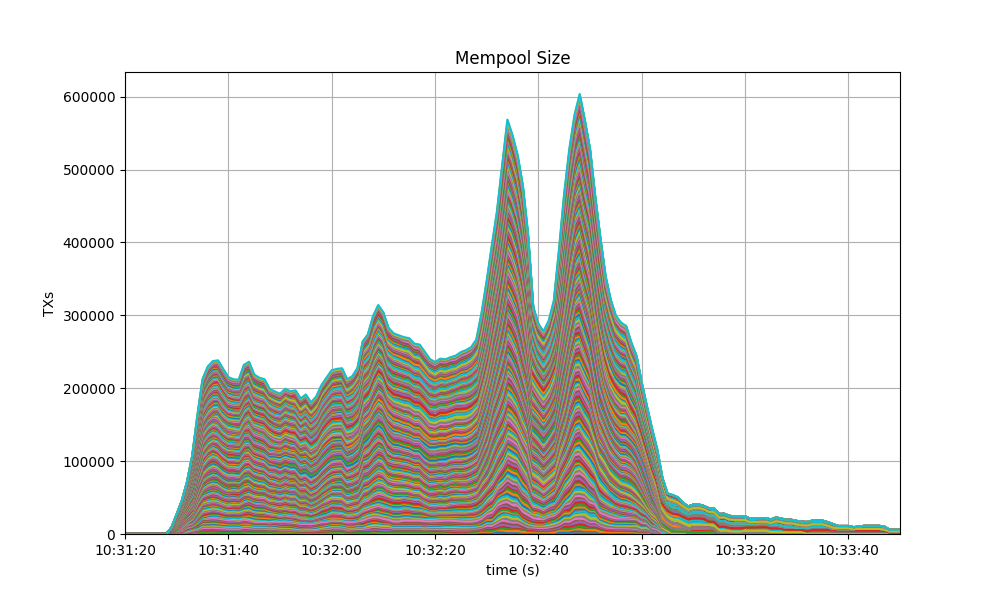
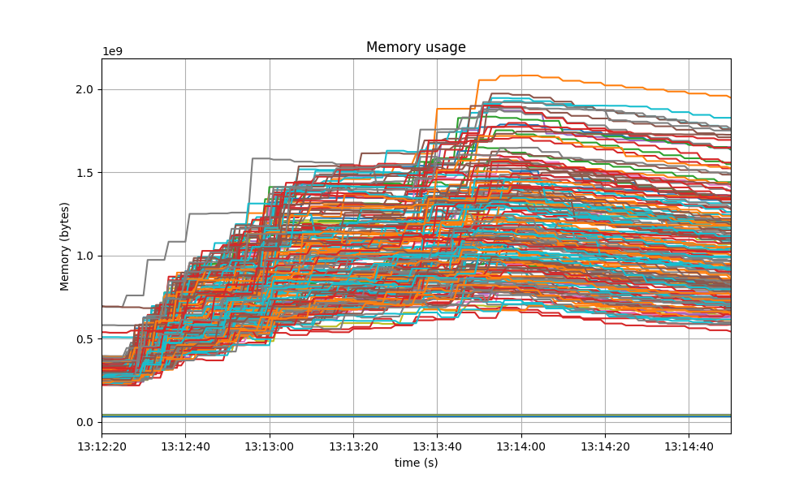
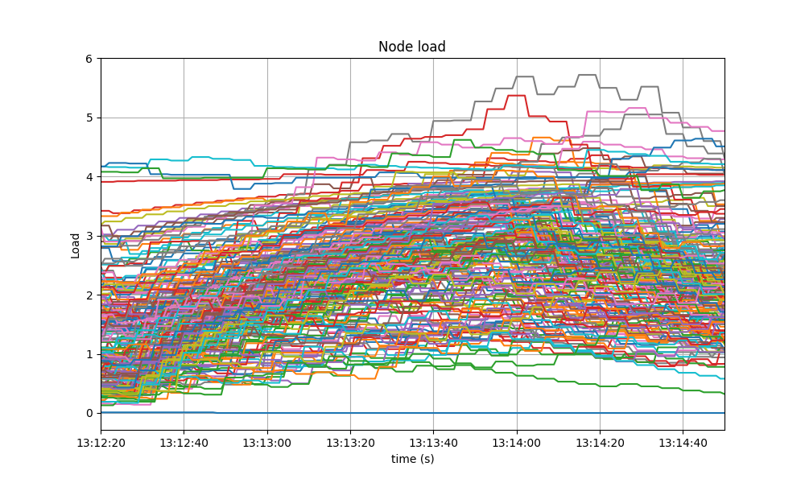
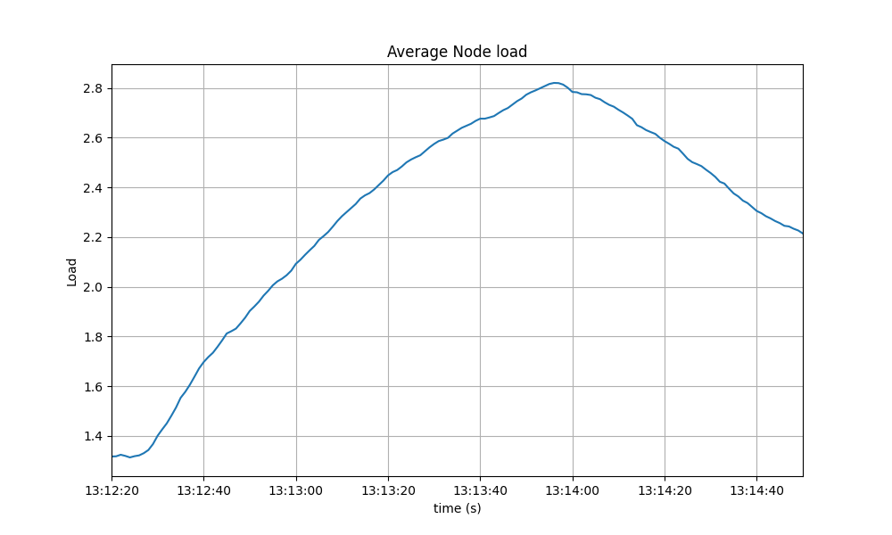

# v0.34.x

## 200 Node Testnet

### Finding the Saturation Point

The first goal when examining the results of the tests is identifying the saturation point.
The saturation point is a setup with a transaction load big enough to prevent the testnet
from being stable: the load runner tries to produce slightly more transactions than can
be processed by the testnet.

The following table summarizes the results for v0.34.x, for the different experiments
(extracted from file [`v034_report_tabbed.txt`](./img/v034_report_tabbed.txt)).

The X axis of this table is `c`, the number of connections created by the load runner process to the target node.
The Y axis of this table is `r`, the rate or number of transactions issued per second.

|        |  c=1  |  c=2  |  c=4  |
| :---   | ----: | ----: | ----: |
| r=25   |  2225 | 4450  | 8900  |
| r=50   |  4450 | 8900  | 17800 |
| r=100  |  8900 | 17800 | 35600 |
| r=200  | 17800 | 35600 | 38660 |

The table shows the number of 1024-byte-long transactions that were produced by the load runner,
and processed by CometBFT, during the 90 seconds of the experiment's duration.
Each cell in the table refers to an experiment with a particular number of websocket connections (`c`)
to a chosen validator, and the number of transactions per second that the load runner
tries to produce (`r`). Note that the overall load that the tool attempts to generate is $c \cdot r$.

We can see that the saturation point is beyond the diagonal that spans cells

* `r=200,c=2`
* `r=100,c=4`

given that the total transactions should be close to the product of the rate, the number of connections,
and the experiment time (89 seconds, since the last batch never gets sent).

All experiments below the saturation diagonal (`r=200,c=4`) have in common that the total
number of transactions processed is noticeably less than the product $c \cdot r \cdot 89$,
which is the expected number of transactions when the system is able to deal well with the
load.
With `r=200,c=4`, we obtained 38660 whereas the theoretical number of transactions should
have been $200 \cdot 4 \cdot 89 = 71200$.

At this point, we chose an experiment at the limit of the saturation diagonal,
in order to further study the performance of this release.
**The chosen experiment is `r=200,c=2`**.

This is a plot of the CPU load (average over 1 minute, as output by `top`) of the load runner for `r=200,c=2`,
where we can see that the load stays close to 0 most of the time.

### Examining latencies

The method described [here](../method.md) allows us to plot the latencies of transactions
for all experiments.

As we can see, even the experiments beyond the saturation diagonal managed to keep
transaction latency stable (i.e. not constantly increasing).
Our interpretation for this is that contention within CometBFT was propagated,
via the websockets, to the load runner,
hence the load runner could not produce the target load, but a fraction of it.

Further examination of the Prometheus data (see below), showed that the mempool contained many transactions
at steady state, but did not grow much without quickly returning to this steady state. This demonstrates
that the transactions were able to be processed by the CometBFT network at least as quickly as they
were submitted to the mempool. Finally, the test script made sure that, at the end of an experiment, the
mempool was empty so that all transactions submitted to the chain were processed.

Finally, the number of points present in the plot appears to be much less than expected given the
number of transactions in each experiment, particularly close to or above the saturation diagonal.
This is a visual effect of the plot; what appear to be points in the plot are actually potentially huge
clusters of points. To corroborate this, we have zoomed in the plot above by setting (carefully chosen)
tiny axis intervals. The cluster shown below looks like a single point in the plot above.

The plot of latencies can we used as a baseline to compare with other releases.

The following plot summarizes average latencies versus overall throughputs
across different numbers of WebSocket connections to the node into which
transactions are being loaded.

### Prometheus Metrics on the Chosen Experiment

As mentioned [above](#finding-the-saturation-point), the chosen experiment is `r=200,c=2`.
This section further examines key metrics for this experiment extracted from Prometheus data.

#### Mempool Size

The mempool size, a count of the number of transactions in the mempool, was shown to be stable and homogeneous
at all full nodes. It did not exhibit any unconstrained growth.
The plot below shows the evolution over time of the cumulative number of transactions inside all full nodes' mempools
at a given time.
The two spikes that can be observed correspond to a period where consensus instances proceeded beyond the initial round
at some nodes.

The plot below shows evolution of the average over all full nodes, which oscillates between 1500 and 2000
outstanding transactions.

The peaks observed coincide with the moments when some nodes proceeded beyond the initial round of consensus (see below).

#### Peers

The number of peers was stable at all nodes.
It was higher for the seed nodes (around 140) than for the rest (between 21 and 74).
The fact that non-seed nodes reach more than 50 peers is due to #9548.

#### Consensus Rounds per Height

Most heights took just one round, but some nodes needed to advance to round 1 at some point.

#### Blocks Produced per Minute, Transactions Processed per Minute

The blocks produced per minute are the slope of this plot.

Over a period of 2 minutes, the height goes from 530 to 569.
This results in an average of 19.5 blocks produced per minute.

The transactions processed per minute are the slope of this plot.

Over a period of 2 minutes, the total goes from 64525 to 100125 transactions,
resulting in 17800 transactions per minute. However, we can see in the plot that
all transactions in the load are processed long before the two minutes.
If we adjust the time window when transactions are processed (approx. 105 seconds),
we obtain 20343 transactions per minute.

#### Memory Resident Set Size

Resident Set Size of all monitored processes is plotted below.

The average over all processes oscillates around 1.2 GiB and does not demonstrate unconstrained growth.

#### CPU utilization

The best metric from Prometheus to gauge CPU utilization in a Unix machine is `load1`,
as it usually appears in the
[output of `top`](https://www.digitalocean.com/community/tutorials/load-average-in-linux).

It is contained in most cases below 5, which is generally considered acceptable load.

### Test Result

**Result: N/A** (v0.34.x is the baseline)

Date: 2022-10-14

Version: 3ec6e424d6ae4c96867c2dcf8310572156068bb6

## Rotating Node Testnet

For this testnet, we will use a load that can safely be considered below the saturation
point for the size of this testnet (between 13 and 38 full nodes): `c=4,r=800`.

N.B.: The version of CometBFT used for these tests is affected by #9539.
However, the reduced load that reaches the mempools is orthogonal to functionality
we are focusing on here.

### Latencies

The plot of all latencies can be seen in the following plot.

We can observe there are some very high latencies, towards the end of the test.
Upon suspicion that they are duplicate transactions, we examined the latencies
raw file and discovered there are more than 100K duplicate transactions.

The following plot shows the latencies file where all duplicate transactions have
been removed, i.e., only the first occurrence of a duplicate transaction is kept.

This problem, existing in `v0.34.x`, will need to be addressed, perhaps in the same way
we addressed it when running the 200 node test with high loads: increasing the `cache_size`
configuration parameter.

### Prometheus Metrics

The set of metrics shown here are less than for the 200 node experiment.
We are only interested in those for which the catch-up process (blocksync) may have an impact.

#### Blocks and Transactions per minute

Just as shown for the 200 node test, the blocks produced per minute are the gradient of this plot.

Over a period of 5229 seconds, the height goes from 2 to 3638.
This results in an average of 41 blocks produced per minute.

The following plot shows only the heights reported by ephemeral nodes
(which are also included in the plot above). Note that the _height_ metric
is only showed _once the node has switched to consensus_, hence the gaps
when nodes are killed, wiped out, started from scratch, and catching up.

The transactions processed per minute are the gradient of this plot.

The small lines we see periodically close to `y=0` are the transactions that
ephemeral nodes start processing when they are caught up.

Over a period of 5229 minutes, the total goes from 0 to 387697 transactions,
resulting in 4449 transactions per minute. We can see some abrupt changes in
the plot's gradient. This will need to be investigated.

#### Peers

The plot below shows the evolution in peers throughout the experiment.
The periodic changes observed are due to the ephemeral nodes being stopped,
wiped out, and recreated.

The validators' plots are concentrated at the higher part of the graph, whereas the ephemeral nodes
are mostly at the lower part.

#### Memory Resident Set Size

The average Resident Set Size (RSS) over all processes seems stable, and slightly growing toward the end.
This might be related to the increased in transaction load observed above.

The memory taken by the validators and the ephemeral nodes (when they are up) is comparable.

#### CPU utilization

The plot shows metric `load1` for all nodes.

It is contained under 5 most of the time, which is considered normal load.
The purple line, which follows a different pattern is the validator receiving all
transactions, via RPC, from the load runner process.

### Test Result

**Result: N/A**

Date: 2022-10-10

Version: a28c987f5a604ff66b515dd415270063e6fb069d

# v0.34.x - From Tendermint Core to CometBFT

This section reports on the QA process we followed before releasing the first `v0.34.x` version
from our CometBFT repository.

The changes with respect to the last version of `v0.34.x`
(namely `v0.34.26`, released from the Informal Systems' Tendermint Core fork)
are minimal, and focus on rebranding Tendermint Core to CometBFT at places
where there is no substantial risk of breaking compatibility
with earlier Tendermint Core versions of `v0.34.x`.

Indeed, CometBFT versions of `v0.34.x` (`v0.34.27` and subsequent) should fulfill
the following compatibility-related requirements.

* Operators can easily upgrade a `v0.34.x` version of Tendermint Core to CometBFT.
* Upgrades from Tendermint Core to CometBFT can be uncoordinated for versions of the `v0.34.x` branch.
* Nodes running CometBFT must be interoperable with those running Tendermint Core in the same chain,
  as long as all are running a `v0.34.x` version.

These QA tests focus on the third bullet, whereas the first two bullets are tested using our _e2e tests_.

It would be prohibitively time consuming to test mixed networks of all combinations of existing `v0.34.x`
versions, combined with the CometBFT release candidate under test.
Therefore our testing focuses on the last Tendermint Core version (`v0.34.26`) and the CometBFT release
candidate under test.

We only run the _200 node test_, and not the _rotating node test_. The effort of running the latter
is not justified given the amount and nature of the changes we are testing with respect to the
full QA cycle run previously on `v0.34.x`.
Since the changes to the system's logic are minimal, we are interested in these performance requirements:

* The CometBFT release candidate under test performs similarly to Tendermint Core (i.e., the baseline)
    * when used at scale (i.e., in a large network of CometBFT nodes)
    * when used at scale in a mixed network (i.e., some nodes are running CometBFT
      and others are running an older Tendermint Core version)

Therefore we carry out a complete run of the _200-node test_ on the following networks:

* A homogeneous 200-node testnet, where all nodes are running the CometBFT release candidate under test.
* A mixed network where 1/3 of the nodes are running the CometBFT release candidate under test,
  and the rest are running Tendermint Core `v0.34.26`.
* A mixed network where 2/3 of the nodes are running the CometBFT release candidate under test,
  and the rest are running Tendermint Core `v0.34.26`.

## 200 Node Testnet

TODO: Get rid of this level of subsection (as there is no rotating node test).
      Not doing it now to save merge conflicts to Lásaro and Jasmina

### Saturation Point

As the CometBFT release candidate under test has minimal changes
with respect to Tendermint Core `v0.34.26`, other than the rebranding changes,
we can confidently reuse the results from the `v0.34.x` baseline test regarding
the [saturation point](#finding-the-saturation-point).

Therefore, we will simply use a load of `r=200,c=2`
(see the explanation [here](#finding-the-saturation-point)).

### Examining latencies

In this section and the remaining, we provide the results of the _200 node test_.
Each section is divided into three parts,
reporting on the homogeneous network (all CometBFT nodes),
mixed network with 1/3 of Tendermint Core nodes,
and mixed network with 2/3 of Tendermint Core nodes.

On each of the three networks, the experiment consists of 4 experiments,
with the goal of making sure the data obtained is consistent
across experiments.
On each of the networks, we pick only one representative run,
and present the results for that run.

#### CometBFT Homogeneous network

The figure below plots the four experiments carried out with this network.
We can see that the latencies follow a comparable pattern across experiments.

#### 1/3 Tendermint Core - 2/3 CometBFT

#### 2/3 Tendermint Core - 1/3 CometBFT

{width=250}

#### Prometheus Metrics

This section reports on the key prometheus metrics extracted from the experiments.

* For the CometBFT homogeneous network, we choose to present the
  experiment with UUID starting with `be8c` (see the latencies section above),
  as its latency data is representative,
  and   it contains the maximum latency of all runs (worst case scenario).
* For the mixed network with 1/3 of nodes running Tendermint Core `v0.34.26`
  and 2/3 running CometBFT.
  TODO
* For the mixed network with 2/3 of nodes running Tendermint Core `v0.34.26`
  and 213 running CometBFT.
  TODO

##### Mempool Size

For reference, the plots below correspond to the baseline results.
The first shows the evolution over time of the cumulative number of transactions
inside all full nodes' mempools at a given time.

The second one shows evolution of the average over all full nodes, which oscillates between 1500 and 2000
outstanding transactions.

###### CometBFT Homogeneous network

The mempool size was as stable at all full nodes as in the baseline.
These are the corresponding plots for the homogeneous network test.

###### 1/3 Tendermint Core - 2/3 CometBFT

###### 2/3 Tendermint Core - 1/3 CometBFT

##### Peers

The plot below corresponds to the baseline results, for reference.
It shows the stability of peers throughout the experiment.
Seed nodes typically have a higher number of peers.
The fact that non-seed nodes reach more than 50 peers is due to
[#9548](https://github.com/tendermint/tendermint/issues/9548).

###### CometBFT Homogeneous network

The plot below shows the result for the homogeneous network.
It is very similar to the baseline. The only difference being that
the seed nodes seem to loose peers in the middle of the experiment.
However this cannot be attributed to the differences in the code,
which are mainly rebranding.

###### 1/3 Tendermint Core - 2/3 CometBFT

###### 2/3 Tendermint Core - 1/3 CometBFT

##### Consensus Rounds per Height

TODO Move this under mempool as we refer to it

For reference, this is the baseline plot.

###### CometBFT Homogeneous network

Most heights took just one round, some nodes needed to advance to round 1 at various moments,
and a few nodes even needed to advance to the third round at one point.
This coincides with the time at which we observed the biggest peak in mempool size
on the corresponding plot, shown above.

###### 1/3 Tendermint Core - 2/3 CometBFT

###### 2/3 Tendermint Core - 1/3 CometBFT

##### Blocks Produced per Minute, Transactions Processed per Minute

The following plot shows the rate of block creation, with a sliding window of 20 seconds,
throughout the experiment.

The next plot is the rate of transactions delivered, with a sliding window of 20 seconds,
throughout the experiment.

Both plots correspond to the baseline results.

###### CometBFT Homogeneous network

The plot for the homogeneous network shows the rate oscillates around 20 blocks/minute.

The plot showing the transaction rate shows the rate stays around 20000 transactions per minute.

###### 1/3 Tendermint Core - 2/3 CometBFT

Heights

Height rate

Transactions

Transaction rate

###### 2/3 Tendermint Core - 1/3 CometBFT

In two minutes the height goes from 32 to 90 which gives an average of 29 blocks per minutes.

In 1 minutes and 30 seconds the system processes 35600 transactions which amounts to 23000 transactions per minute.

##### Memory Resident Set Size

Reference plot for Resident Set Size (RSS) of all monitored processes.

And this is the baseline average plot.

###### CometBFT Homogeneous network

This is the plot for the homogeneous network, which slightly more stable than the baseline over
the time of the experiment.

And this is the average plot. It oscillates around 560 MiB, which is noticeably lower than the baseline.

###### 1/3 Tendermint Core - 2/3 CometBFT

###### 2/3 Tendermint Core - 1/3 CometBFT

##### CPU utilization

This is the baseline `load1` plot, for reference.

###### CometBFT Homogeneous network

Similarly to the baseline, it is contained in most cases below 5.

###### 1/3 Tendermint Core - 2/3 CometBFT

Total

Average

###### 2/3 Tendermint Core - 1/3 CometBFT

### Test Results

#### CometBFT Homogeneous network

**Result: PASS**

Date: 2023-02-08

Version: 3b783434f26b0e87994e6a77c5411927aad9ce3f

#### 1/3 Tendermint Core - 2/3 CometBFT

**Result: ????**

Date: 2023-02-08

Version: xxxxxxxxxxxxxxxxx

#### 2/3 Tendermint Core - 1/3 CometBFT

**Result: PASS**

Date: 2023-02-08

Versions:

CometBFT 3b783434f26b0e87994e6a77c5411927aad9ce3f
Tendermint Core 66c2cb63416e66bff08e11f9088e21a0ed142790
