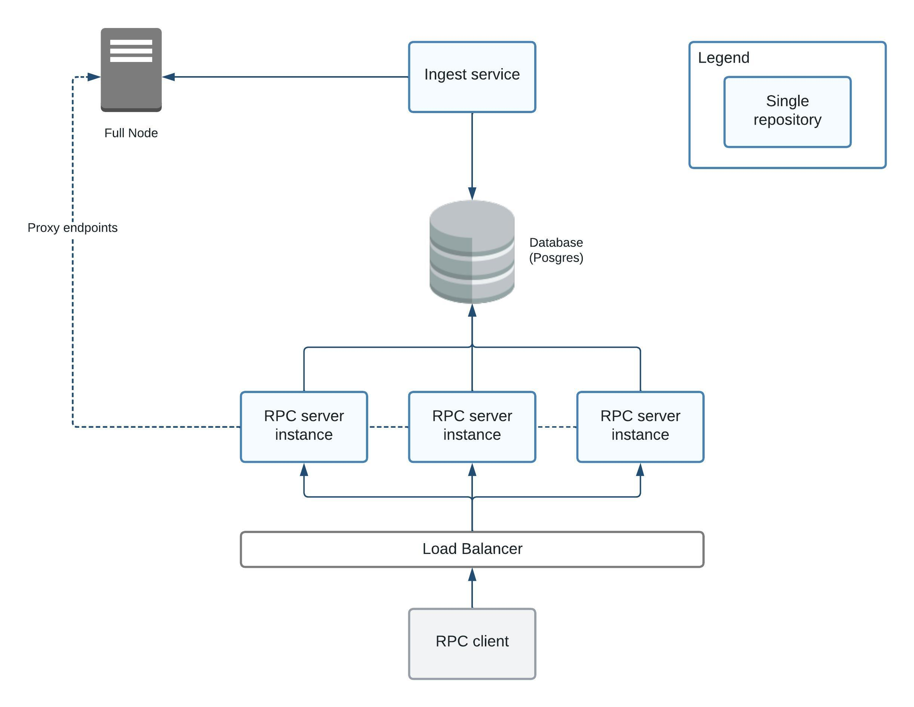

# ADR-102: RPC Companion

## Changelog

- 2022-03-27: First draft (@andynog)
- 2024-03-19: Update ADR information (@andynog)
- 2024-03-25: Final updates before publishing (@andynog)

## Status

Accepted

[Tracking issue](https://github.com/cometbft/cometbft/issues/707)

## Context

This solution can run as a sidecar, a separate process that runs concurrently with the full node. However, the RPC
Companion is optional, meaning that the full node will still provide RPC services that can be queried if operators
don't want to run an RPC Companion service.

This ADR provides a reference implementation of a system that can be used to offload queryable data from a CometBFT
full node to a database and offer a service exposing the same JSON-RPC methods on an endpoint as the regular JSON-RPC
methods of a CometBFT node endpoint. This makes it easier for integrators of RPC clients, such as client libraries and
applications, to switch to this RPC Companion with as little effort as possible.

This architecture also makes it possible to scale horizontally the querying capacity of a full node by running multiple
copies of the RPC Companion server instances that can be behind a scalable load-balancer (e.g., Cloudflare), which makes
it possible to serve the data in a more scalable way.

One of the benefits of utilizing an RPC Companion is that it enables data indexing on external storage, leading to
improved performance compared to the internal indexer of CometBFT. The internal indexer of CometBFT has certain
limitations and might not be suitable for specific application use cases.

## Alternative Approaches

The Data Companion Pull API concept, identified as [[ADR-101]](adr-101-data-companion-pull-api.md), is a novel idea. As it gains popularity and acceptance,
users are expected to develop their own versions of it to meet their specific requirements. The RPC Companion is the
initial implementation of a Data Companion that can serve as a model for others to follow.

## Decision

TBD

## Detailed Design

### Requirements

The target audience for this solution are operators and integrators that want to alleviate the load on their nodes by offloading
the queryable data requests to the **RPC Companion**.

This solution shall meet the following requirements in order to provide real benefits to these users.

The **RPC Companion** solution shall:

1. Provide an **[Ingest Service](#ingest-service)** implemented as a data companion that can pull data from a CometBFT node and store it on
its own storage (database)
2. Provide a storage ([Database](#database)) that can persist the data using a [database schema](#database-schema) that
can store information that was fetched from the full node.
3. Do not force breaking changes to the existing RPC.
4. Ensure the responses returned by the RPC Companion v1 endpoint is wire compatible with the existing CometBFT
JSON-RPC endpoint.
5. Implement tests to verify backwards compatibility.

### [RPC Endpoint](#rpc-endpoint)

The RPC Companion endpoint will be the same as the CometBFT JSON-RPC endpoint but with a `/v1` appended to it. The RPC
Companion endpoint can be hosted on a different URL and might also use a different port than the default CometBFT RPC
port (e.g. `26657`) as shown below.

For example, suppose these are the URLs for each RPC endpoint:

CometBFT RPC -> `http://cosmos.host:26657`

RPC Companion -> `http://rpc-companion.host:8080/v1`

To make a request for a `block` at height `5` using the CometBFT JSON-RPC endpoint:

    curl --header "Content-Type: application/json" --request POST --data '{"method": "block", "params": ["5"], "id": 1}' http://cosmos.host:26657

To make the same request to the RPC Companion endpoint:

    curl --header "Content-Type: application/json" --request POST --data '{"method": "block", "params": ["5"], "id": 1}' http://rpc-companion.host:8080/v1

> Note that only the URL and port changes between these two `curl` commands

The RPC Companion will accept JSON-RPC requests, the same way as the CometBFT JSON-RPC endpoint does.

The RPC Companion endpoint methods listed in the following table should be implemented first as they are straightforward
and less complex.

| **JSON-RPC method** | **JSON-RPC Parameters**                | **Description**                                 | **Notes**                                                                                                                                                                                                                                                                             |
|---------------------|----------------------------------------|-------------------------------------------------|---------------------------------------------------------------------------------------------------------------------------------------------------------------------------------------------------------------------------------------------------------------------------------------|
| `abci_info`         |                                        | Get information about the application           | This method will return the same response structure as the equivalent CometBFT method. It will return the latest information stored in its database that was retrieved from the full node.                                                                                            |
| `block`             | * height                               | Get block at a specified height                 | This method will return the same response structure as the equivalent CometBFT method. The data retrieved from the companion database for a particular block will have to be properly serialized into the `block` struct in order to be returned as a response.                       |
| `block_by_hash`     | * hash                                 | Get block by its hash                           | This method will return the same response structure as the equivalent CometBFT method.                                                                                                                                                                                                |
| `block_results`     | * height                               | Get block results at a specified height         | This method will return the same response structure as the equivalent CometBFT method. The data retrieved from the companion database for a particular block result will have to be properly serialized into the `ResultsBlockResults` struct in order to be returned as a response.  |
| `blockchain`        | * minHeight <br/> * maxHeight          | Get blocks in a specified height range          | This method will return the same response structure as the equivalent CometBFT method. The data retrieved from the companion database will include one or more blocks.                                                                                                                |
| `commit`            | * height                               | Get commit results at a specified height        | This method will return the same response structure as the equivalent CometBFT method.                                                                                                                                                                                                |
| `consensus_params`  | * height                               | Get consensus parameters at a specified height  | This method will return the same response structure as the equivalent CometBFT method.                                                                                                                                                                                                |
| `header`            | * height                               | Get header at a specified height                | This method will return the same response structure as the equivalent CometBFT method.                                                                                                                                                                                                |
| `header_by_hash`    | * hash                                 | Get header by its hash                          | This method will return the same response structure as the equivalent CometBFT method.                                                                                                                                                                                                |
| `health`            |                                        | Get node health                                 | This method basically only returns an empty response. This can be used to test if the server RPC is up.  While this on CometBFT is used to return a response if the full node is up, when using the companion service this will return an `OK` status if the companion service is up. |
| `tx`                | * hash <br/> * prove                   | Get a transaction by its hash                   | This method will return the same response structure as the equivalent CometBFT method.                                                                                                                                                                                                |
| `validators`        | * height <br/> * page <br/> * per_page | Get validator set at a specified height         | This method will return the same response structure as the equivalent CometBFT method.                                                                                                                                                                                                |

The following methods can also be implemented, but might require some additional effort and complexity to be implemented.
These are mostly the ones that provide `search` and `query` functionalities. These methods will proxy the request to the
full node. Since they are not dependent on data retrieval from the RPC Companion database they should just act as proxies
to the full node. In the future, it might be possible to implement these methods in the RPC Companion if the database
stores all the information required to be indexed and the queries specified in the JSON-RPC methods can be translated into
SQL statements to return the queried data from the database.

| **JSON-RPC method** | **JSON-RPC Parameters**                                              | **Description**                        | **Notes**                                                                                                                                                                                  |
|---------------------|----------------------------------------------------------------------|----------------------------------------|--------------------------------------------------------------------------------------------------------------------------------------------------------------------------------------------|
| `abci_query`        | * path <br/> * data <br/> * height <br/> * prove                     | Query information from the application | This method will return the same response structure as the equivalent CometBFT method. The RPC companion service will have to implement a proper abci parameter to sql query translation.  |
| `block_search`      | * query <br/> * page <br/> * per_page <br/> * order_by               | Query information about a block        | This method will return the same response structure as the equivalent CometBFT method. The RPC companion service will have to implement a proper query parameter to sql query translation. |
| `tx_search`         | * query <br/> * page <br/> * per_page <br/> * prove <br/> * order_by | Query information about transactions   | This method will return the same response structure as the equivalent CometBFT method. The RPC companion service will have to implement a proper query parameter to sql query translation. |

The following methods will proxy the requests through the RPC Companion endpoint to the full node to ensure that clients don't need to implement a routing logic for methods that would not be available in the RPC Companion endpoint.

> The `/broadcast_tx_*` methods might need some additional logic for proxying since some of them have different asynchronicity patterns.

| **JSON-RPC method**    | *JSON-RPC Parameters** | **Description**                           | **Notes**                                                                                                                                                                                                             | Proxy |
|------------------------|------------------------|-------------------------------------------|-----------------------------------------------------------------------------------------------------------------------------------------------------------------------------------------------------------------------|-------|
| `broadcast_evidence`   | * evidence             | Broadcast evidence of the misbehavior     | The evidence parameter is in JSON format                                                                                                                                                                              | yes   |
| `broadcast_tx_async`   | * tx                   | Broadcast a transaction                   | Returns right away with no response                                                                                                                                                                                   | yes   |
| `broadcast_tx_sync`    | * tx                   | Broadcast a transaction                   | Returns with the response from CheckTx                                                                                                                                                                                | yes   |
| `broadcast_tx_commit`  | * tx                   | Broadcast a transaction                   | Returns with the responses from CheckTx and DeliverTx                                                                                                                                                                 | yes   |
| `check_tx`             | * tx                   | Check a transaction                       | Checks a transaction without executing it                                                                                                                                                                             | yes   |
| `consensus_state`      |                        | Gets consensus state                      | The consensus state will not be stored in the RPC companion database so it should proxy the request to the full node                                                                                                  | yes   |
| `dump_consensus_state` |                        | Gets the full consensus state             | The consensus state will not be stored in the RPC companion database so it should proxy the request to the full node                                                                                                  | yes   |
| `genesis`              |                        | Gets the genesis information              | The RPC companion service can proxy the genesis request to the full node. If there are use cases that serving the genesis from the RPC companion service (no proxy) is desirable then it can be implemented as method | yes   |
| `net_info`             |                        | Gets network information                  | The request should proxy to the full node since the RPC companion database will not store network information                                                                                                         | yes   |
| `unconfirmed_txs`      | * limit                | Gets the list of unconfirmed transactions | The request should proxy to the full node since the RPC companion database will not store unconfirmed transactions information                                                                                        | yes   |
| `num_unconfirmed_txs`  |                        | Gets data about unconfirmed transactions  | The request should proxy to the full node since the RPC companion database will not store unconfirmed transactions information                                                                                        | yes   |
| `status`               |                        | Gets node status                          | The request should proxy to the full node since the RPC companion database will not store node status information                                                                                                     | yes   |

> NOTE: The RPC Companion should not implement logic to store data in its database that can modify state in the blockchain such as
the `broadcast_tx_*` methods.  These requests will proxy to the full node as outlined above.

### High-level architecture



This diagram shows all the required components for a full RPC Companion solution. The solution implementation contains
many parts and each one is described below:

### [Ingest Service](#ingest-service)

The **Ingest Service** pulls the data from the full node JSON-RPC endpoint and stores the information retrieved in
the RPC Companion database.

The **Ingest Service** should run as a "singleton" which means only one instance of this service
should be fetching the information from the CometBFT full node.

Currently, the Data Companion Pull APIs offer gRPC services to retrieve `Block` and `BlockResults`. These can be used
to pull the data from the server.

The **Ingest Service** can influence the pruning of `Blocks` and `BlockResults` on the full node via a [pruning service](https://docs.cometbft.com/v1.0/explanation/data-companion/pruning).
Once the Ingest Service pulls the data from the full node and is able to process it, and it gets an acknowledgement from
the database that the data was inserted, the **Ingest Service** can communicate with the full node notifying it that
a specific height has been processed and set the processed height as the `retain height` on the full node signaling
this way to the node that this height can be pruned.

If the **Ingest Service** becomes unavailable (e.g. stops), then it should resume synchronization with the full node when it is back online.
The **Ingest Service** should query the full node for the last `retain height` and the **Ingest Service** should request
and process all the heights missing on the database until it catches up with the full node latest height.

In case the **Ingest Service** becomes unavailable for a long time and there are several heights to be synchronized, it is
important for the **Ingest Service** to do it in a throttled way (in short intervals) to prevent the server to become overloaded.

### [Database](#database)

The database stores the data retrieved from the full node and provides this data for the RPC server instance.

It is proposed that the relational database [PostgreSQL](https://www.postgresql.org/)  be used in order to support
the [RPC server instance](#rpc-instance) scalability

Also, using a relational database will also provide more flexibility when implementing a future RPC Companion `/v2`
endpoint that can return data in different forms and database indexes might also be leveraged in order to boost the
query responses performance.

The data needs to be available both for the Ingest Service (database writes) and the RPC server instance (database reads)
and these services might be running from different machines so an embedded database is not recommended in this case
since accessing the data remotely might not be optimal for an embedded key-value database. Also since the RPC might have
many server instances (or processes) running that will need to retrieve data concurrently it is recommended to use
a well-known robust database engine that can support such a load.

Also, PostgreSQL supports ACID transactions, which is important to provide more guarantees that the data was successfully
inserted in the database and that an acknowledgement can be sent back to the Ingest Service to notify the
full node to prune the inserted data. Supporting ACID transactions can also ensure that there are no partial reads
(return data that was partially written to the database), avoiding that readers access incomplete or inconsistent data.

#### [Database Schema](#database-schema)

Implementing this solution comes with a challenge - designing a database schema that can facilitate return responses
equivalent to the existing CometBFT JSON-RPC endpoint. However, the schema should also be flexible enough to return
customized responses in the future.

Since the RPC Companion stores the information in a relational database, there are opportunities to better structure and
normalize the data in the future. For example, here is the schema definition for a table to persist a `Block` data
structure in the PostgreSQL database:

```sql
-- TABLE: comet.v1.block

DROP TABLE IF EXISTS comet.v1.block CASCADE;

CREATE TABLE comet.v1.block
(
    height  comet.uint64 NOT NULL,
    data    bytea NOT NULL,
    CONSTRAINT block_pkey PRIMARY KEY (height)
);
```

It's important to add a version to the table (e.g `v1`) to ensure schema changes can be supported

> Note that only the height is stored as structure data. More data field can be normalized and stored in individual fields,
but trying to normalize the CometBFT data structures into a database schema should be only performed if there's a need to
do so (e.g. search for information and using the field as a query parameter).

##### Data types

This solution utilizes PostgreSQL's built-in data types to implement a data schema in the database. By using a relational
database, it is possible to normalize the data structures, which can lead to significant storage savings. However,
it's important to note that normalizing the schema too much can make it complex to retrieve a specific dataset due to
the need for data joins. As a result, it's crucial to exercise caution when over-normalizing the schema.

Also, when normalizing, it is important to ensure the referential integrity is not violated since this can cause issues
to the clients consuming the data.

In order to accurately ensure the database is storing the full node data types properly, the database implements
custom data types (`domains` in PostgreSQL).

For example, PostgreSQL doesn't have an unsigned `uint8`, `uint32`, `uint64` datatype, therefore in order to support
this in the database, you can use a `domain`, which is a base type with additional constraints:

```sql
-- DOMAIN: comet.uint8

DO $$ BEGIN
CREATE DOMAIN comet.uint8 AS numeric;

ALTER DOMAIN comet.uint8
    ADD CONSTRAINT value_max CHECK (VALUE <= '255'::numeric);

ALTER DOMAIN comet.uint8
    ADD CONSTRAINT value_positive CHECK (VALUE >= 0::numeric);
EXCEPTION
    WHEN duplicate_object THEN null;
END $$;

-- DOMAIN: comet.uint32

DO $$ BEGIN
CREATE DOMAIN comet.uint32 AS numeric;

ALTER DOMAIN comet.uint32
    ADD CONSTRAINT value_max CHECK (VALUE <= '4294967295'::numeric);

ALTER DOMAIN comet.uint32
    ADD CONSTRAINT value_positive CHECK (VALUE >= 0::numeric);
EXCEPTION
    WHEN duplicate_object THEN null;
END $$;

-- DOMAIN: comet.uint64

DO $$ BEGIN
CREATE DOMAIN comet.uint64
    AS numeric;

ALTER DOMAIN comet.uint64 OWNER TO postgres;

ALTER DOMAIN comet.uint64
    ADD CONSTRAINT value_max CHECK (VALUE <= '18446744073709551615'::numeric);

ALTER DOMAIN comet.uint64
    ADD CONSTRAINT value_positive CHECK (VALUE >= 0::numeric);
EXCEPTION
    WHEN duplicate_object THEN null;
END $$;
```

##### Schema migration

Another point to consider is when the data structures change across CometBFT releases.

A potential solution for this scenario is to find a way in the database that can support "versioning" of data structures.
For example, let's assume there's a `Block` structure, let's call it `v1`. If in the future there's a need to modify
this structure that is not compatible with the previous data structure, then the database would support a `v2` schema
for `ResultBlock` and an `index` table could determine the criteria on which data structure should be used for inserting
or querying data.

### [RPC server instance](#rpc-instance)

The **RPC server instance** is a node that runs the RPC API process for the data companion. This server instance provides
an RPC API (`/v1`) with the same JSON-RPC methods of the full node JSON-RPC endpoint. The RPC Companion service will expose
the same JSON-RPC methods and will accept the same request types and return wire compatible responses (should match the
same response as the equivalent full node JSON-RPC endpoint).

The **RPC server instance**, when serving a particular request, retrieves the required data from the database in order to
fulfill the request. The data should be serialized in a way that makes it wire compatible with the CometBFT JSON-RPC endpoint.

It is possible to integrate a caching layer as part of the RPC server instance solution. Caching can be useful for queries
that are idempotent, which means they produce the same result regardless of how many times they are executed. There are
various caching solutions available, either off-the-shelf or custom-built, that can be added to the RPC server instance
logic. However, implementing a caching solution is not within the scope of this ADR.

The RPC service endpoints from the server instances should be exposed through an external load-balancer service such
as Cloudflare or AWS ELB, or a server running its own load balancer mechanism (e.g. nginx).

The RPC clients should make requests to the **RPC Companion** server instances through this load balancer for scalability
reasons.

The **RPC server instance** will also implement logic to proxy requests to the full node. It should properly handle
the proxy requests and responses from the full node.

The **RPC Companion** endpoint should support the `https` protocol in order to support a secure endpoint access. It's recommended that
the `https` support is provided by the load balancer.

## Consequences

### Positive

- The **RPC Companion** can be more scalable and consequently provide a higher query throughput.
- Less backpressure on the full node that is running consensus.
- Possibility for future additional custom endpoints (e.g a `/v2`) with additional methods not available in the `/v1` endpoint.
- Can act as a basis for users to create better and faster indexers solutions.
- Possibility to turn off indexing on the full node if the data can be offloaded to an external data storage that supports
indexing.

### Negative

- Additional infrastructure complexity to set up and maintain.
- Additional infrastructure costs if using a load balanced setup for the RPC service endpoint (multiple nodes) and  a fail-over
database setup (master/replica)

### Neutral

- Optional feature, users will only use it if their use case requires such solution
- No privacy / security issues should arise since the data returned by the **RPC Companion** will be the same
as the current RPC.

## References

- [ADR-101: Data Companions Pull API](adr-101-data-companion-pull-api.md)
- [Data Companion Guide - CometBFT documentation](https://docs.cometbft.com/v1.0/explanation/data-companion/)
- [RPC Companion - Reference Implementation](https://github.com/cometbft/rpc-companion)


