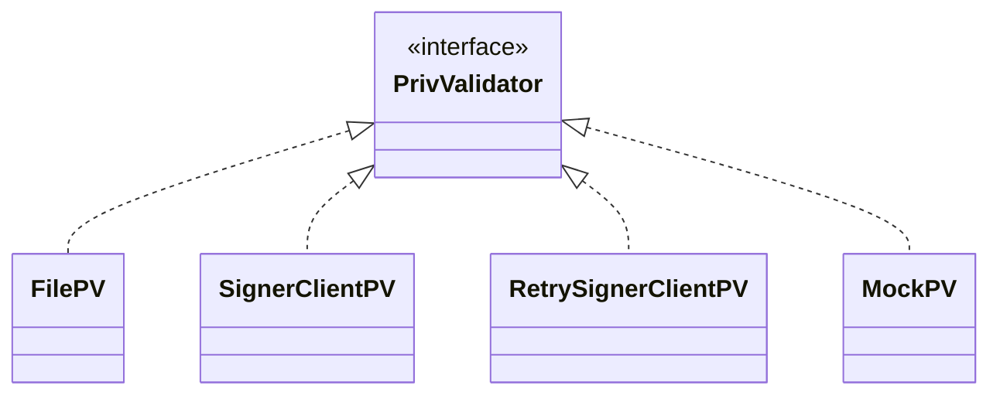
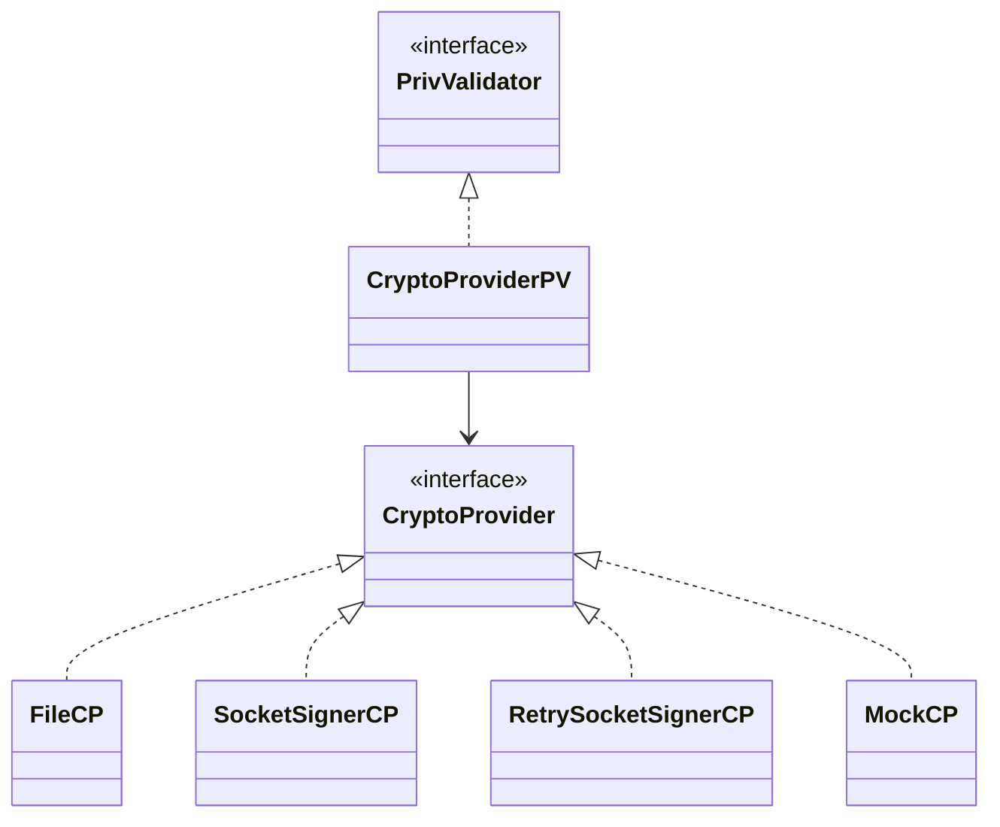

# ADR 117: Implementing CryptoProvider for PrivValidator

## Change log

* 2024-07-01: Initial proposal (Zondax AG: @raynaudoe @juliantoledano @jleni @educlerici-zondax @lucaslopezf)
* 2024-08-08: ADR title changed. Update proposal (Zondax AG: @raynaudoe @juliantoledano @jleni @educlerici-zondax @lucaslopezf)

## Status

Proposed

## Abstract

This ADR proposes the implementation of [ADR-001-crypto-provider](https://github.com/cosmos/crypto/blob/main/docs/architecture/adr-001-crypto-provider.md) within CometBFT's existing PrivValidator framework. The primary goal is to refactor the current `PrivValidator` implementations by replacing them with `CryptoProvider`-based implementations. This change will maintain the existing PrivValidator logic while allowing for multiple implementations through the CryptoProvider interface.

This approach enables "pluggable cryptography" that offers a more modular design and future-proofs the crypto tools. The implementation will preserve the existing multi-curve support while providing a more flexible and extensible architecture for cryptographic operations.

This ADR extensively references concepts like `CryptoProvider`.
Please check the full ADR describing them [here](https://github.com/cosmos/crypto/blob/main/docs/architecture/adr-001-crypto-provider.md#crypto-provider).

## Context

The introduction of the `CryptoProvider` interface into the CometBFT cryptographic package offers several benefits. By using the `CryptoProvider` interface, the existing `PrivValidator` logic can be kept while allowing for multiple implementations of `PrivValidator` through the `CryptoProvider` interface. This means that different cryptographic methods can be plugged in without changing the core logic of `PrivValidator`.

This flexibility makes it easier to adapt to new security standards and improves performance for different use cases. For example, if a new, more secure signing method is developed, it can be implemented as a new `CryptoProvider` and used by `PrivValidator` without needing to rewrite existing code. This helps to keep the cryptographic code up-to-date and more secure.

For readability purposes, here's an extract of **adr-001-crypto-provider** that defines the `CryptoProvider` interface:

```go
// CryptoProvider aggregates the functionalities of signing, verifying, and hashing, and provides metadata.
type CryptoProvider interface {
    // GetSigner returns an instance of Signer.
    GetSigner() Signer

    // GetVerifier returns an instance of Verifier.
    GetVerifier() Verifier

    // GetHasher returns an instance of Hasher.
    GetHasher() Hasher

    // Metadata returns metadata for the crypto provider.
    Metadata() ProviderMetadata
}
```

## Decision

We will:

* Define types and interfaces as the code attached
* Refactor existing code into new structure and interfaces (more details in the next section)
* Implement Unit Tests to ensure no backward compatibility issues
* Establish a migration path where the previous implementation will coexist with the new one, ensuring no sudden breaking changes occur


## Detailed Design

The implementation of ADR-001 in CometBFT will require a medium-level refactor of the codebase. Below we describe the proposed strategy to perform such implementation, which is:

* Add a new `PrivValidator` implementation that uses the `CryptoProvider` interface underneath.

* New directories reorganization:
Implementations of crypto providers (previously `Privval` implementations) should be in their own directory. See the [Directories reorganization](#directories-reorganization) section for more details.

* **[Optional]** Adding [Keyring](https://github.com/cosmos/cosmos-sdk/blob/main/crypto/keyring/keyring.go) and [Record](https://github.com/cosmos/cosmos-sdk/blob/main/proto/cosmos/crypto/keyring/v1/record.proto) for storing and loading providers.

* **[Optional]** Use `Keyring` to load and instantiate validators when booting up a node.


#### Create a single implementation for `PrivValidator`

The current CometBFT codebase includes the following implementations of `PrivValidator`:

* `FilePV`: Handles file-based private validators.
* `SignerClient`: Manages remote signing.
* `RetrySignerClient`: Provides retry mechanisms for remote signing.
* `MockPV`: Used exclusively for testing purposes.

We propose introducing a new implementation, `CryptoProviderPV`, which will unify and replace all the above implementations. This single implementation will act as an abstraction layer for the `PrivValidator` implementations mentioned above.

**Current design:**




**Proposed design:**



For these new implementations, the current code for `File`, `SocketClient`, and `RetrySocketClient` will have to implement the `CryptoProvider` interface instead of the `PrivValidator` one.

##### Code snippets for `CryptoProviderPV`

As mentioned above, instead of having several implementations of `PrivValidator`, the proposal is to have only one that, by dependency injection, loads the corresponding `CryptoProvider` that offers the same functionality as the previous implementations of `PrivValidator`.

Below is an example of how `CryptoProviderPV` would look like. Note that in this particular case, since the PrivateKey is managed inside the corresponding implementation, we're not passing that value to the signer. This is to avoid having to significantly change the code for `FilePV`. This is also valid for all implementations that manage their private keys in their own logic.

```go
// CryptoProviderPV is the implementation of PrivValidator using CryptoProvider's methods
type CryptoProviderPV struct {
    provider CryptoProvider
}

// NewCryptoProviderPV creates a new instance of CryptoProviderPV
func NewCryptoProviderPV(provider CryptoProvider) (*CryptoProviderPV, error) {
    return &CryptoProviderPV{provider: provider}, nil
}

// SignVote signs a canonical representation of the vote. If signExtension is true, it also signs the vote extension.
func (pv *CryptoProviderPV) SignVote(chainID string, vote *Vote, signExtension bool) error {
    signer := pv.provider.GetSigner()

    // code for getting voteBytes goes here
    // voteBytes := ...

    // The underlying signer needs these parameters so we pass them through SignerOpts
    options := SignerOpts{
        "chainID": chainID,
        "vote":    vote,
    }

    sig, _ := signer.Sign(voteBytes, options)
    vote.Signature = sig
    return nil
}

// SignProposal signs a canonical representation of the proposal
func (pv *CryptoProviderPV) SignProposal(chainID string, proposal *Proposal) error {
    signer := pv.provider.GetSigner()

    // code for getting proposalBytes goes here
    // proposalBytes := ...

    // The underlying signer needs these parameters so we pass them through SignerOpts
    options := SignerOpts{
        "chainID":  chainID,
        "proposal": proposal,
    }

    sig, _ := signer.Sign(proposalBytes, options)
    proposal.Signature = sig
    return nil
}

// SignBytes signs an arbitrary array of bytes
func (pv *CryptoProviderPV) SignBytes(bytes []byte) ([]byte, error) {
    signer := pv.provider.GetSigner()
    return signer.Sign(bytes, SignerOpts{})
}

```

*Note:* Each provider (File, Socket, SignerClient, RetrySignerClient) will need to be modified to satisfy the `CryptoProvider` interface.


#### Loading and storing

When we refer to storing a `CryptoProvider`, we're essentially preserving two key elements: the type of crypto provider (e.g., file-based, hardware security module, remote signer, etc) and its associated configuration parameters.

These configuration parameters can vary widely depending on the provider type. For instance, a file-based provider might need to store file paths, while a hardware security module provider could require device identifiers or network addresses. Remote signers might need endpoint URLs and authentication details. By storing both the type and these specific configurations, we ensure that the `CryptoProvider` can be correctly instantiated.

Alternatives:

* *Low impact / minimal dependencies*: The corresponding `CryptoProvider` can be directly stored on disk in a dedicated directory in an encoding format of choice (text, JSON)

* *Greater impact / better security*: Use cosmos-sdk's [Keyring](https://github.com/cosmos/cosmos-sdk/blob/8bfcf554275c1efbb42666cc8510d2da139b67fa/client/v2/autocli/keyring/interface.go#L11-L23). to manage `CryptoProvider` along with its private keys. This specifically applies to the `FilePV` implementation, which could store its private keys through `Keyring` instead of a file in the filesystem. This approach will require decoupling the `Keyring` package from the cosmos-sdk, which could be cumbersome.


#### Directories reorganization

Implementations of crypto providers (previously `Privval` implementations) should be in their own directory:

```plaintext
cometbft/
├── privval/
│   ├── provider/
│   │   ├── file.go
│   │   ├── signer.go
│   │   ├── retry_signer.go
│   │   ├── mock.go
├── types/
│   ├── priv_validator.go
```

#### Other considerations

##### Node startup

Node's configuration file should include the name of the `CryptoProvider` to be loaded at startup. Also, the startup logic will need to be changed from creating a validator to loading a `CryptoProvider`

*Note:* It's important to note that during the migration path, both configurations (priv validators and crypto providers) will coexist. This means that if a `CryptoProvider` ID is passed in the configuration, the loader will give priority to that config and load the corresponding provider. However, if the provider ID is nil, it will load the priv validators as it always has. This approach ensures a smooth transition and maintains backward compatibility while allowing for the gradual adoption of the new `CryptoProvider` system.

##### `PrivValidator`  users

Every piece of code that makes use of the `PrivValidator` interface should not suffer from changes or require any adaptation. This is because the new `CryptoProviderPV` will implement the same `PrivValidator` interface, ensuring backward compatibility. The internal refactoring to use `CryptoProvider` will be encapsulated within the new implementation, allowing for a seamless transition without affecting the wider codebase that relies on `PrivValidator`.


## Consequences

### Positive

* Single place of truth
* Easier to extend
* Unit test for each crypto package
* Greater maintainability
* Incentivize addition of implementations instead of forks
* Decoupling behavior from implementation

### Negative

* It will involve an effort to adapt existing code.
* It will require attention to detail and audition.

### Neutral

* It will involve extensive testing.