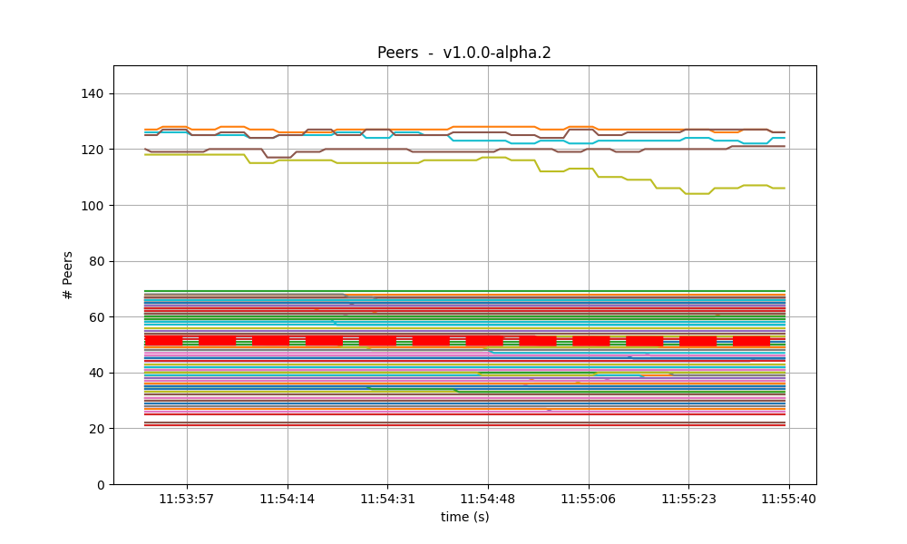
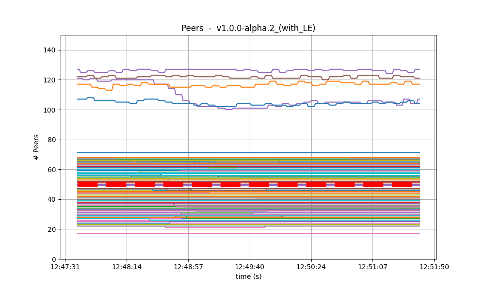
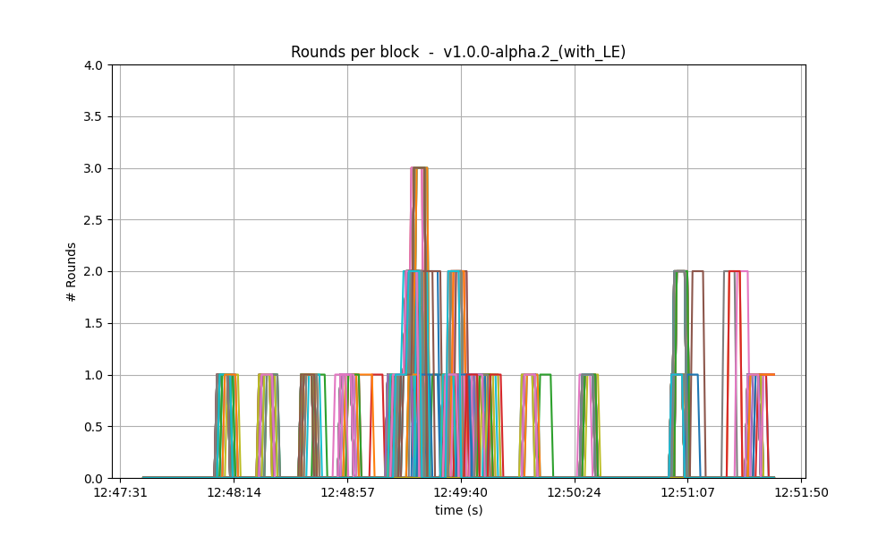
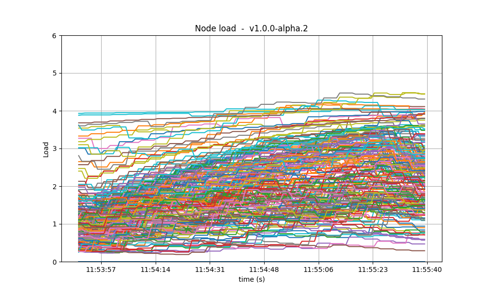
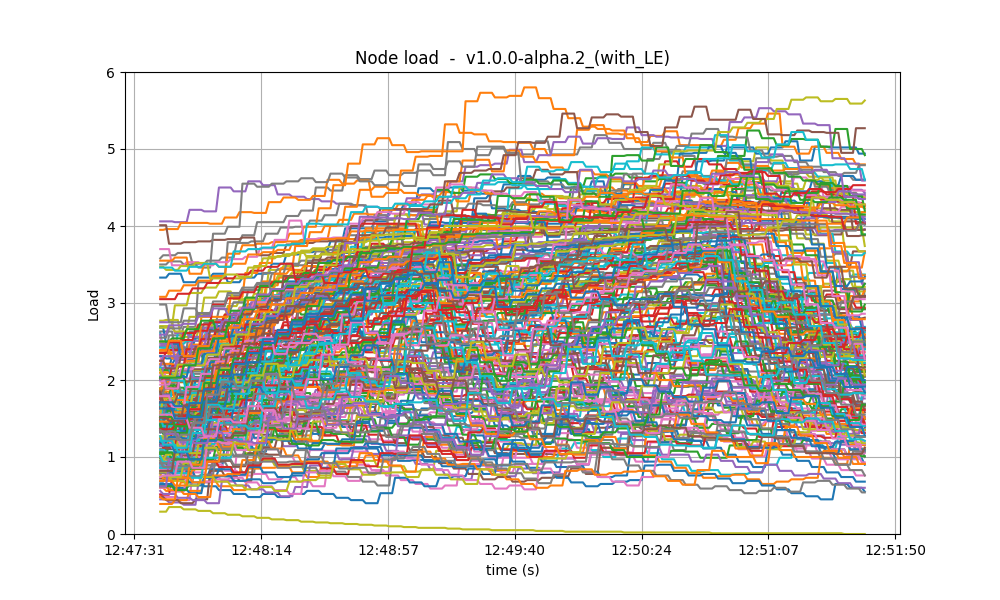

# QA results for CometBFT v1.x

We run this iteration of the QA tests on CometBFT `v1.0.0-alpha.2`, the second tag of the backport
branch `v1.x` from the CometBFT repository. The previous QA tests were performed on
`v0.38.0-alpha.2` from May 21, 2023, which we use here as a baseline for comparison. There are many
changes with respect to the baseline, including `TO COMPLETE`. For the full list of changes, check
out the [CHANGELOG](https://github.com/cometbft/cometbft/blob/v1.0.0-alpha.2/CHANGELOG.md).

The main goal of the QA process is to validate that there are no meaningful, substantial regressions
from the previous version. We consider that there is a regression if we find a difference bigger
than 10% in the results. After having performed the experiments, we conclude that there are no
significant differences with respect to the baseline. Therefore CometBFT `v1.0.0-alpha.2` has passed
the QA tests. 

In the rest of this document we present and analyse the obtained results. The main steps of the QA
process are the following:
- [Saturation point](#saturation-point): On a 200-nodes network, find its saturation point, that is,
  the transaction load on which the system begins to show a degraded performance. On the rest of the
  QA experiments we will use subject the system to a load slightly under the saturation point.
- [200-nodes test](#200-nodes-test): During a fixed amount of time, inject on the 200-nodes network
  a constant load of transactions. Then collect metrics and block data to compute latencies, and
  compare them against the results of the baseline.
- [Rotating-nodes test](#rotating-nodes-test): Run initially 10 validators and 3 seed nodes. Then
  start a full node, wait until it is block-synced, and stop it. Repeat these steps 25 times while
  checking the nodes are able to catch up to the latest height of the network.

Additionally, for this version, we perform the following experiments.
- `TO COMPLETE`
- ...

## Latency emulation (LE)

For the first time in the QA process we can additionally run the experiments using latency emulation
(LE). We typically deploy all the nodes of the testnet in the same region of a DigitalOcean
data center. This keeps the costs of running the tests low, but it makes the communication between
nodes unrealistic, as there is almost no latency. While still deploying the testnet in one region,
we now can emulate latency by adding random delays to outgoing messages. 

This is how we emulate latency:
- [This table][aws-latencies] has real data collected from AWS and containing the average latencies
  between different AWS data centers in the world.
- When we define the testnet, we randomly assign a "zone" to each node, that is, one of the regions
  in the latency table.
- Before starting CometBFT in each node, we run [this script][latency-emulator-script] to set the
  added delays between the current node and each of the other zones, as defined in the table. The
  script calls the `tc` utility for controlling the network traffic at the kernel level.

Until now all of our QA results were obtained without latency emulation. In order to analyze the
obtained results under similar configurations, we will make the analysis in a two-step comparison.
First, we will compare the QA results of `v0.38` (the baseline) to those of `v1` without latency
emulation. Then, we will compare results of `v1` with and without latency emulation.

## Table of Contents
- [Saturation point](#saturation-point)
- [200-nodes test](#200-nodes-test)
  - [Latencies](#latencies)
  - [Metrics](#metrics)
  - [Results](#results)
- [Rotating-nodes test](#rotating-nodes-test)

## Saturation point

The first step of our QA process is to find the saturation point of the testnet. As in other
iterations of our QA process, we have used a network of 200 nodes as testbed, plus one node to load
transactions and another to collect metrics. One of the validator nodes is the target that receives
all the transaction load. The method to identify the saturation point is explained
[here](CometBFT-QA-34.md#saturation-point) and its application to the baseline is described
[here](TMCore-QA-37.md#finding-the-saturation-point).

The results of the experiments for finding the saturation point are in the file
[`v1_report_tabbed.txt`](imgs/v1/200nodes/metrics/v1_report_tabbed.txt), and the following table
summarizes them.

| r    | c=1       | c=2       | c=4   |
| ---: | --------: | --------: | ----: |
| 200  | 17800     | **34600** | 50464 |
| 400  | **31200** | 54706     | 49463 |
| 800  | 51146     | 51917     | 41376 |
| 1600 | 50889     | 47732     | 45530 |

The X axis (`c`) is the number of connections from the load runner process to the
target node. The Y axis (`r`) is the rate or number of transactions issued per second. Each
connection sends `r` transactions per second.

We observe in the table that the system is saturated beyond the diagonal defined by the entries
`c=1,r=400` and `c=2,r=200`. Entries in the diagonal have the same amount of transaction load, so we
consider them equivalent. For the chosen diagonal, the expected number of processed transactions is
`1 * 400 tx/s * 89 s = 35600`. (Note that we use 89 out of 90 seconds of the experiment because the
last transaction batch coincides with the end of the experiment and is thus not sent.) For the
experiments just below the diagonal we would expected double that number, that is, `1 * 800 tx/s *
89 s = 71200`, but the system is not able to process such load, so some transactions are dropped.

For comparison, this is the table obtained on the baseline version, where the saturation point is
also beyond the diagonal defined by `c=1,r=400` and `c=2,r=200`.

| r    | c=1       | c=2       | c=4   |
| ---: | --------: | --------: | ----: |
| 200  | 17800     | **33259** | 33259 |
| 400  | **35600** | 41565     | 41384 |
| 800  | 36831     | 38686     | 40816 |
| 1600 | 40600     | 45034     | 39830 |

In conclusion, we chose `c=1,r=400` as the transaction load that we will use in the rest of QA
process. This is the same value used in the previous QA tests.

### With latency emulation

For these set of experiments we changed the parameters of the transaction load: we use only one
connection and the rate in the range from 100 to 1000 in intervals of 100 txs/second.

| r    | txs   | 
| ---: | ----: |
| 100  | 8900  |
| 200  | 17800 |
| 300  | 26700 | 
| 400  | 35600 |
| 500  | 34504 |
| 600  | 42169 |
| 700  | 38916 |
| 800  | 38004 |
| 900  | 34332 |
| 1000 | 36948 |

## 200-nodes test

This experiment consist in running 200 nodes, injecting a load of 400 txs/s during 90 seconds, and
collect the metrics. The network is composed of 175 validator nodes, 20 full nodes, and 5 seed
nodes. Another node sends the load to only one of the validators.

### Latencies

The following figures show the latencies of the experiment carried out with the configuration
`c=1,r=400`.

v0.38 | v1 (without LE / with LE) 
:--------------:|:--------------:|
 |  

As can be seen, in most cases the latencies are very similar, and in some cases,
the baseline has slightly higher latencies than the version under test. Thus,
from this small experiment, we can say that the latencies measured on the two
versions are equivalent, or at least that the version under test is not worse
than the baseline.

### Metrics

We further examine key metrics extracted from Prometheus data on the experiment with configuration
`c=1,r=400`.

#### Mempool size

The mempool size, a count of the number of transactions in the mempool, was shown to be stable and
homogeneous at all full nodes. It did not exhibit any unconstrained growth. 

The following figures show the evolution over time of the cumulative number of transactions inside
all full nodes' mempools at a given time.

| v0.38 | v1 (without LE / with LE)
| :--------------:|:--------------:|
|  | 
| | 

The following figures show the evolution of the average mempool size over all full nodes, which mostly stays
below 1000 outstanding transactions except for a peak above 2000, coinciding with the moment the
system reached round number 1 (see below); this is better than the baseline, which oscilates between
1000 and 2500.

| v0.38 | v1 (without LE / with LE) 
| :--------------:|:--------------:|
|  | 
| | 

#### Peers

The number of peers was stable at all nodes. As expected, the seed nodes have more peers (around
125) than the rest (between 20 and 70 for most nodes). The red dashed line denotes the average
value.

| v0.38 | v1 (without LE / with LE) 
|:--------------:|:--------------:|
|  | 
| | 

Just as in the baseline, the fact that non-seed nodes reach more than 50 peers is due to [\#9548].

#### Consensus rounds

Most blocks took just one round to reach consensus, except for a few cases when it was needed a
second round. For these specific runs, the baseline required an extra round more times.

| v0.38 | v1 (without LE / with LE) 
|:--------------:|:--------------:|
|  | 
| | 

#### Blocks produced per minute and transactions processed per minute

These figures show the rate in which blocks were created, from the point of view of each
node. That is, they shows when each node learned that a new block had been agreed upon. For most of
the time when load was being applied to the system, most of the nodes stayed around 20
blocks/minute. The spike to more than 100 blocks/minute is due to a slow node catching up. The
baseline experienced a similar behavior.

| v0.38 | v1 (without LE / with LE)
|:--------------:|:--------------:|
|  | 
| | 

| v0.38 | v1 (without LE / with LE)
|:--------------:|:--------------:|
|  | 
| | 

The collective spike on the right of the graph marks the end of the load
injection, when blocks become smaller (empty) and impose less strain on the
network. This behavior is reflected in the following graph, which shows the
number of transactions processed per minute.

#### Memory resident set size

The following graphs show the Resident Set Size of all monitored processes. Most nodes use less than
0.9 GB of memory, and a maximum of 1.3GB. In all cases, the memory usage in this run is less than
the baseline. On all processes, the memory usage went down as the load was being removed, showing no
signs of unconstrained growth.

| v0.38 | v1 (without LE / with LE) 
|:--------------:|:--------------:|
| | 
| | 

#### CPU utilization

The best metric from Prometheus to gauge CPU utilization in a Unix machine is `load1`, as it usually
appears in the [output of
`top`](https://www.digitalocean.com/community/tutorials/load-average-in-linux). In this case, the
load is contained below 4 on most nodes, with the baseline showing a similar behavior.

| v0.38 | v1 (without LE / with LE) 
|:--------------:|:--------------:|
|  | 
| | 

### Test Results

We have shown that there is no regressions when comparing CometBFT `v1.0.0-alpha.2` against the
results obtained for `v0.38`. The observed results are equal or sometimes slightly better than the
baseline. We therefore conclude that this version of CometBFT has passed the test.

| Scenario  | Date       | Version                                                   | Result |
| --------- | ---------- | --------------------------------------------------------- | ------ |
| 200-nodes | 2024-03-21 | v1 (without LE / with LE).0.0-alpha.2 (4ced46d3d742bdc6093050bd67d9bbde830b6df2) | Pass   |

## Rotating-nodes test

`... TO COMPLETE ...`

[aws-latencies]: https://github.com/cometbft/cometbft/blob/v1.0.0-alpha.2/test/e2e/pkg/latency/aws-latencies.csv
[latency-emulator-script]: https://github.com/cometbft/cometbft/blob/v1.0.0-alpha.2/test/e2e/pkg/latency/latency-setter.py 
[\#9548]: https://github.com/tendermint/tendermint/issues/9548
[end-to-end]: https://github.com/cometbft/cometbft/tree/main/test/e2e
