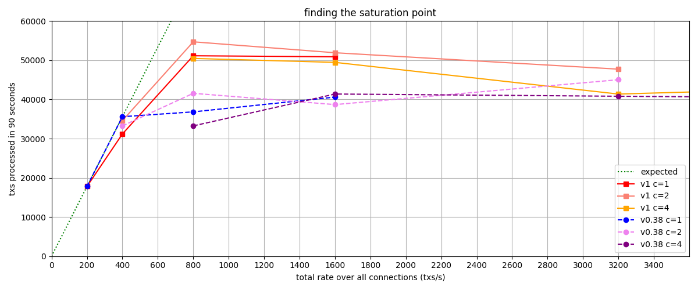
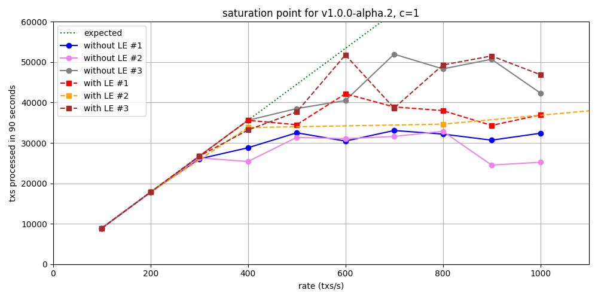
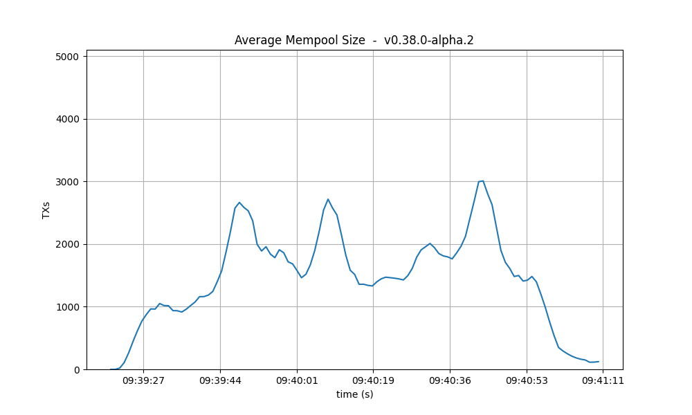
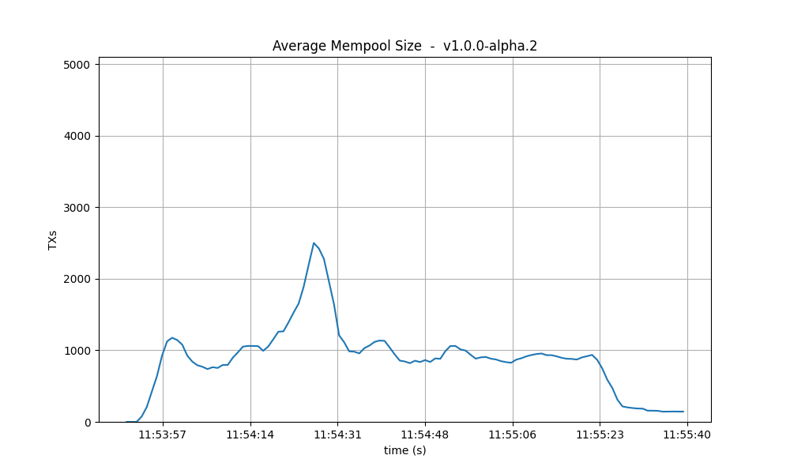
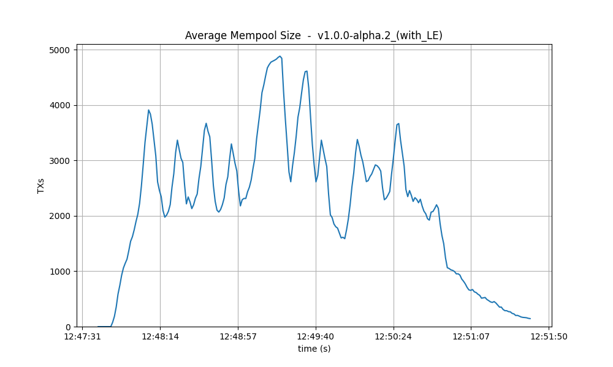
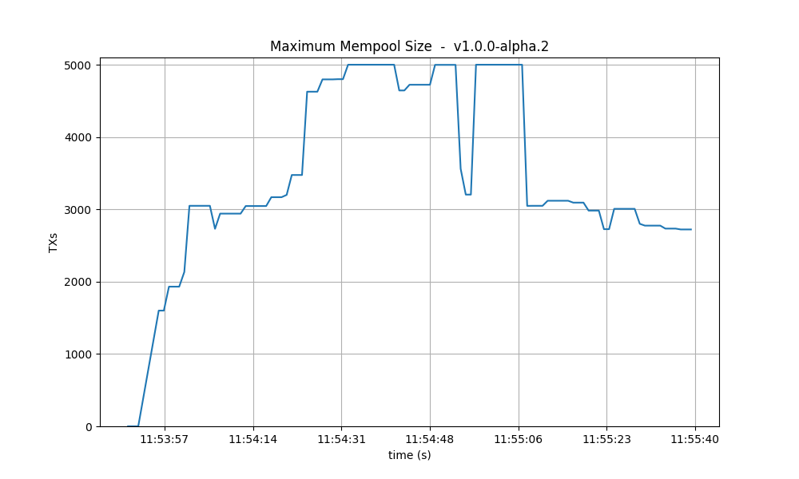
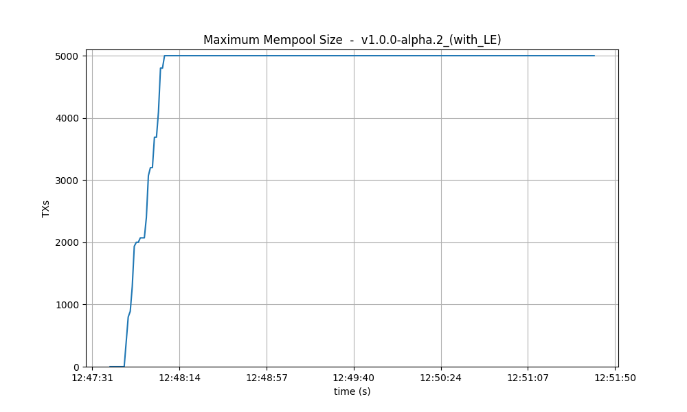

## Table of Contents
- [QA results for CometBFT v1.x](#qa-results-for-cometbft-v1x)
  - [Latency emulation (LE)](#latency-emulation-le)
  - [Storage optimizations](#storage-optimizations)
  - [Saturation point](#saturation-point)
    - [With latency emulation](#with-latency-emulation)
  - [200-nodes test](#200-nodes-test)
    - [Latencies](#latencies)
    - [Metrics](#metrics)
      - [Mempool size](#mempool-size)
      - [Peers](#peers)
      - [Consensus rounds](#consensus-rounds)
      - [Blocks produced per minute and transactions processed per minute](#blocks-produced-per-minute-and-transactions-processed-per-minute)
      - [Memory resident set size](#memory-resident-set-size)
      - [CPU utilization](#cpu-utilization)
    - [Test Results](#test-results)
      - [Test results with latency emulation](#test-results-with-latency-emulation)
  - [Rotating Nodes Testnet](#rotating-nodes-testnet)
    - [Latencies](#latencies-1)
    - [Prometheus Metrics](#prometheus-metrics)
      - [Blocks and Transactions per minute](#blocks-and-transactions-per-minute)
      - [Peers](#peers-1)
      - [Memory Resident Set Size](#memory-resident-set-size-1)
      - [CPU utilization](#cpu-utilization-1)
    - [Test Result](#test-result)

# QA results for CometBFT v1.x

We run this iteration of the [Quality Assurance (QA)][qa] process on CometBFT `v1.0.0-alpha.2`, the
second tag of the backport branch `v1.x` from the CometBFT repository. The previous QA tests were
performed on `v0.38.0-alpha.2` from May 21, 2023, which we use here as a baseline for comparison.
There are many changes with respect to the baseline. In particular, new features that can affect
performance are some improvements to bandwidth consumption and proposer-based timestamps (PBTS). For
the full list of changes, check out the
[CHANGELOG](https://github.com/cometbft/cometbft/blob/v1.0.0-alpha.2/CHANGELOG.md).

The primary objective of the QA process is to ensure that no significant regressions have occurred
compared to the previous version. We consider that a regression is present if there is a variance
greater than 10% in the results. After having performed the experiments, we have determined that no
notable differences exist when compared to the baseline. Consequently, version `v1.0.0-alpha.2` has
successfully passed the QA tests. 

In the remainder of this document we present and analyse the results obtained. The main steps of the
QA process are the following:
- [Saturation point](#saturation-point): On a network with 200 nodes, identify its saturation point,
  that is, the transaction load where system performance begins to degrade. Subsequent QA
  experiments will subject the system to a load slightly below this saturation point.
- [200-nodes test](#200-nodes-test): Apply a consistent transaction load to the 200-nodes network
  for a fixed duration. Then, gather metrics and block data to calculate latencies and compare them
  with the baseline results.
- Rotating-nodes test: Initially, deploy 10 validators and 3 seed nodes. Start the same load
  (saturation point) used for the previous tests. Then, launch 25 full nodes, wait until they are
  caught up to the latest height (minus 100) using Block Sync, and then stop them and wipe out their
  data on disk. Repeat this process until the chain reaches height 3000. Then, stop the load and
  wait for the full nodes to catch up one more time.

## Latency emulation (LE)

For the first time in the QA process we are introducing latency emulation (LE) into our experiments.
We typically deploy all the testnet nodes within the same region of a DigitalOcean data center to
keep the costs low. However, this setup creates unrealistic communication between nodes due to
minimal latency. To address this, while still deploying the testnet in a single region, we can now
emulate latency by adding random delays into outgoing messages.

Here's how we emulate latency:
- Reference real latency data: We utilize [a table][aws-latencies] containing real data collected
  from AWS, which includes average latencies between different AWS data centers worldwide.
- Assign zones: When defining the testnet, each node is randomly assigned a "zone", corresponding
  to one of the regions listed in the latency table.
- Set delays: Prior to launching CometBFT on each node, we execute a script to configure added
  delays between the current node and every other zone, as specified in the latency table. This
  script utilizes the `tc` utility to control network traffic at the kernel level.

Up until now, all QA results were obtained without latency emulation. To ensure fair comparisons, we
will conduct a two-step analysis. First, we will compare the QA results of `v0.38` (the baseline)
with those of `v1` without latency emulation. Secondly, we will compare the results of `v1` with and
without latency emulation.

It's important to note that the results with latency emulation in this report are not used to assess
whether `v1.0.0-alpha.2` passes the QA tests. Instead, they serve as a baseline for future QA tests to
be conducted for upcoming releases.

## Storage optimizations

We have conducted several experiments aimed to address concerns regarding storage efficiency and
performance of CometBFT. These experiments focused on various aspects, including the effectiveness
of the pruning mechanism, the impact of different database key layouts, and the performance of
alternative database engines like PebbleDB. For a comprehensive overview, you can access the full
report [here](../storage/README.md).

The experiments were performed on different versions of CometBFT. Of particular relevance for this
report are those where we targeted a version based on `v1.0.0-alpha.1`. The main difference with
`v1.0.0-alpha.2` is PBTS, which does not impact storage performance. Hence, we consider the results
obtained equally applicable to `v1.0.0-alpha.2`. In particular, both versions include the data
companion API, background pruning, compaction, and support for different key layouts. 

To summarize the findings relevant to `v1`:
- Pruning does not negatively affect the node performance, though it showed to be ineffective at
  controlling storage growth. However, combining pruning with forced compaction and the new key
  layout proved to be an effective strategy, which we recommend adopting.
- Experiments reveal mixed results regarding the impact of different database key layouts on
  performance. While some scenarios exhibit improvements in block processing times and storage
  efficiency, particularly with the new key layout, further analysis suggests that the benefits of
  the new layout were not consistently realized across different environments. Consequently, we've
  released the new key layout as purely experimental.
- Tests with PebbleDB showed promising performance improvements, especially when paired with the new
  key layout. PebbleDB exhibits superior handling of compaction without the need of manual
  intervention.

## Saturation point

The initial phase of our QA process involves identifying the saturation point within the testnet. As
in previous iterations, our testbed comprises 200 nodes (175 validator nodes, 20 full nodes, and 5
seed nodes), along with one node dedicated to sending transaction load, and another for metric
collection. All nodes use the same, default configuration. The experiment entails multiple
iterations, each lasting 90 seconds, with varied load configurations. A configuration is
characterized by:
- `c`, denoting the number of connections from the load runner process to the target node, and
- `r`, indicating the rate or frequency of transactions submitted per second. Each connection
  dispatches `r` transactions per second. 

All transactions are 1024 bytes long.
For more details on the methodology to identify the saturation point, see
[here](method.md#running-the-test).

The figure below shows the values obtained for v1 and v0.38 (the baseline). It's important to note
that configurations that have the same amount of total transaction load are regarded as equivalent.
For example, `c=1,r=400` and `c=2,r=200` are plotted on the same x-axis value corresponding to their
total rate of 400 tx/s, which corresponds to configuration with `c=1`.

 

In the figure, we observe that up to a rate of 400 tx/s, the obtained values closely match or are
equal to the expected number of processed transactions, which is 35600 txs. However, beyond this
point, the system becomes overloaded and cannot process all incoming transactions, resulting in
dropped transactions. This state indicates that the system is saturated. The expected number of
processed transactions is calculated as `c * r * 89 s = 35600 txs`. It's worth noting that we
utilize 89 out of 90 seconds of the experiment duration, as the final transaction batch coincides
with the end of the experiment and is thus not sent.

The complete results from which the figure was generated can be found in the file
[`v1_report_tabbed.txt`](imgs/v1/200nodes/v1_report_tabbed.txt). The following table summarizes the
values plotted in the figure, that is, the number of transaction processed. We can see the
saturation point in the diagonal defined by `c=1,r=400` and `c=2,r=200`:

| r    | c=1       | c=2       | c=4   |
| ---: | --------: | --------: | ----: |
| 200  | 17800     | **34600** | 50464 |
| 400  | **31200** | 54706     | 49463 |
| 800  | 51146     | 51917     | 41376 |
| 1600 | 50889     | 47732     | 45530 |

For comparison, this is the table obtained on the baseline version, with the same saturation point:

| r    | c=1       | c=2       | c=4   |
| ---: | --------: | --------: | ----: |
| 200  | 17800     | **33259** | 33259 |
| 400  | **35600** | 41565     | 41384 |
| 800  | 36831     | 38686     | 40816 |
| 1600 | 40600     | 45034     | 39830 |

In conclusion, we chose `c=1,r=400` as the transaction load that we will use in the rest of QA
process. This is the same value used in the previous QA tests.

### With latency emulation

For comparing where the network starts to saturate in `v1` with and without latency emulation, we
run a new set of experiments with different configurations of transaction loads: we use only one
connection and a transaction rate ranging from 100 to 1000 tx/s, in intervals of 100. The figure
depicts in total six instances of these experiments, three with latency emulation and three without. 

 

Up to 300 tx/s, the throughput is optimal for both configurations. However, when the load increases
beyond this threshold, not all transactions are processed. Given the limited number of experiments
conducted, it's challenging to conclusively determine which configuration offers better throughput.
Nevertheless, we can still say that there are no big discrepancies in the obtained values on both
scenarios.

## 200-nodes test

This experiment consists in running the 200-nodes network, injecting a load of 400 tx/s (`c=1,r=400`)
during 90 seconds, and collecting the metrics. The network composition is the same as used for
finding the saturation point.

For the experiments with latency emulation we have set a duration of 180 seconds instead of 90.

### Latencies

The following figures show the latencies of the experiment. Each dot represents a block: at which
time it was created (x axis) and the average latency of its transactions (y axis).

| v0.38 | v1 (without LE / with LE) 
|:--------------:|:--------------:|
|  |  
| | 

In both cases, most latencies are around or below 4 seconds. On `v0.38` there are peaks reaching 10
seconds, while on `v1` (without LE) the only peak reaches 8 seconds. Even if both images are
similar, it's crucial to note that `v0.38` implements [BFT time][bft-time], while the experiments on
`v1` were performed with [PBTS][pbts]. The implication is that PBTS tends to produce slightly
smaller latencies. The reason is that, in PBTS, the block's timestamp is the proposer's wallclock
value at the moment the block was created. For reference, with BFT time, the block's timestamp is
the median of the timestamp of all precommits in the previous height. Each of these timestamps
reflects the validator's wallclock time when the precommit is sent. Consequently, latencies
calculated when BFT time is active tend to contain one extra network propagation delay--the one
whereby precommits are disseminated.

With these considerations in mind, and taking into account that this is a small experiment, we infer
that the latencies measured on `v1` are not worse than those of the baseline. With latency
emulation, the latencies are considerably higher, as expected.

### Metrics

In this section we analyse key metrics extracted from Prometheus data on the 200-nodes experiment
with configuration `c=1,r=400`.

#### Mempool size

The following figures show the evolution of the average and maximum mempool size over all full
nodes. 

**Average size** On `v1`, the average mempool size mostly stays below 1000 outstanding transactions
except for a peak above 2000, coinciding with the moment the system reached round number 1 (see
below). For these particular runs, this result is better than the baseline, which oscilates between
1000 and 2500.

With latency emulation, the average mempool size stays mostly above 2000 outstanding transactions
with peaks almost reaching the maximum mempool size of 5000 transactions.

| v0.38 | v1 (without LE / with LE) 
| :--------------:|:--------------:|
|  | 
| | 

**Maximum size** The maximum mempool size indicates when one or more nodes have reached their
maximum capacity in terms of the number of transactions they can hold. In version `v0.38`, it's
apparent that most of the time, at least one node is dropping incoming transactions.
Conversely, in `v1`, this happens less often, especially after reaching round 1 (as detailed below).

However, when we introduce latency emulation into `v1`, there is consistently at least one node with
a saturated mempool.

| v0.38 | v1 (without LE / with LE)
| :--------------:|:--------------:|
|  | 
| | 

#### Peers

On all experiments, the number of peers was stable on all nodes. As expected, the seed nodes have
more peers (around 125) than the rest (between 20 and 70 for most nodes). The red dashed line
denotes the average value. Just as in the baseline, the fact that non-seed nodes reach more than 50
peers is due to [\#486].

| v0.38 | v1 (without LE / with LE) 
|:--------------:|:--------------:|
|  | 
| | 

#### Consensus rounds

On both versions, most blocks took just one round to reach consensus, except for a few cases when
a second round was needed. On these two particular runs, we observe that `v0.38` required an extra
round on more occasions than `v1`.

With latency emulation, the performance is notably worse: the consensus module requires an extra
round more often, even needing four rounds to finalise a block. This indicates that the values of
consensus timeouts should be increased, so that to represent the actual delays in the network.

| v0.38 | v1 (without LE / with LE) 
|:--------------:|:--------------:|
|  | 
| | 

#### Blocks produced per minute and transactions processed per minute

These figures show the rate in which blocks were created from the point of view of each node,
indicating when each node learned that a new block had been agreed upon. Throughout much of the load
application period, the majority of nodes maintained a rate of between 20 and 40 blocks per minute.
A spike to more than 100 blocks per minute occurred due to a slower node catching up. In the
baseline scenario, most blocks had a somewhat slower rate of approximately between 10 and 30 blocks
per minute.

| v0.38 | v1 (without LE / with LE)
|:--------------:|:--------------:|
|  | 
| | 

| v0.38 | v1 (without LE / with LE)
|:--------------:|:--------------:|
|  | 
| | 

The collective spike on the right of the graph marks the end of the load injection, when blocks
become smaller (empty) and impose less strain on the network.

With latency emulation (LE), there is a noticeable degradation in throughput. The block generation
rate drops from approximately 30 blocks per minute (without LE) to around 10 blocks per minute.
Since the rates of transaction processing are similar, this means that more transactions are
included in the blocks, as shown in the following images. The most probable reason is that, once block latency is higher with latency emulation, more transactions are available at the proposer when it is ready to propose a new block. Note that the maximum block size is 4 Mb.

| v0.38 | v1 (without LE / with LE)
|:--------------:|:--------------:|
|  | 
| | 

#### Memory resident set size

The following graphs show the Resident Set Size of all monitored processes. Most nodes use less than
0.9 GB of memory, and a maximum of 1.3GB. In all cases, the memory usage in `v1` is less than in the
baseline. On all processes, the memory usage went down as the load was being removed, showing no
signs of unconstrained growth. With latency emulation, the results are comparable.

| v0.38 | v1 (without LE / with LE) 
|:--------------:|:--------------:|
| | 
| | 

#### CPU utilization

The most reliable metric from Prometheus for assessing CPU utilization in a Unix machine is `load1`,
commonly found in the [output of
`top`](https://www.digitalocean.com/community/tutorials/load-average-in-linux). In these scenarios,
the load remains consistently below 4 on the majority of nodes, with the baseline exhibiting a
similar pattern. With latency emulation, the CPU load reaches 5 on some nodes, probably due to
having a busier mempool and processing more rounds.

| v0.38 | v1 (without LE / with LE) 
|:--------------:|:--------------:|
|  | 
| | 

### Test Results

We have demonstrated that there are no regressions when comparing CometBFT `v1.0.0-alpha.2` against
the results obtained for `v0.38`. In fact, the observed results are identical to, or occasionally even
slightly better than those of the baseline. We therefore conclude that this version of CometBFT has
passed the test.

| Scenario  | Date       | Version                                                   | Result |
| --------- | ---------- | --------------------------------------------------------- | ------ |
| 200-nodes | 2024-03-21 | v1.0.0-alpha.2 (4ced46d3d742bdc6093050bd67d9bbde830b6df2) | Pass   |

#### Test results with latency emulation

As expected, the introduction of emulated latencies to the network results in a degradation of
performance for `v1` compared to `v1` without latency emulation, although not by an order of
magnitude. Moving forward with the next QA tests, it may be prudent to consider adjusting the
saturation point to a slightly lower value. Determining this adjustment will require conducting new
experiments on the network with latency emulation.

## Rotating Nodes Testnet

As done in past releases, we use `c=1,r=400` as load, as the saturation point in the 200-node test
has not changed from `v0.38.x` (see the corresponding [section](#saturation-point) above).
Further, although latency emulation is now available, we decided to run this test case
without latency emulation (LE); this choice may change in future releases.

The baseline considered in this test case is `v0.38.0-alpha.2`, as described
in the [introduction](#qa-results-for-cometbft-v1x) above.

### Latencies

The following two plots show latencies for the whole experiment.
We see the baseline (`v0.38.0-alpha.2`) on the left, and the current version
on the right.

We can appreciate that most latencies are under 4 seconds in both cases,
and both graphs have a comparable amount of outliers between 4 seconds and 11 seconds.

|                               v0.38.0                               |                    v1.0.0 (without LE)                    |
| :-----------------------------------------------------------------: | :-------------------------------------------------------: |
|  |  |

### Prometheus Metrics

This section shows relevant metrics both on `v1.0.0` and the baseline (`v0.38.0`).
In general, all metrics roughly match those seen on the baseline
for the rotating node experiment.

#### Blocks and Transactions per minute

The following two plots show the blocks produced per minute. In both graphs, most nodes stabilize around 40 blocks per minute.

|                            v0.38.0                             |                          v1.0.0 (without LE)                          |
| :------------------------------------------------------------: | :-------------------------------------------------------------------: |
|  |  |

The following plots show only the heights reported by ephemeral nodes, both when they were blocksyncing
and when they were running consensus.

|                               v0.38.0                                |                        v1.0.0 (without LE)                         |
| :------------------------------------------------------------------: | :----------------------------------------------------------------: |
|  |  |

In both cases, we see the main loop of the `rotating` test case repeat itself a number of times.
Ephemeral nodes are stopped, their persisted state is wiped out, their config is transferred over
from the orchestrating node, they are started, we wait for all of them to catch up via blocksync,
and the whole cycle starts over. All these steps are carried out via `ansible` playbooks.

We see that there are less cycles in `v1.0.0`. The reason is the following.
All `ansible` steps are currently run from the orchestrating node (i.e., the engineer's laptop).
The orchestrating node when running the rotating nodes test case for `v1.0.0`
was connected to a network connection that was slower than when the equivalent test was run for `v0.38.x`.
This caused the steps reconfiguring ephemeral nodes at the end of each cycle to be somewhat slower.
This can be noticed in the graphs when comparing the width (in x-axis terms) of the gaps without metric
from the end of a cycle to the beginning of the next one.

If we focus on the _width_ of periods when ephemeral nodes are blocksynching, we see that they are slightly narrower
in `v1.0.0`. This is likely due to the improvements introduced as part of the issues
[#1283](https://github.com/cometbft/cometbft/issues/1283),
[#2379](https://github.com/cometbft/cometbft/issues/2379), and
[#2465](https://github.com/cometbft/cometbft/issues/2465).

The following plots show the transactions processed per minute.

|                            v0.38.0                             |                          v1.0.0 (without LE)                          |
| :------------------------------------------------------------: | :-------------------------------------------------------------------: |
|  |  |

They seem similar, except for an outlier in the `v1.0.0` plot.

#### Peers

The plots below show the evolution of the number of peers throughout the experiment.

|                         v0.38.0                         |                      v1.0.0 (without LE)                       |
| :-----------------------------------------------------: | :------------------------------------------------------------: |
|  |  |

The plotted values and their evolution show the same dynamics in both plots.
Nevertheless, all nodes seem to acquire more peers when ephemeral node are catching up in the `v1.0.0` experiment.

For further explanations on these plots, see the [this section](TMCore-QA-34.md#peers-1).

#### Memory Resident Set Size

These plots show the average Resident Set Size (RSS) over all processes.
They are comparable in both releases.

|                            v0.38.0                             |                          v1.0.0 (without LE)                          |
| :------------------------------------------------------------: | :-------------------------------------------------------------------: |
|  |  |

#### CPU utilization

The plots below show metric `load1` for all nodes for `v1.0.0-alpha.2` and for the baseline (`v0.38.0`).

|                        v0.38.0                        |                 v1.0.0 (without LE)                 |
| :---------------------------------------------------: | :-------------------------------------------------: |
|  |  |

In both cases, it is contained under 5 most of the time, which is considered normal load.

### Test Result

| Scenario | Date       | Version                                                   | Result |
| -------- | ---------- | --------------------------------------------------------- | ------ |
| Rotating | 2024-04-03 | v1.0.0-alpha.2 (e42f62b681a2d0b05607a61d834afea90f73d366) | Pass   |

[qa]: README.md#cometbft-quality-assurance
[aws-latencies]: https://github.com/cometbft/cometbft/blob/v1.0.0-alpha.2/test/e2e/pkg/latency/aws-latencies.csv
[latency-emulator-script]: https://github.com/cometbft/cometbft/blob/v1.0.0-alpha.2/test/e2e/pkg/latency/latency-setter.py 
[bft-time]: ../../../spec/consensus/bft-time.md
[pbts]: ../../../spec/consensus/proposer-based-timestamp/README.md
[\#486]: https://github.com/cometbft/cometbft/issues/486
[end-to-end]: https://github.com/cometbft/cometbft/tree/main/test/e2e
