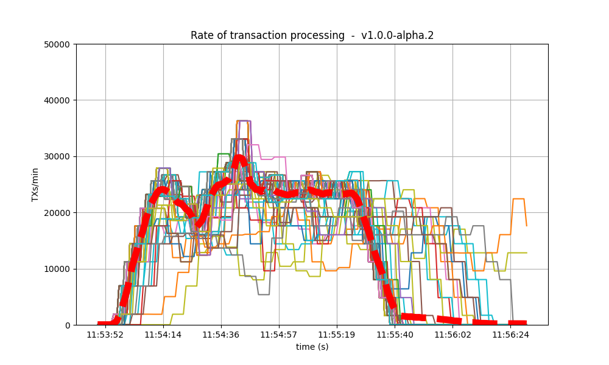
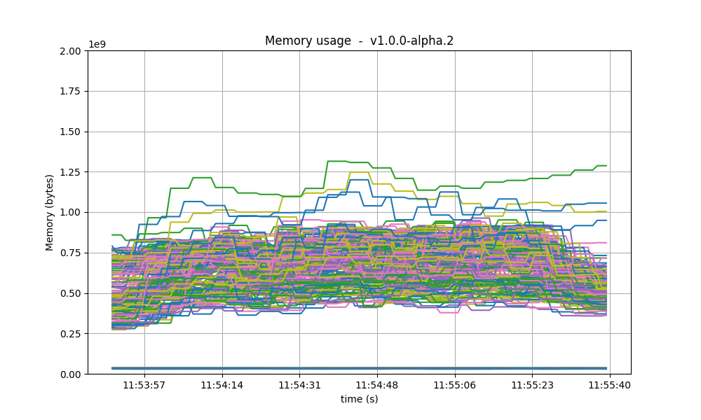
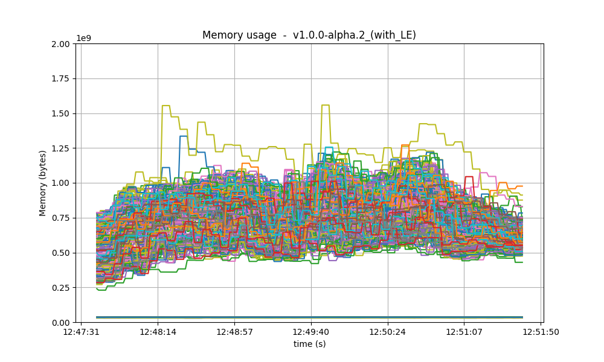

# QA results for CometBFT v1.x

We run this iteration of the [Quality Assurance (QA)][qa] process on CometBFT `v1.0.0-alpha.2`, the
second tag of the backport branch `v1.x` from the CometBFT repository. The previous QA tests were
performed on `v0.38.0-alpha.2` from May 21, 2023, which we use here as a baseline for comparison.
There are many changes with respect to the baseline. In particular, new features that can affect
performance are some improvements to bandwidth consumption and proposer-based timestamps (PBTS). For
the full list of changes, check out the
[CHANGELOG](https://github.com/cometbft/cometbft/blob/v1.0.0-alpha.2/CHANGELOG.md).

The primary objective of the QA process is to ensure that no significant regressions have occurred
compared to the previous version. We consider that a regression is present if there is a variance
greater than 10% in the results. After having performed the experiments, we have determined that no
notable differences exist when compared to the baseline. Consequently, version `v1.0.0-alpha.2` has
successfully passed the QA tests. 

In the remainder of this document we present and analyse the results obtained. The main steps of the
QA process are the following:
- [Saturation point](#saturation-point): On a network of 200 nodes, identify its saturation point,
  that is, the transaction load where system performance begins to degrade. Subsequent QA
  experiments will subject the system to a load slightly below this saturation point.
- [200-nodes test](#200-nodes-test): Apply a consistent transaction load to the 200-nodes network
  for a fixed duration. Then, gather metrics and block data to calculate latencies and compare them
  with the baseline results.
- Rotating-nodes test: Initially, deploy 10 validators and 3 seed nodes.
  Then, launch a full node, wait until it is caught up to the latest height using Block Sync, and
  then stop it. Repeat this process 25 times while ensuring that the nodes can catch up to the
  network's latest height.

## Latency emulation (LE)

For the first time in the QA process we are introducing latency emulation (LE) into our experiments.
We typically deploy all the testnet nodes within the same region of a DigitalOcean data center to
keep the costs low. However, this setup creates unrealistic communication between nodes due to
minimal latency. To address this, while still deploying the testnet in a single region, we can now
emulate latency by adding random delays into outgoing messages.

Here's how we emulate latency:
- Reference real latency data: We utilize [a table][aws-latencies] containing real data collected
  from AWS, which includes average latencies between different AWS data centers worldwide.
- Assign zones: When defining the testnet, each node is randomly assigned a "zone", corresponding
  to one of the regions listed in the latency table.
- Set delays: Prior to launching CometBFT on each node, we execute a script to configure added
  delays between the current node and every other zone, as specified in the latency table. This
  script utilizes the `tc` utility to control network traffic at the kernel level.

Up until now, all QA results were obtained without latency emulation. To ensure fair comparisons, we
will conduct a two-step analysis. First, we will compare the QA results of `v0.38` (the baseline)
with those of `v1` without latency emulation. Secondly, we will compare the results of `v1` with and
without latency emulation.

It's important to note that the results with latency emulation in this report are not used to assess
whether `v1.0.0-alpha.2` passes the QA tests. Instead, they serve as a baseline for future QA tests to
be conducted for upcoming releases.

## Table of Contents
- [Saturation point](#saturation-point)
- [200-nodes test](#200-nodes-test)
  - [Latencies](#latencies)
  - [Metrics](#metrics)
  - [Results](#results)

## Saturation point

The initial phase of our QA process involves identifying the saturation point within the testnet. As
in previous iterations, our testbed comprises 200 nodes (175 validator nodes, 20 full nodes, and 5
seed nodes), along with one node dedicated to sending transaction load, and another for metric
collection. All nodes use the same, default configuration. The experiment entails multiple
iterations, each lasting 90 seconds, with varied load configurations. A configuration is
characterized by:
- `c`, denoting the number of connections from the load runner process to the target node, and
- `r`, indicating the rate or frequency of transactions submitted per second. Each connection
  dispatches `r` transactions per second. 

For more details on the methodology to identify the saturation point, see
[here](method.md#running-the-test).

The figure below shows the values obtained for v1 and v0.38 (the baseline). It's important to note
that configurations that have the same amount of total transaction load are regarded as equivalent.
For example, `c=1,r=400` and `c=2,r=200` are plotted on the same x-axis value corresponding to their
total rate of 400 tx/s, which corresponds to configuration with `c=1`.

 

In the figure, we observe that up to a rate of 400 tx/s, the obtained values closely match or are
equal to the expected number of processed transactions, which is 35600 txs. However, beyond this
point, the system becomes overloaded and cannot process all incoming transactions, resulting in
dropped transactions. This state indicates that the system is saturated. The expected number of
processed transactions is calculated as `c * r * 89 s = 35600 txs`. It's worth noting that we
utilize 89 out of 90 seconds of the experiment duration, as the final transaction batch coincides
with the end of the experiment and is thus not sent.

The complete results from which the figure was generated can be found in the file
[`v1_report_tabbed.txt`](imgs/v1/200nodes/v1_report_tabbed.txt). The following table
summarizes the values, i.e., the number of transaction processed, plotted in the figure. We can see the saturation point in the diagonal defined
by `c=1,r=400` and `c=2,r=200`:

| r    | c=1       | c=2       | c=4   |
| ---: | --------: | --------: | ----: |
| 200  | 17800     | **34600** | 50464 |
| 400  | **31200** | 54706     | 49463 |
| 800  | 51146     | 51917     | 41376 |
| 1600 | 50889     | 47732     | 45530 |

For comparison, this is the table obtained on the baseline version, with the same saturation point:

| r    | c=1       | c=2       | c=4   |
| ---: | --------: | --------: | ----: |
| 200  | 17800     | **33259** | 33259 |
| 400  | **35600** | 41565     | 41384 |
| 800  | 36831     | 38686     | 40816 |
| 1600 | 40600     | 45034     | 39830 |

In conclusion, we chose `c=1,r=400` as the transaction load that we will use in the rest of QA
process. This is the same value used in the previous QA tests.

### With latency emulation

For comparing where the network starts to saturate in `v1` with and without latency emulation, we
run a new set of experiments with different configurations of transaction loads: we use only one
connection and a transaction rate ranging from 100 to 1000 tx/s, in intervals of 100. The figure
depicts in total six instances of these experiments, three with latency emulation and three without. 

 

Up to 300 tx/s, the throughput is optimal for both configurations. However, when the load increases
beyond this threshold, not all transactions are processed. Given the limited number of experiments
conducted, it's challenging determining conclusively which configuration offers better throughput.
Nevertheless, we can still say that there are no big discrepancies in the obtained values on both
scenarios.

## 200-nodes test

This experiment consist in running the 200-nodes network, injecting a load of 400 tx/s (`c=1,r=400`)
during 90 seconds, and collecting the metrics. The network composition is the same as used for
finding the saturation point.

For the experiments with latency emulation have set a duration of 180 seconds instead of the 90.

### Latencies

The following figures show the latencies of the experiment. Each dot represents a block: at which
time it was created (x axis) and the average latency of its transactions (y axis).

| v0.38 | v1 (without LE / with LE) 
|:--------------:|:--------------:|
|  |  
| | 

In both cases, most latencies are around or below 4 seconds. On `v0.38` there are peaks reaching 10
seconds, while on `v1` (without LE) the only peak reaches 8 seconds. In general, the images are
similar. From this small experiment we infer that the latencies measured on `v1` are not worse than
those of the baseline. With latency emulation, the latencies are considerably higher, as expected.

### Metrics

In this section we analyse key metrics extracted from Prometheus data on the 200-nodes experiment
with configuration `c=1,r=400`.

#### Mempool size

The following figures show the evolution of the average and maximum mempool size over all full
nodes. 

**Average size** On `v1`, the average mempool size mostly stays below 1000 outstanding transactions
except for a peak above 2000, coinciding with the moment the system reached round number 1 (see
below). For these particular runs, this result is better than the baseline, which oscilates between
1000 and 2500.

With latency emulation, the average mempool size stays mostly above 2000 outstanding transactions
with peaks almost reaching the maximum mempool size of 5000 transactions.

| v0.38 | v1 (without LE / with LE) 
| :--------------:|:--------------:|
|  | 
| | 

**Maximum size** The maximum mempool size indicates when one or more nodes have reached their
maximum capacity in terms of the number of transactions they can hold. In version `v0.38`, it's
apparent that most of the time, at least one node that is dropping incoming transactions.
Conversely, in `v1`, this happens less often, especially after reaching round 1 (as detailed below).

However, when we introduce latency emulation into `v1`, there is consistently at least one node with
a saturated mempool.

| v0.38 | v1 (without LE / with LE)
| :--------------:|:--------------:|
|  | 
| | 

#### Peers

On all expertiments, the number of peers was stable on all nodes. As expected, the seed nodes have
more peers (around 125) than the rest (between 20 and 70 for most nodes). The red dashed line
denotes the average value. Just as in the baseline, the fact that non-seed nodes reach more than 50
peers is due to [\#9548].

| v0.38 | v1 (without LE / with LE) 
|:--------------:|:--------------:|
|  | 
| | 

#### Consensus rounds

On both versions, most blocks took just one round to reach consensus, except for a few cases when it
was needed a second round. On these two particular runs, we observe that `v0.38` required an extra
round on more occasions than `v1`.

With latency emulation, the performance is notably worse: the consensus module requires an extra
round more often, even needing four rounds to finalise a block. This indicates that the values of consensus timeouts should be increased, so that to represent the actual delays in the network.

| v0.38 | v1 (without LE / with LE) 
|:--------------:|:--------------:|
|  | 
| | 

#### Blocks produced per minute and transactions processed per minute

These figures show the rate in which blocks were created from the point of view of each node,
indicating when each node learned that a new block had been agreed upon. Throughout much of the load
application period, the majority of nodes maintained a rate of approximately 20 blocks per minute. A
spike to more than 100 blocks per minute occurred due to a slower node catching up. This behavior
was similar in the baseline scenario.

| v0.38 | v1 (without LE / with LE)
|:--------------:|:--------------:|
|  | 
| | 

| v0.38 | v1 (without LE / with LE)
|:--------------:|:--------------:|
|  | 
| | 

The collective spike on the right of the graph marks the end of the load injection, when blocks
become smaller (empty) and impose less strain on the network.

With latency emulation (LE), there is a noticeable degradation in throughput. The block generation
rate drops from approximately 30 blocks per minute (without LE) to around 10 blocks per minute.
Since the rates of transaction processing are similar, this means that more transactions are
included in the blocks, as shown in the following images. The most probable reason is that, once block latency is higher with latency emulation, more transactions are available at the proposer when it is ready to propose a new block. Note that the maximum block size is 4 Mb.

| v0.38 | v1 (without LE / with LE)
|:--------------:|:--------------:|
|  | 
| | 

#### Memory resident set size

The following graphs show the Resident Set Size of all monitored processes. Most nodes use less than
0.9 GB of memory, and a maximum of 1.3GB. In all cases, the memory usage in `v1` is less than in the
baseline. On all processes, the memory usage went down as the load was being removed, showing no
signs of unconstrained growth. With latency emulation, the results are comparable.

| v0.38 | v1 (without LE / with LE) 
|:--------------:|:--------------:|
| | 
| | 

#### CPU utilization

The most reliable metric from Prometheus for assessing CPU utilization in a Unix machine is `load1`,
commonly found in the [output of
`top`](https://www.digitalocean.com/community/tutorials/load-average-in-linux). In these scenarios,
the load remains consistently below 4 on the majority of nodes, with the baseline exhibiting a
similar pattern. With latency emulation, the CPU load reaches 5 on some nodes.

| v0.38 | v1 (without LE / with LE) 
|:--------------:|:--------------:|
|  | 
| | 

### Test Results

We have demonstrated that there are no regressions when comparing CometBFT `v1.0.0-alpha.2` against
the results obtained for `v0.38`. In fact, the observed results are identical to, or occasionally even
slightly better than those of the baseline. We therefore conclude that this version of CometBFT has
passed the test.

| Scenario  | Date       | Version                                                   | Result |
| --------- | ---------- | --------------------------------------------------------- | ------ |
| 200-nodes | 2024-03-21 | v1.0.0-alpha.2 (4ced46d3d742bdc6093050bd67d9bbde830b6df2) | Pass   |

#### Test results with latency emulation

As expected, the introduction of emulated latencies to the network results in a degradation of
performance for `v1` compared to `v1` without latency emulation, althugh not by an order of
magnitude. Moving forward with the next QA tests, it may be prudent to consider adjusting the
saturation point to a slightly lower value. Determining this adjustment will require conducting new
experiments on the network with latency emulation.

[qa]: README.md#cometbft-quality-assurance
[aws-latencies]: https://github.com/cometbft/cometbft/blob/v1.0.0-alpha.2/test/e2e/pkg/latency/aws-latencies.csv
[latency-emulator-script]: https://github.com/cometbft/cometbft/blob/v1.0.0-alpha.2/test/e2e/pkg/latency/latency-setter.py 
[\#9548]: https://github.com/tendermint/tendermint/issues/9548
[end-to-end]: https://github.com/cometbft/cometbft/tree/main/test/e2e
