# Overview

This report summarizes the changes on CometBFT storage between Q3 2023 and Q1 2024, along with all the experiments and benchmarking performed to understand the impact of those changes. 

As of Q3 2023, the CometBFT team has dedicated significant resources addressing a number of storage related concerns:
1. Pruning not working: operators noticed that even when nodes prune data, the storage footprint is increasing.
2. Enabling pruning slows down nodes. Many chains disable pruning due to the impact on block processing time. 
3. CometBFT is addressing application level concerns such as transaction indexing. Furthermore, operators have very coarse grained control over what is stored on their node. 
4. Comet supports many database backends when ideally we should converge towards one. This requires understanding of the DB features but also the way CometBFT uses the database. 
5. The representation of keys CometBFT uses to store block and state data is suboptimal for the way this data is sorted within most kvstores. This work was [started in Tendermint 0.36](https://github.com/tendermint/tendermint/pull/5771) but not completed. We picked up that work and experimented with the proposed data layout.

All the experiments were performed on `main` after `v1-alpha.1` was released. The experiments on Injective were done on custom branches porting the changes to `0.37.x` with the changes Injective has on their fork of 0.37:
- [Injective testing "v1"](https://github.com/cometbft/cometbft/tree/storage/tmp/injective/v0.37.x-testing-validator)
- [Injective testing "v2"](https://github.com/cometbft/cometbft/tree/storage/tmp/injective/v0.37.x-testing-newlayout-validator)

We also have non Injective specific backports to 0.37.x based code in the following branches:

- [Old keylayout](https://github.com/cometbft/cometbft/tree/storage/tmp/v0.37.x-testing-validator)
- [New key layout](https://github.com/cometbft/cometbft/tree/storage/tmp/v0.37.x-testing-validator)

These branches are however used only for testing and development purposes and are not meant nor designed to be used in production. 

### Releases containing the changes

- *v1* : Data companion, background pruning, compaction and support for different key layouts
- *v0.38.x-experimental*: Data companion, background pruning (production ready)
- *Validator testing branches based of 0.37.x* - background pruning, compaction, key layout (not production ready).

## Pre Q1 2024 results
By the end of Q3 we have addressed and documented the second problem by introducing a data companion API. The API allows node operators to extract data out of full nodes or validators, index them in whichever way they find suitable and instruct CometBFT to prune data at a much finer granularity:
- Blocks
- State
- ABCI Results 
- The transaction indexer
- The block indexer

For comparison, until then, CometBFT would only prune the block and state store (not including ABCI results), based on instructions from the application.

More details on the API itself and how it can be used can be found in the corresponding [ADR](https://github.com/cometbft/cometbft/blob/main/docs/references/architecture/adr-101-data-companion-pull-api.md) and [documentation](https://github.com/cometbft/cometbft/tree/main/docs/explanation/data-companion).

The rest of this report covers the changes and their impact related to fixing and improving the pruning related points (1 and 3) as well as supporting a new data key layout (point 5). The results are obtained using `goleveldb` as the default backend unless stated otherwise. 

## Q1 goals & summary of results
The expected result for Q1 was fixing the problem of storage growth despite pruning and improving database access times with a more optimal key layout. 

While we did indeed fix the problem of pruning/compaction not working, based on the results we obtained we could not demonstrate a certain benefit of changing the database key representation. 

Without a real world application, when running our test applications, our hypothesis on the impact of ordering was demonstrated by performance improvements and faster compaction times with the new layout.

The one experiment with a real application (injective) did not back up this theory though. Even though the overall performance was better than the software version used by the application at the moment. 

The block processing time reported by our application were in the range of 600-850ms compared to 100s of ms for the real world application. Furthermore, the application might have different access patterns. Our tests can be seen as testing only CometBFT's interaction with storage, without much interference from the application.  

That is why, in Q1, we introduce an interface with two implementations: the current key layout (a "v1") and a new representation ("v2") sorting the keys by height using ordercode. The new layout is marked as purely experimental. Our hope is that chains will be incentivized to experiment with it and provide us with more real world data. This will also facilitate switching the data layout without breaking changes between releases if we decide to officially support a new data layout. 

**Summary of Q1 results:**

- pruning on its own is inefficient to control storage growth
- we have complemented pruning with a (forced) compaction feature, and this proved effective to control storage growth
- we confirmed that moving pruning + compaction to background mitigates potential performance impact of this feature, by running tests with it on Injective mainnet
  - this works as expected, therefore pruning + compaction does not show to impact node performance and we recommend using it
- regarding key layouts:
  - our hypothesis was that the new "v2" layout should improve read/write performance on block & state store access
  - we obtained contradicting results on this hypothesis locally vs. production settings, concretely:
  - in local setting, enabling pruning with the old "v1" key layout _had_ a performance impact; enabling pruning with new layout _had no_ impact
  - in mainnet setting the observation was in reverse: using the new layout _introduced a ~10ms latency_
  - it is inconclusive if the new key layout "v2" is beneficial, so we will introduce this as an experimental feature
  - we expect to continue working with operator teams to gather data from production, ideally Injective and Osmosis
- pebbleDB: handles compaction without the need for Comet to force it, generally shows better performance with the new layout

Application developers who use `cometbft-db` as a database backend for their application store should use the new API forcing compaction. This will reduce the storage used by their application in case of pruning. 

# Testing setup

The experiments were ran in a number of different settings:
 1. We call this setup **Local-1node**:  Local runs on one node using a light kvstore application with almost no app state. This setup increases the chances that storage is the bottleneck and enables us to evaluate the changes independent 
 of the demands of specific applications. Furthermore, we were able to create a larger storage footprint quicker
 thus speeding up the experimentation process. 

 To evaluate the impact of forced compaction and the different key layouts on both compaction/pruning and performance, we ran the following set of experiments on this setup:
 - Current layout - no pruning
 - Current layout - pruning, no forced compaction
 - Current layout - pruning and forced compaction
 - New layout - no pruning
 - New layout - pruning, no forced compaction
 - New layout - pruning and forced compaction

 We have also experimented with a [third key layout option](https://github.com/cometbft/cometbft/pull/1814), from which we initially expected the most: The new layout combined with insights into the access pattern of CometBFT to order together keys frequently accessed. In all
 our experiments, when running CometBFT using this layout was less efficient than the other two and we therefore dismissed it.

 We reduced the `timeout_commit` in this setup to 300ms to speed up execution. The load was generated using `test/loadtime` with the following parameters: `-c 1 -T 3600 -r 1000 -s 8096`, sending 8KB transactions at a rate of 1000txs/s for 1h. 

 Each experiment was repeated 3 times to make sure the results are deterministic. 

 2. **e2e-6 node**: CometBFT's e2e application run on a Digital Ocean cluster of 6 nodes. Each node had a different combination of changes:
  - Pruning with and without compaction on the current database key layout vs. the same but using the new key layout that uses `ordercode` to sort keys by height. 
  - No pruning using the current database key layout vs. the new key layout. 

  The nodes ran on top of a 11GB database to analyze the effects of pruning but also potentially capture additional impact on performance depending on the key layout. 

3. **production-testing**: The validator team at Informal Staking was kind enough to spend a lot of time with us trying to evaluate our changes on full nodes running on mainnet Injective chains. As their time was limited and they had found initially that pruning, in addition to not working, slows down Injective nodes, we were interested to understand the impact our changes made on their network. Future investigation on mainnet nodes would be required to gather more real-world data on chains with different demands and see if pruning is indeed ineffective and the slow down is reproducible. 

## **Metrics collected**

- **Storage footprint** 
- **RAM usage**
- **Block processing time** (*cometbft_state_block_processing_time*) This time here indicates the time to execute `FinalizeBlock` while reconstructing the last commit from the database and sending it to the application for processing. 
- **Block time**: Computes the time taken for 1 block based on the number of blocks procssed in 1h. Note that for small networks the validators usually keep up and thus their average block times end up being similar.
- **Duration of individual consensus steps** (*cometbft_consensus_step_duration_seconds* aggregated by step)
- **consensus_total_txs**

During this work we extended CometBFT with two additional storage related metrics:
- *Block store access time* that records the time taken for each method to access the block store
- *State store access time* that records the time taken for each method to access the state store

## Pruning

Pruning the blockstore and statestore is a long supported feature by CometBFT. An application can set a `retain_height` - the number of blocks which must be kept - and instruct CometBFT to prune the remaining blocks (taking into account some other constraints). 

## The pruning feature on its own is ineffective in reducing storage footprint
Unfortunately, many users have noticed that, despite the pruning feature based on `retain_height` being enabled, the growth of both the state and block store does not stop. To free up storage, operators copy the database, enforce compaction of the deleted items manually and copy it back. We have talked to operators and some have to do this weekly or every two weeks. 

After some research, we found that some of the database backends can be forced to compact the data. We experimented on it and confirmed those findings.

That is why we extended `cometbft-db`, [with an API](https://github.com/cometbft/cometbft-db/pull/111) to instruct the database to compact the files. Then we made sure that CometBFT [calls](https://github.com/cometbft/cometbft/pull/1972) this function after blocks are pruned. 

To evaluate whether this was really beneficial, we ran a couple of experiments and recorded the storage used:

### Local 1 node run of a dummy app that grows the DB to 20GB:

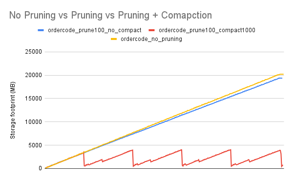

### Running CometBFT's e2e application in a mixed network of 6 nodes. 
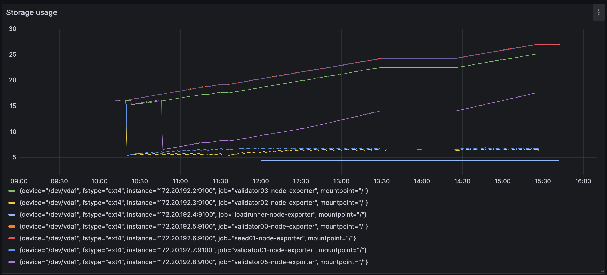
 
 The nodes doing pruning and compaction have a constant footprint compared to the other nodes. 
 *validator03* and *validator05* prune without compaction. They have a smaller footprint than the 
 nodes without pruning. The fact that the footprint of *validator05* has a lower footprint than 
 *validator03* stems from the compaction logic of `goleveldb`. As the keys on *validator03* are sorted
 by height, new data is simply appended without the need to reshuffle very old levels with old heights. 
 On *validator05*, keys are sorted lexicographically leading to `goleveldb` *touching* more levels on insertions. By default, the conditions for triggering compaction are evaluated only when a file is touched. This is the reason why random key order leads to more frequent compaction. (This was also confirmed by [findings](https://github.com/cometbft/cometbft/files/12914649/DB.experiments.pdf) done by our intern in Q3/Q4 2023 on goleveldb without Comet on top, part of the [issue](https://github.com/cometbft/cometbft/issues/64) to understand the database backends and decide which one to optimize and choose.). 

### Production - Injective mainnet

#### Pruning without compaction

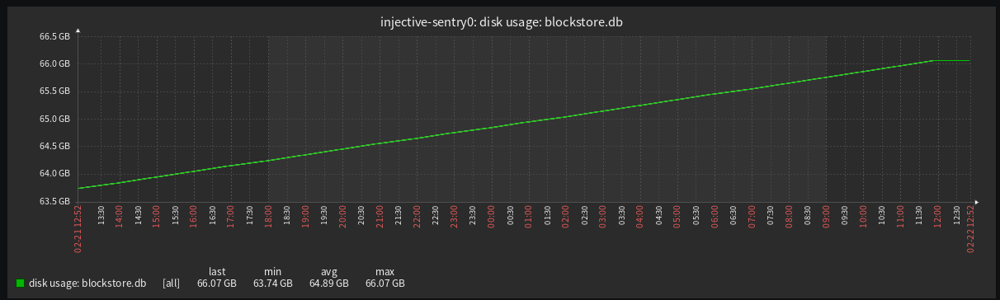
#### Pruning with compaction

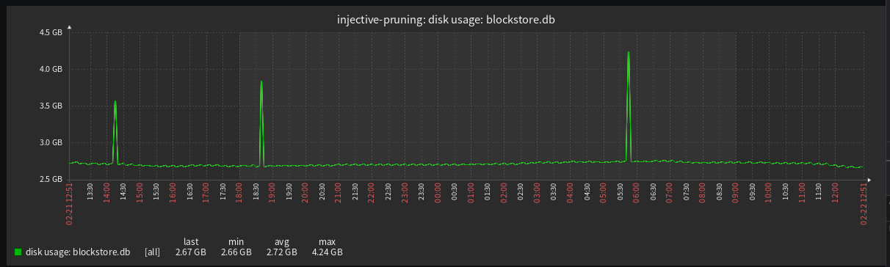

## Pruning is slowing nodes down

While the previous results confirm the storage footprint can be reduced, it is important that this is not impacting the performance of the entire system. 

The most impactful change we have made with regards to that is moving block and state pruning into a background process. Up until v1.x, pruning was done before a node moves on to the next height, blocking 
consensus from proceeding. In Q3 2023, we changed this by launching a pruning service that checks in fixed intervals, whether there are blocks to be pruned. This interval is configurable and is `10s` by default. 

### Production - Injective mainnet
The impact of this changes is best demonstrated with the runs by Informal staking comparing 4 Injective nodes with the following setup:

1. *injective-sentry0* comet="v0.37" , pruning="default", keylayout=old
2. *injective-sentry1* comet="v0.37" , pruning="none" , keylayout=old
3. *injective-pruning* comet="modified" , pruning="600blocks" , keylayout=old
4. *injective-newlayout* comet="modified" , pruning="600blocks" , keylayout=new

Comet v0.37 is the current 0.37 release used in production where pruning is not happening within a background process. 

We report the time to execute Commit:
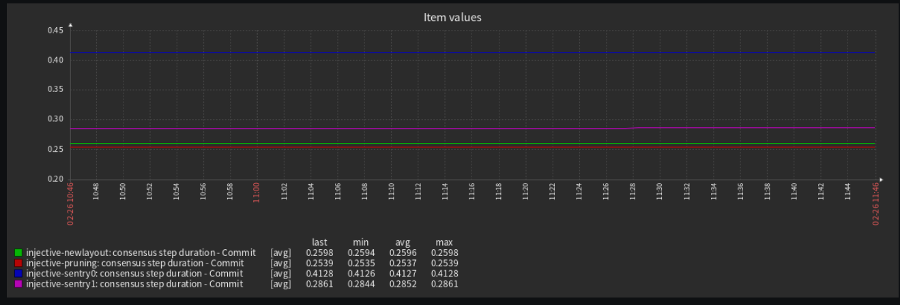

The time to complete Commit for pruning done within the same thread, the Commit step takes 412ms vs 286ms when no pruning is activated. Using these numbers as baseline, the new changes for both layout do not degrade performance. The duration of Commit with pruning over the current DB key layout is 253ms, and 260ms on the new layout. 

The graph below plots the block processing time for the 4 nodes.

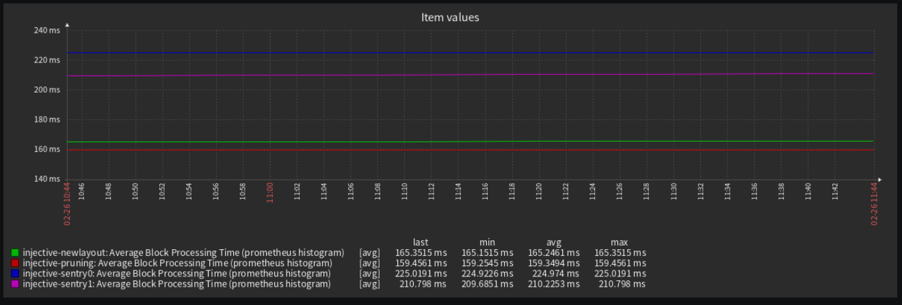

The new changes lead to faster block processing time compared even to the node that has no pruning active. However, the new layout seems to be slightly slower. We will discuss this in more details below. 

## Database key layout and pruning

The results above clearly show that pruning is not impacting the nodes performance anymore and could be turned on. The next step was determining whether we should remove the current database key representation from CometBFT and use the new ordering by height, which should be more optimal. (Pure golevelDB benchmarks showed orders of magnitute improvement when keys were written in order vs randomly: 8s vs 16ms - this can be seen in the PDF report on `goleveldb` experiments linked above).
However, while running the same set of experiments locally vs. in production, we obtained contradicting results on the impact of the key layout on these numbers. 

### **Local-1node** 
In this setup, we came to the conclusion that, if pruning is turned on, only the version of CometBFT using the new database key layout was not impacted by it. The throughput of CometBFT (measured by num of txs processed within 1h), decreased with pruning (with and without compaction) using the current layout - 500txs/s vs 700 txs/s with the new layout. The compaction operation itself was also much faster than with the old key layout. The block time difference is between 100 and 200ms which for some chains can be significant. 
The same was true for additional parameters such as RAM usage (200-300MB). 

We show the findings in the table below. `v1` is the current DB key layout and `v2` is the new key representation leveraging ordercode. 

| Metric              | No pruning v1 | No pruning v2 | Pruning v1 | Pruning v2 | Pruning + compaction v1 | Pruning + compaction v2
| :---------------- | :------: | ----: | ------: | ----: | ------: | ----: |
| Total tx       |   2538767   | 2601857 | 2063870 | 2492327 | 2062080 | 2521171 |
| Tx/s           |   705.21   | 722.74 | 573.30 | 692.31 | 572.80 | 700.33 |
| Chain height   |   4936   | 5095 | 4277 | 4855 | 4398 | 5104 |
| RAM (MB)    |  550   | 470 | 650 | 510 | 660 | 510|
| Block processing time(ms) |  1.9   | 2.1 | 2.2 | 2.1 | 2.0 | 1.9 |
| Block time (s) | 0.73| 0.71 | 0.84 | 0.74| 0.82| 0.71|

We collected locally periodic heap usage samples via `pprof` and noticed that compaction for the old layout would take ~80MB of RAM vs ~30MB with the new layout. 

When backporting these changes to the 0.37.x based branch we gave to Informal staking, we obtained similar results when ran locally on the kvstore app. However, this is not what they observed on mainnet. In the graphs above, we see that the new layout, while still improving performance compared to CometBFT v0.37.x, introduced a ~10ms latency in this particular case. According to the operators, this is a big difference for chains like Injective. 

### **e2e - 6 nodes**

In this experiment, we started a network of 6 validator nodes and 1 seed node. Each node had an initial state with 11GB in its blockstore. The configuration of the nodes is the same one as in the local runs:

 - **validator00**: Current layout - no pruning 
 - **validator05**: Current layout - pruning, no forced compaction
 - **validator02**: Current layout - pruning and forced compaction
 - **validator04**: New layout - no pruning
 - **validator03**: New layout - pruning, no forced compaction
 - **validator01**: New layout - pruning and forced compaction 

 Once the nodes synced up to the height in the blockstore, we ran a load of transactions against the network for ~6h. As the run was long, we alternated the nodes to which the load was sent to avoid potential pollution of results by the handling of incoming transactions . 

*Block time*

As all nodes were validator nodes who were able to most of the time keep up, their block times were very similar (~3ms of difference). We thus looked whether validators were missing blocks and the Commit time to give us an indication of the impact the layout and pruning have.

*Time to execute Commit*

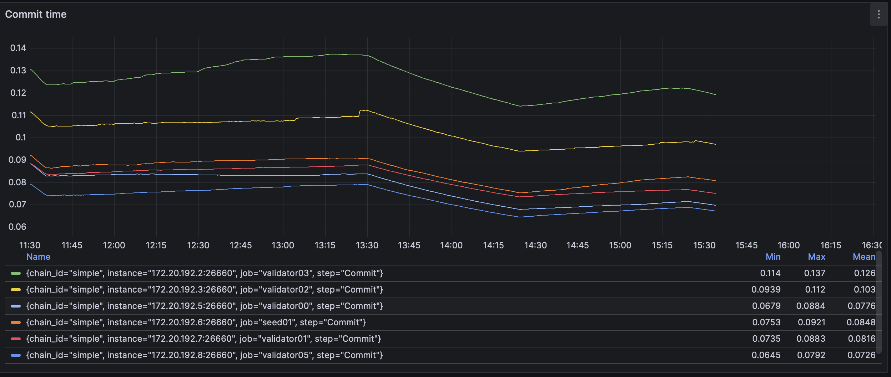

*Missed blocks*
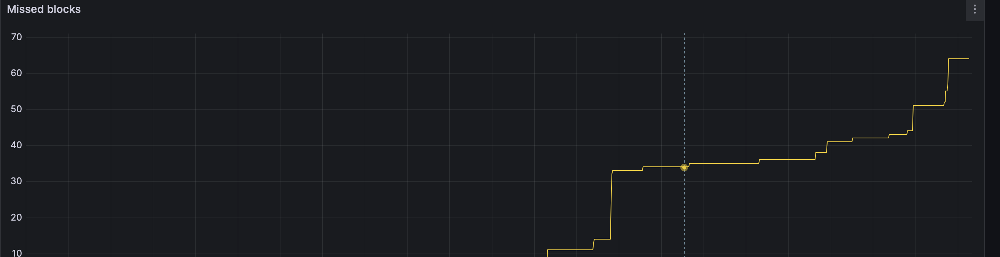

The graph above shows the number of missed blocks per validator. *validator02* is doing pruning and compaction using the old layout and keeps missing blocks. The other two validators all use the new layout with *validator03* doing pruning without compaction compared to *validator01* who missed only 1 block while doing pruning and compaction. 

This is something we could not verify in production because the nodes ran by Informal Staking were not validator nodes. 

 *Block Store Access time* 

 In general, store access times are very low, without pruning they are up to 40ms.  The storage device on the Digital Ocean nodes are SSDs but many of our operators use state of the art NVMe devices, thus they could be even lower in production. 
 Without pruning, the current layout is slightly faster than the new one. However, when pruning is turned on and deletions are performed, the access times grow (to 100s of ms) and using the new layout leads to lower access times. The gap grows slightly as the database size grows (second graph). 

 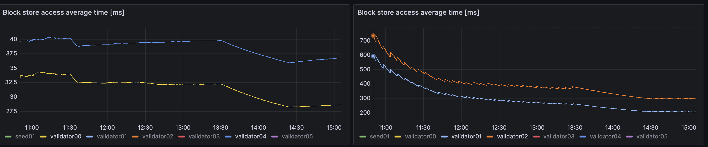

 *State Store Access time*

 The conclusions for the state store access times are very similar to those for the blockstore. Note though that in our e2e app the state store does not grow to more than 1GB as we disabled ABCI results saving and the validator set is not updated - which typically leads to increase in state. 

 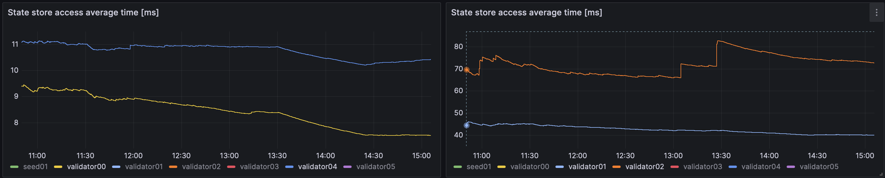

 *RAM Usage*
 The difference in RAM used between the nodes was not very big. Nodes that prune efficiently (with compaction), used 20-40MB more RAM than nodes that did no pruning. 
 
 But *validator04* and *validator00*  (no pruning) are using 278MB of RAM . *validator02* (pruning on old layout) uses 330MB of RAM and *validator01*(pruning on new layout) uses 298MB. This is in line with the local runs where pruning on the new layout uses less RAM. 

### Conclusion on key layout
As demonstrated by the above results, and mentioned at the beginning, `v1.x` will be released with support for the new key layout as a purely experimental feature.

Without pruning, for a bigger database and block processing times (on runs with our e2e), the new layout lowered the overall block processing time even without pruning. When the block times are very low (in our local setup or on Injective), we did not observe the same benefits. 
 
Thus, the final decision should be left to the application after testing and understanding their behaviour. 

As the feature is experimental, we do not provide a way to convert the database back into the current format if it is initialized with the new layout. 

The two layouts are not interchange-able, once one is used, a node cannot switch to the other. The version to be used is set in the `config.toml` and defaults to `v1` - the current layout. Once the layout is set, it is written back to the database with `version` as the key. When a node boots up and loads the database initially, if this flag is set, it takes precedence over any configuration file. 

The support for both layouts will allow users to benchmark their applications. If at any point we get clear indications that one layout is better than the other, we will gladly drop support for one of them and provide users with a way to migrate their databases gracefully. 

## Pebble

`PebbleDB` was recently added to `cometbft-db` by Notional labs and based on their benchmarks it was superior to goleveldDB. 

We repeated our tests done in **1-node-local** using PebbleDB as the underlying database. While PebbleDB is slightly better in performance (tx/s), the most impressive difference is that PebbleDB seemed to handle compaction very well without a need to enforce it. 

In the graph below, we see the old layout without any compaction and the new layout with and without compaction on the same workload that generated 20GB of data when no pruning is active. 

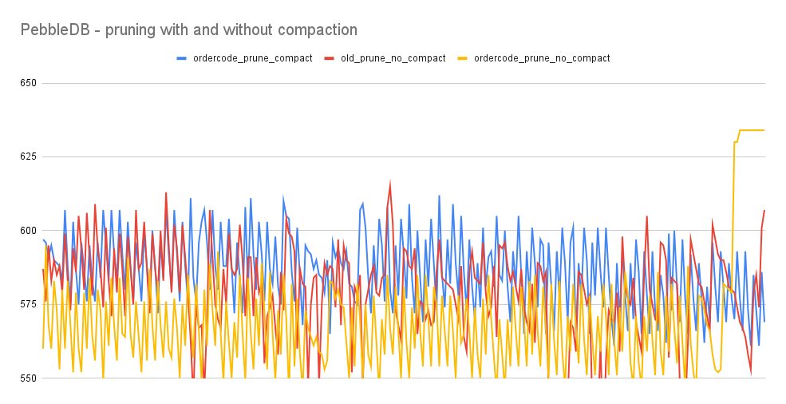

The table below shows the performance metrics for Pebble:

| Metric              | No pruning v1 | No pruning v2 | Pruning v1 | Pruning v2 | Pruning + compaction v1 | Pruning + compaction v2
| :---------------- | :------: | ----: | ------: | ----: | ------: | ----: |
| Total tx       |   2827232   | 2906186 | 2851298 | 2873765 | 2826235 | 2881003 |
| Tx/s           |   785.34   | 807.27 | 792.03 | 798.27 | 785.08 | 800.28 |
| Chain height   |   5743   | 5666 | 5553| 5739 | 5551 | 5752 |
| RAM (MB)    |  494   | 445 | 456 | 445 | 490 | 461 |
| Block processing time(ms) |  2.1   | 3.9 | 2.1 | 2.1 | 2.1 | 2.1 |
| Block time (s) | 0.63 | 0.64 | 0.65 | 0.63 | 0.65 | 0.63 |