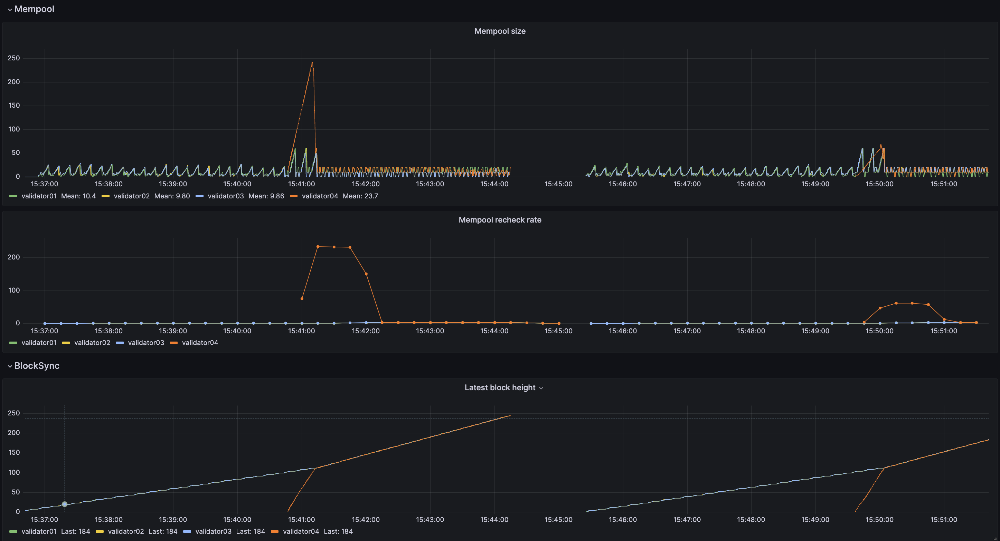

# RFC 103: Incoming transactions when node is catching up

## Changelog

- 2023-04-20: Initial version (@hvanz)
- 2023-05-02: Update following PR comments (@hvanz)
- 2023-05-04: Update following more PR comments (@hvanz)

## Abstract

Once a node starts running and is initialized, it can receive transactions from
clients via RPC endpoints or from other nodes via P2P channels in its mempool
reactor. The node then validates these transactions using `CheckTx` calls to the
application. This process occurs even when the node is catching up to reach the
latest block heights through state sync or block sync, and the application may
not be up to date yet with the latest height of the blockchain. If a
transaction's validity depends on the application state, it will likely be
rejected by the application when received at this stage.

This document aims to answer the following questions:
- How should a node handle incoming transactions while catching up? Should it
  reject all transactions until it switches to consensus mode, or should it call
  `CheckTx` even though the application will likely deem the transaction
  invalid?
- Should nodes or clients send transactions when they suspect the receiving node
  is not initialized?

## Background

### Life cycle of a node

A CometBFT node transitions through the following stages: set up,
initialization, catch up, and consensus.

When a node starts executing (for instance, from the CLI with the `start`
command), it first reads its configuration files and *sets up* all its
components, including reactors, stores, P2P connections, and RPC services. Then,
the node starts running and turns on all the components. At this point we say
that the node is *initialized*. The mempool reactor is running and the [RPC
endpoints][rpc] are open, allowing the node to [receive][receive] and process
transactions from other nodes and clients.

The node could start the consensus protocol immediately to reconstruct the block
history, but this could take a very long time. State sync and block sync are much
faster mechanisms to bootstrap the node and reach the latest heights of the
chain. While a node is performing state sync or block sync, it is in *catch up*
mode. Once synchronization finishes, the node is not necessarily at the
latest height, but it is assumed to be fairly close to it, so the node is ready
to fully participate in consensus. At this point, it switches to *consensus*
mode, which should never leave unless it is stopped or it crashes.

### Transaction validation with CheckTx

The `CheckTx` [method][check-tx] acts as a gatekeeper to the mempool, which
only accepts valid transactions. The validity of a transaction is defined
deterministically by the application, but it may depend on the application
state, which may change at every height.

`CheckTx` is called:
- from the [RPC endpoints][rpc] `broadcast_tx_async`, `broadcast_tx_sync`, and
  `broadcast_tx_commit`, and
- when the node [receives][receive] a `Txs` message from a peer: for each
  transaction in `Txs` there will be a call to `CheckTx`.

`CheckTx` puts the transaction in the cache, sends a `RequestCheckTx` ABCI
message to the application, and sets a callback to process a `ResponseCheckTx`.
If the application deems the transaction as valid, `CheckTx` stores the
transaction in the mempool and notifies the consensus reactor that there are
transactions available to be [put in a new block][reap]. Otherwise it does not
add the transaction to the mempool and removes it from the cache.

### Mempool cache

The mempool reactor implements a cache of received transactions that it uses to
discard already-seen transactions, thus avoiding processing duplicates.

Transactions remain in the cache until the application replies that a
transaction is invalid. This can occur in three cases.
1. The first time a transaction is received and then rejected by `CheckTx`.
2. When the block executor [updates][update] the mempool, right after finalizing
   and committing a block: if there was an error while executing a transaction
   against the application, then it is removed from the cache. 
3. When all the transactions in the mempool need to be rechecked after a new
   block has been delivered to the application. Each transaction will be
   validated again with `CheckTx` and removed from the cache if deemed invalid.

In the first and third cases, the reply from the application is a
`ResponseCheckTx` message. In the second case, the reply is a
`ResponseFinalizeBlock`.

All these cases are for removing invalid transactions, so the cache also
requires that `keep-invalid-txs-in-cache` is set to false. The configuration
`keep-invalid-txs-in-cache` is for ignoring invalid, already-seen transactions.
This is useful for applications that consider rejected transactions will never
be accepted again.

When a transaction is received, cached, and deemed valid, but the mempool is
full, it is not kept in the cache. This is done to provide an opportunity for
the transaction to be re-validated if it is received again later, potentially
when there is sufficient free space in the mempool.

## Discussion

### Inbound messages

A node that is not in consensus mode, should accept or reject incoming
transactions? The mempool reactor currently accepts and validates all incoming
transactions. It only implements the cache to discard already-seen transactions.

There are not many reasons at this stage to have an operational mempool reactor
and the `broadcast_tx_*` [endpoints][rpc] open. One reason is to store
transactions to be able to validate them and have them ready once the node
switches to consensus mode (in particular, the node could be the next
validator). Another reason is for participating actively in the gossip protocol
for propagating transactions. In any case, the application will most probably
reject transactions if its validity depends on the application state. And the
reactor only propagates transactions that are validated and stored in the
mempool.

__Decision__ Nodes that are catching up cannot guarantee effective handling of
incoming transactions. They are not yet prepared to participate in transaction
propagation properly. Therefore we see no strong reason at this stage for
keeping the mempool reactor operational and the `broadcast_tx_*` endpoints open.
Instead, we believe that nodes should reject incoming transactions until they
switch to consensus mode. This approach will provide clearer semantics for the
RPC endpoints, thus improving the user experience. Please refer to issue
[#785](https://github.com/cometbft/cometbft/issues/785), which will address this
decision.

### Outbound messages

We cannot control or predict what a client may send to the RPC endpoints, but we
can dictate what honest nodes must send to their peers.

The gossip algorithm currently implemented is a naive *push* protocol: a node
will forward all the transactions in its mempool to all its peers, except to the
nodes from which it received the transaction.

The protocol implements only one minor optimization. For each peer, the
`broadcastTxRoutine` [function][broadcast] in the mempool reactor iterates
through all transactions in the mempool and sends them one by one to a peer.
Just before sending a transaction, if the node suspects that the peer is lagging
behind, it waits some time before checking again if the node has caught up. This
is the [code][optimization]:
```golang
if peerState.GetHeight() < memTx.Height()-1 {
  time.Sleep(PeerCatchupSleepIntervalMS * time.Millisecond)
  continue
}
```
where: 
- `peerState` is the local state of the peer (updated with the information
  received by the consensus reactor in `PeerState.ApplyNewRoundStepMessage`
  messages), 
- `memTx.Height()` is the height at which transaction `memTx.tx` was validated
  (set during the handling of `CheckTx` responses), and
- `PeerCatchupSleepIntervalMS` is fixed to `100`.

>For a historical reference, this optimization has been around since 2015. There
>is no documentation or comment on the reason it was introduced. A first version
>with only the condition to check the peer's height was introduced in a
>[commit](https://github.com/tendermint/tendermint/commit/12566f51af2bbdc73e3c79c603be0593d8cb1574)
>from September 2015. In December 2015 a huge refactoring
>[commit](https://github.com/CometBFT/cometbft/commit/ef43af19ab2af994afaf9fdb148df2918454d9c4)
>introduced the line that makes the broadcast routine sleep.

> Note that the evidence reactor implements a similar optimization.

Should the code for this optimization be removed from the mempool reactor to
make it consistent with how the [RPC endpoints][rpc] are implemented, that is,
without filtering any message? Experimental evidence shows that actually the
optimization works and improves the behavior of the nodes. The following picture
shows the results of an experiment with four interconnected nodes. On the left
we see the collected metrics when we run the nodes without the optimization. On
the right we see the results of running the nodes with the optimization, that
is, without modifying the code.
 The node in
orange called _validator04_ joins the network at around height 100 and starts
performing block sync. In the graph at the bottom we can see the height of all
nodes and in particular how this node starts from height 0 and catches up with
the other nodes. Also we can observe that, when the optimization is disabled
(left side), while the orange node is catching up, both its mempool size (top
graph) and the number of rejected transactions (middle graph) increases
significantly compared to the optimizated code (right side). 

__Decision__ The results presented above indicate that the optimization is
effectively improving the system's performance and should be kept for now. In
particular, the decrease in mempool size implies that the memory usage of the
catching-up node is lower compared to those with the unoptimized code.
Similarly, the decrease in the recheck rate suggests that CPU usage is also
lower.

## References

### Mempool Reactor

1. [Receive][receive]
1. [broadcastTxRoutine][broadcast]
1. [Outbound optimization][optimization]

### CListMempool

1. [CheckTx][check-tx]
1. [Update][update]
1. [ReapMaxBytesMaxGas][reap]

### RPC endpoints

1. [broadcast_tx_*][rpc]


[receive]: https://github.com/CometBFT/cometbft/blob/23c37d65990aa8ef2cc5a442792f56eb87d4d1e9/mempool/reactor.go#L93
[broadcast]: https://github.com/CometBFT/cometbft/blob/23c37d65990aa8ef2cc5a442792f56eb87d4d1e9/mempool/reactor.go#L132
[optimization]: https://github.com/CometBFT/cometbft/blob/23c37d65990aa8ef2cc5a442792f56eb87d4d1e9/mempool/reactor.go#L171-L174
[check-tx]: https://github.com/cometbft/cometbft/blob/23c37d65990aa8ef2cc5a442792f56eb87d4d1e9/mempool/clist_mempool.go#L202
[update]: https://github.com/cometbft/cometbft/blob/23c37d65990aa8ef2cc5a442792f56eb87d4d1e9/mempool/clist_mempool.go#L577
[reap]: https://github.com/cometbft/cometbft/blob/23c37d65990aa8ef2cc5a442792f56eb87d4d1e9/mempool/clist_mempool.go#L519
[rpc]: https://github.com/cometbft/cometbft/blob/23c37d65990aa8ef2cc5a442792f56eb87d4d1e9/rpc/core/mempool.go#L22-L144
