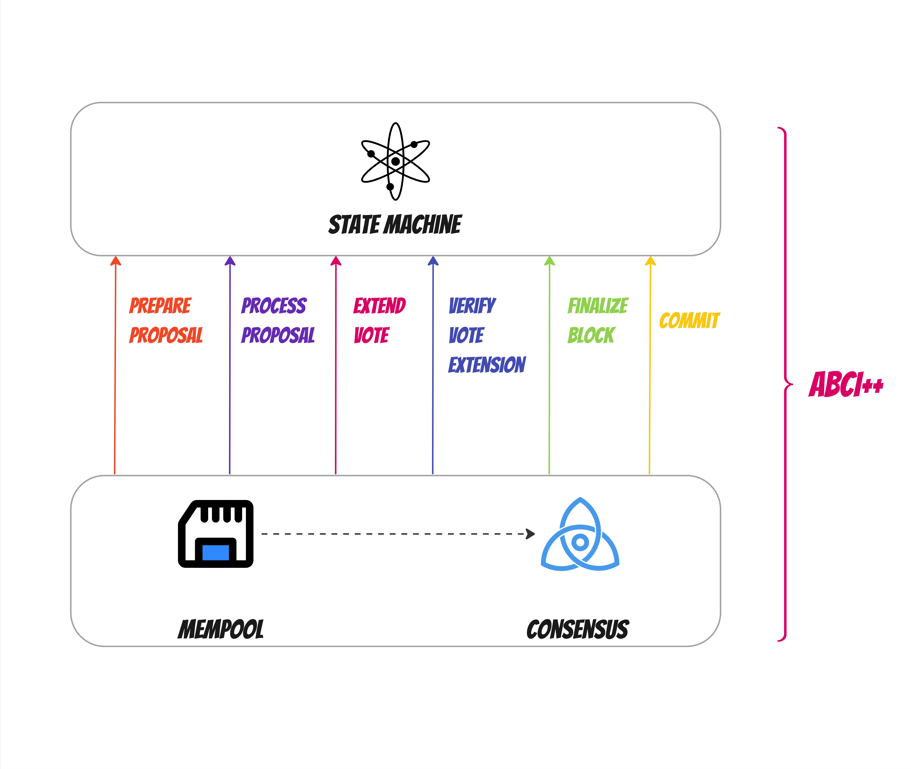

# Introduction to ABCI 2.0

`ABCI 2.0` is an updated version of the ABCI (Application Blockchain Interface) from CometBFT. For more details, check the [specification document](https://docs.cometbft.com/v1.0/spec/abci/).

## ABCI 2.0 Methods

### PrepareProposal

- **Purpose**: Modify block proposals before finalization.
- **Process**: The block proposer collects pending transactions, creating a "raw proposal". The application can then reorder, add, or remove transactions, creating a "prepared proposal."

### ProcessProposal

- **Purpose**: Validate a block proposal based on application-specific rules.
- **Process**: Validators assess the proposal and can reject invalid blocks. If rejected, the consensus algorithm will perform a nil prevote. The logic must be deterministic to avoid liveness problems.

### ExtendVote

- **Purpose**: Add application-specific data to pre-commit messages.
- **Process**: Validators can add vote extensions to their pre-commit messages, which the application can use later. If no data is added, a zero-length byte array is returned. This method can use non-deterministic logic.

### VerifyVoteExtension

- **Purpose**: Validate vote extension data in pre-commit messages.
- **Process**: Checks the integrity of vote extensions. If invalid, the entire pre-commit message is rejected. This method must follow deterministic logic to avoid liveness problems.

### FinalizeBlock

- **Purpose**: Process a decided proposal and update the application's state.
- **Process**: Includes transaction results, updates to the validator set, changes to consensus parameters, and the `app_hash`. Changes are not persisted until the `Commit` phase.

### Commit

- **Purpose**: Permanently store finalized state changes.
- **Process**: Before `Commit`, the mempool is locked to prevent new transactions. The application must persist state changes to ensure blockchain integrity and reliability.

---------------

*In the next session, you will learn about [**Forum Application**](2.intro-forumApp.md) and how it functions.*
