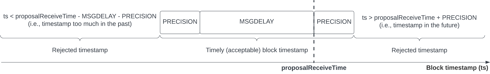

# Proposer-Based Timestamps (PBTS)

This document describes a version of the Tendermint consensus algorithm
that uses proposer-based timestamps.

PBTS is a Byzantine fault-tolerant algorithm used by CometBFT for computing [block times](../time.md).

## Overview

With PBTS, the timestamp of a block is assigned by its
proposer, according with its local clock.
In other words, the proposer of a block also *proposes* a timestamp for the block.
Validators can accept or reject a proposed block.
A block is only accepted if its timestamp is acceptable.
A proposed timestamp is acceptable if it is *received* within a certain time window,
determined by synchronous parameters.

The motivation for introducing this new method for assigning timestamps is
summarized in the [first draft proposal][main_v1].

### Synchronous Parameters

For validating timestamps, PBTS augments the system model considered by the
consensus algorithm with *synchronous assumptions*:

- **Synchronized clocks**: simultaneous clock reads at any two correct validators
differ by at most `PRECISION`;

- **Bounded message delays**: the end-to-end delay for delivering a `Proposal`
  message, broadcast by a correct proposer, to all correct validators is 
  bounded by `MSGDELAY`.

`PRECISION` and `MSGDELAY` are consensus parameters, shared by all validators,
that define whether the timestamp of a block is acceptable,
according with the introduced `timely` predicate.

#### Note on Liveness

Setting too small values for synchronous parameters can compromise,
possibly in an irreversible way, liveness of consensus.
This is particularly relevant for the `MSGDELAY` parameter.
When the `Proposal` end-to-end delay is underestimated or unrealistic, proposed block
times can be rejected by all correct nodes.

In order to prevent networks with bad parameters from not making progress (that is, 
remaining at the consensus instance for same height forever), the `MSGDELAY`
parameter has become adaptive in the implementation.
This means that the `MSGDELAY` parameter should be interpreted in the form `MSGDELAY(r)`, where `r` is the
consensus round, with `MSGDELAY(r+1) > MSGDELAY(r)`.
The original `MSGDELAY` is therefore in practice `MSGDELAY(0)`.

More details and discussion on [issue 2184][issue2184].

### Timestamp Validation

The `timely` predicate is defined as follows.
Let `proposalReceiveTime` be the time, read from its local clock, at
which a validator receives a `Proposal` message for a `block` with timestamp `ts = block.time`.
The proposed timestamp `ts` can be accepted if both:

 - `ts <= proposalReceiveTime + PRECISION`
 - `ts >= proposalReceiveTime - MSGDELAY - PRECISION`

The following diagram graphically represents the conditions for accepting a proposed timestamp:

A more detailed and formalized description of the `timely` predicate is available in the
[System Model and Properties][sysmodel] document.

## Implementation

The implementation of PBTS requires some changes in Tendermint consensus algorithm,
summarized below:

- A proposer timestamps a block with the current time, read from its local clock.
The block's timestamp represents the time at which it was assembled
(after the `getValue()` call in line 18 of the [arXiv][arXiv] algorithm):

    - Block timestamps are definitive, meaning that the original timestamp
	is retained when a block is re-proposed (line 16);

    - To preserve monotonicity, a proposer might need to wait until its clock
	reads a time greater than the timestamp of the previous block;

- A validator only prevotes for a block if its timestamp is considered `timely`
(compared to the original algorithm, a check is added to line 23).
Otherwise, the validator prevotes `nil` (line 26):

    - Validators register the time at which they received `Proposal` messages,
	in order to evaluate the `timely` predicate;

    - Blocks that are re-proposed because they received `2f+1 Prevotes`
	in a previous round (line 28) are not subject to the `timely` predicate,
    as their timestamps have already been evaluated at a previous round.

The full solution is detailed and formalized in the [Algorithm Specification][algorithm] document.

## Further details

- [System Model and Properties][sysmodel]
- [Algorithm Specification][algorithm]
- [TLA+ Specification][proposertla]

### Issues

- [cometbft#2184: PBTS: should synchrony parameters be adaptive?][issue2184]
- [tendermint/spec#355: PBTS: evidence][issue355]: can we punish Byzantine proposers?
- [tendermint/spec#377: PBTS: margins for proposal times assigned by Byzantine proposers][issue377]

[main_v1]: ./v1/pbts_001_draft.md

[algorithm]: ./pbts-algorithm.md
[algorithm_v1]: ./v1/pbts-algorithm_001_draft.md

[sysmodel]: ./pbts-sysmodel.md
[sysmodel_v1]: ./v1/pbts-sysmodel_001_draft.md
[timely-predicate]: ./pbts-sysmodel.md#timely-predicate

[proposertla]: ./tla/README.md

[bfttime]: ../bft-time.md
[arXiv]: https://arxiv.org/pdf/1807.04938.pdf

[issue353]: https://github.com/tendermint/spec/issues/353
[issue355]: https://github.com/tendermint/spec/issues/355
[issue370]: https://github.com/tendermint/spec/issues/370
[issue371]: https://github.com/tendermint/spec/issues/371
[issue372]: https://github.com/tendermint/spec/issues/372
[issue377]: https://github.com/tendermint/spec/issues/377
[issue2184]: https://github.com/cometbft/cometbft/issues/2184
