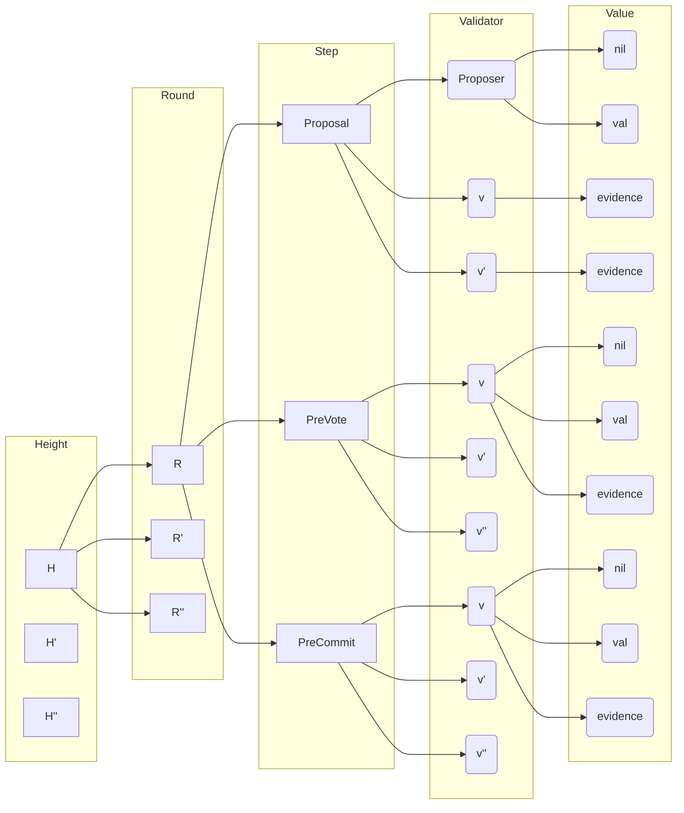

# Part 1: Background

> **Warning**    
> We assume that you understand the Tendermint algorithm and therefore we will not review it here. 
If this is not the case, please refer to [here](../).

The Tendermint algorithm assumes that a **Global Stabilization Time (GST)** exists, after which communication is reliable and timely, i.e., it satisfies the following property:

| Eventual $\Delta$-Timely Communication|
|-----|
|There is a bound $\Delta$ and an instant GST (Global Stabilization Time) such that if a correct process $p$ sends a message $m$ at a time $t \geq \text{GST}$ to a correct process $q$, then $q$ will receive $m$ before $t + \Delta$.

**Eventual $\Delta$-Timely Communication** is the basis for a stronger assumption, **Gossip Communication**, which is used to ensure progress.

|Gossip communication|
|-----|
| (i) If a correct process $p$ sends some message $m$ at time $t$, all correct processes will receive $m$ before $\text{max} \{t,\text{GST}\} + \Delta$.
| (ii) If a correct process $p$ receives some message $m$ at time $t$, all correct processes will receive $m$ before $\text{max}\{t,\text{GST}\} + \Delta$.

In the Tendermint algorithm, three kinds of messages are exchanged: `PROPOSAL`, `PRE-VOTE`, and `PRE-COMMIT`.
The algorithm progresses when certain conditions are satisfied over the set of messages received.
For example, in order do decide on a value `v`, the set must include a `PROPOSAL` for `v` and more than two thirds of the number processes in `PRE-COMMIT` for the same `v`, during the same round.
Roughly speaking, if Gossip Communication is guaranteed and only correct processes existed, then when GST is eventually reached, previously sent `PROPOSAL` and `PRE-COMMIT` messages will be delivered and a decision made.

However, since processes are subject to failures, it is not guaranteed that needed messages are ever sent and correct processes cannot wait indefinitely.
Hence, processes executes in rounds in which they wait for conditions to be met for sometime but, if they timeout, they send negative message that will lead to new rounds.
Again, Gossip Communication guarantees that eventually the conditions for deciding are met, even if only after GST is reached.

Implementing Gossip Communication, however, is hard for two main reasons. 
First, it relies on a GST, which may never arrive.
Second, even if the GST will definitely arrive, it could still take arbitrarily long to do so and, in practice, implementing this property would require unbounded memory since even messages sent before the GST need to be buffered to be reliably delivered between correct processes.

Fortunately, while Gossip Communication is a sufficient condition for the Tendermint algorithm to terminate, it is not strictly necessary, because the conditions to progress and terminate are evaluated over the messages of subsets of rounds executed, not all of them.
The remaining messages may be ignored and forgotten, in order to bound memory usage.

> **TODO**    
> Expand the text to justify why we are taking a CRDT approach.
> 
> We care about the information about what has been proposed and what each process has voted for.
> We represent this as an incremental replicated data-structure that processes try to converge (eventual consistency), a CRDT.
>
> - Gossip communication is a way to implement this as an operations based CRDT.
> - Actual gossiping is a way to implement this as a state based CRDT.
> - Pruning is provided by a merge operation that drops superseded information
>    - Rounds smaller than the latest proof-of-lock-round may be pruned. 
>    - Heights smaller than the current height may be pruned.

## The Condition State

The condition state consists in a forrest of trees keeping information regarding heights.
Each tree contains the information regarding a single height, 1-to-1.
The root of the tree contains the corresponding height number; we used may use tree and height interchangeably.

Each height is linked to the all the Rounds for the corresponding height.
Each Round is further linked to steps validators go through in protocol's rounds.
And each step is linked to Validators in the validator set for the corresponding round and height.

Each validator is associated with states equal to the value it has proposed, pre-voted or pre-committed, during the corresponding steps of the protocol.
Given that each validator can set this state at most once per round, the values associated with the validator are either $\bot$, if the state has not been set, or an actual value.
In the specific case of the Proposal step, only the Proposer for a round should ever have a value different from $\bot$.

The Condition State is potentially infinite, given that the number of heights and rounds is infinite.
Each process $p$ keeps a local view $L_p$ of the Condition State forest $C$, which approximates the full state in the following ways:
- not all trees in $C$ have a corresponding tree in $L_p$;
    - if $p$ has never heard of a tree, then it cannot be included in $L_p$.
    - the tree was pruned.
    - trees in $L_p$ may be removed if their information is guaranteed not be be required in the future.
    - $p$ knows how to differentiate a dropped subtrees from subtrees that have never been known;
- any tree in $L_p$, excluding value leaves, must be prefixes of trees in $C$.
- the value leaf $v_p$ in $L_p$ and the corresponding value leaf $v_C/$ in $C$ are related in the following way:
    - if $v_C = \bot$, then $v_p = \bot$
    - if $v_C \neq \bot$, then $v_p = \bot \lor v_p = v_p$
    > **TODO**: evidence of misbehavior: $v_C \neq \bot \neq v_p \neq v_C$ implies misbehavior.

> **TODO**    
> The local views of processes are a CRDT:
> - Prune is performed as a result of updates that with newer information, be it because of a new message or because of a merge.
> - The gossip state clearly mirrors the Tendermint algorithm messages (each value leaf corresponds to a received message), so it is clear that it can be implemented as an operation based CRDT.
>   - Operation based CRDT require reliable messaging, masked as Gossip Communication in the whitepaper.
>   - Pruning a tree drops the requirement for reliably delivering messages corresponding to the pruned parts.
> - The state may also be implemented as state based CRDT.
>   - Relevant parts of the tree are shared through gossiping.
>   - Pruned parts should not be relevant (or they wouldn't have been pruned).
>   - CometBFT implements this approach, although unknowingly.

If implemented as an operation-based CRDT, then the messages exchanged 

Therefore we formalize the requirements of the Tendermint algorithm in terms communication primitives that take supersession into account, providing a *best-effort* to deliver all messages but which may not deliver those that have been superseded.
During LSP, in which messages are timely delivered, the algorithm will not broadcast superseding messages needlessly (for example, due to timeouts), ensuring eventual progress.

|Best-Effort Communication with Supersession|
|-----|
| If a correct process $p$ broadcasts/delivers some message $m$, then, eventually, either $m$ is superseded or every correct process delivers $m$.|

> **Note**
> 1. Processes should not broadcast messages superseded from the start, but this behavior should not be assumed.
> 2. The delivery of superseded messages is not required, but this behavior should not be assumed.

In order to deliver messages even in the presence of failures, the network must be connected in such a way to allow routing messages around any malicious nodes and to provide redundant paths between correct ones.
This may not be feasible at all times, but should happen at least during periods in which the system is "stable".

In other words, during periods without network partition, in which messages are timely delivered, and that are long enough for the multiple communication rounds to succeed, non-superseded messages from correct processes will be delivered to all other correct processes.
We call "long enough" $\Delta$.

| Eventual $\Delta$-Timely Communication with Supersession |
|---|
| If a correct process $p$ broadcasts/delivers some message $m$ at time $t$, then, before $\text{max} \{t,\text{GST}\} + \Delta$, either $m$ is superseded or every correct process delivers $m$.

$\Delta$ encapsulates the assumption that, during stable periods, timeouts eventually do not expire precociously, given that they all can be adjusted to reasonable values, and the steps needed to deliver a message can be accomplished within $\Delta$.
Without precocious timeouts, no needless supersession of messages should happen and all messages exchanged should help algorithms progress.
In the Tendermint algorithm, for example, no votes for Nil are broadcast, and Best-Effort Communication with Supersession leads to Eventual $\Delta$-Timely Communication with Supersession, which leads to termination.

Clearly, if GST is reached, then there must be such $\Delta$ and while GST cannot be enforced but simply assumed to show that algorithms can make progress under good conditions, in practice, systems do go through frequent LSP which allow algorithms that depend on GST use to make progress.

> :clipboard: **TODO**
> * Show that "best-effort superseded communication" + GST implies "Eventual delta timely superseded communication".

# Part 2: CONS/GOSSIP interaction

CONS, the Consensus Reactor State Layer, is where the actions of the Tendermint algorithm are implemented.
Actions are executed once certain pre-conditions apply, such as timeout expirations or reception of information from particular subsets of the nodes in the system, neighbors or not.

An action may require communicating with applications and other reactors, for example to gather data to compose a proposal or to deliver decisions, and with the P2P layer, to communicate with other nodes.

## Northbound Interaction - ABCI
Here we assume that all communication with the Application and other reactors are performed through the Application Blockchain Interface, or [ABCI](../../abci/).
We make such assumption based on the example of how proposals are created; although CONS interacts with with the Mempool reactor to build tentative proposals, actual proposals are defined by the Applications (see PrepareProposal), and therefore the communication with Mempool could be ignored.

ABCI specifies both what CONS [requires from the applications](../../abci/abci%2B%2B_app_requirements.md) and on what CONS [provides to Applications](../../abci/abci%2B%2B_tmint_expected_behavior.md).

## Southbound Interaction - GOSSIP-I
CONS interacts southbound only with GOSSIP, to broadcast messages.

CONS does not handle individual message delivery but, instead, is given conditions check if the set of already received and non-superseded messages match criteria needed to trigger actions.
These conditions may be expressed in different ways:
* the set of messages may be queried by CONS or is directly exposed to CONS by GOSSIP
* CONS provides GOSSIP with predicates to be evaluated over the set of delivered messages and with "callbacks" to be invoked when the predicates evaluate to true.

Both approaches should be equivalent and not impact the specification much, even if the corresponding implementations would be much different.
For now, we follow the first approach by having CONS read the sets directly.[^setsorpred]

[^setsorpred]: **TODO**: should we not specify these shared variables and instead pass predicates to GOSSIP from consensus? Variables make it harder to separate the CONS from GOSSIP, as the the variables are shared, but is highly efficient. Predicates are cleaner, but harder to implement efficiently. For example, when a vote arrives, multiple predicates may have to be tested independently, while with variables the tests may collaborate with each other.

CONS and GOSSIP also share a vocabulary of CONS messages and an operator to test for message supersession.

[VOC-CONS-GOSSIP]    
* Message Types[^messagetypes]
    * ProposalMessage
    * Prevote
    * Precommit
* Actions and predicates
    * broadcast(p, m): p broadcasts message m.
    * delivered(p): messages delivered $p$.
* Supersession
    * $\text{SSS}(\_,\_)$: the supersession operator

[^messagetypes]: **TODO**: specify message contents as they are needed to specify SSS, below.
 

### Requires from GOSSIP

A process needs to be able to broadcast and receive messages broadcast by itself and others.

| [REQ-CONS-GOSSIP-BROADCAST.1]|
|----|
| A process $p$ can broadcast a message $m$ to all of its neighbors.

|[REQ-CONS-GOSSIP-DELIVERY.1] |
|----|
| A process $p$ delivers messages broadcast by itself and other processes.

As per the discussion in [Part I](#part-1-background), CONS requires a **Best-Effort Communication with Supersession** from the pair broadcast/delivered.
Best effort implies that, under good conditions, broadcast and non superseded messages are delivered.

| [REQ-CONS-GOSSIP-BROADCAST.2] |
|----|
| (a) For all processes $p,q$ and message $m1$, if broadcast(p,m1), no failures or network partitions happen afterwards, and there is no message $m2$ broadcast such that m2.SSS(m1), then eventually, for every process $q$, $m1 \in delivered(q)$.|
| (b) If, for some correct process $p$, $m1 \in delivered(q)$, no failures or network partitions happen afterwards, and there is no message $m2$ broadcast such that m2.SSS(m1), 
then eventually, for every process $q$, $m \in delivered(q)$.

Messages delivered must remain available at least while they are not superseded.

|[REQ-CONS-GOSSIP-DELIVERY.2]|
|----|
|For any message $m1 \in superDelivered(p)$ at time $t1$, if there exists a time $t3, t1 \leq t3$, at which $m1 \notin superDelivered(p)$, then there exists a time $t2, t1 \leq t2 \leq t3$ at which there exists a message $m2 \in superDelivered(p), m2.\text{SSS}(m1)$

> :clipboard: **TODO**: time can be replaced by leads to.

### Provides to GOSSIP

In order to identify when a message has been superseded, GOSSIP must be provided with a supersession operator.

|[PROV-CONS-GOSSIP-SUPERSESSION.1]|
|----|
|`SSS(lhs,rhs)` returns true if and only if $\text{lhs}.\text{SSS}(\text{rhs})$

> :clipboard: **TODO**: Define supersession for messages in the GOSSIP-I vocabulary.

|[PROV-CONS-GOSSIP-SUPERSESSION.2]|
|----|
| The number of non-superseded messages broadcast by a process is limited by some constant.

And does not broadcast messages superseded at creation (TODO: at all?)

|[PROV-CONS-GOSSIP-SUPERSESSION.3]|
|----|
| If $p$ broadcast $m2$ at time $t1$, then $p$ does not broadcast any $m1$, $m2.\text{SSS}(m1)$ at any point in time $t2 > t1$.

## Problem Statement (TODO: better title)

> **TODO**: a big, TODO. 

Here we show that "Best-Effort Superseded communication" + GST implies "Eventual $\Delta$-Timely Superseded communication", needed by the consensus protocol to make progress. In other words we show that 

[REQ-CONS-GOSSIP-BROADCAST.1] + [REQ-CONS-GOSSIP-BROADCAST.2] + [REQ-CONS-GOSSIP-DELIVERY.1] + [REQ-CONS-GOSSIP-DELIVERY.2] + GST implies "Eventual $\Delta$-Timely Superseded communication"

# Part III: GOSSIP requirements and provisions 
GOSSIP, the Consensus Reactor Communication Layer, provides on its northbound interface the facilities for CONS to communicate with other nodes by sending gossiping the messages broadcast by CONS and accumulating the gossiped messages while they have not been superseded.
On its southbound interface, GOSSIP relies on the P2P layer to implement the gossiping.

## Northbound Interaction - GOSSIP-I
Northbound interaction is performed through GOSSIP-I, whose vocabulary has been already [defined](#gossip-i-vocabulary).

Next we enumerate what is required and provided from the point of view of GOSSIP as a means to detect mismatches between CONS and GOSSIP.

### Requires from CONS
Because connections and disconnections may happen continuously and the total membership of the system is not knowable, reliably delivering messages in this scenario would require buffering messages indefinitely, in order to pass them on to any nodes that might be connected in the future.
Since buffering must be limited, GOSSIP needs to know which messages have been superseded and can be dropped, and that the number of non-superseded messages at any point in time is bounded.[^drop]

[^drop]: Supersession allows dropping messages but does not require it.

|[REQ-GOSSIP-CONS-SUPERSESSION.1]|
|----|
|`SSS(lhs,rhs)` is provided.

|[REQ-GOSSIP-CONS-SUPERSESSION.2]|
|----|
| There exists a constant $c \in Int$ such that, at any point in time, for any process $p$, the subset of messages broadcast by $m$ that have not been superseded, by the $p$'s knowledge, is smaller than $c$.

### Provides to CONS

| [PROV-GOSSIP-CONS-BROADCAST.1]|
|----|
| To broadcast a message $m$ to its neighbors, process $p$ executes $\text{broadcast}(p,m)$.

| [PROV-GOSSIP-CONS-DELIVERY.1]|
|----|
| $\text{delivered}(p)$ is a set of messages received by $p$.

|[PROV-GOSSIP-CONS-BROADCAST.2]|
|-----|
| TODO
| [PROV-CONS-GOSSIP-SUPERSESSION.3] + ?? implies [REQ-CONS-GOSSIP-BROADCAST.2] is satisfied.

Observe that the requirements from CONS allows GOSSIP to provide broadcast guarantees as a best effort and while bounding the memory used. That is, 

|[PROV-GOSSIP-CONS-DELIVERY.2]|
|----|
| If some some message $m1$ is ever contained in delivered(p), then $m$ will be in any successive calls to delivered(p) at least until some $m2$, $m2.SSS(m1)$, is in delivered(p).

## SouthBound Interaction
Differently from the interaction between GOSSIP and CONS, in which GOSSIP understands CONS messages, P2P is oblivious to the contents of messages it transfers, which simplifies the P2P-I interface in terms of message types.

### P2P-I Vocabulary

[VOC-GOSSIP-P2P]
* nes[p]: sets of current connections of $p$
* igs[p]: set of processes not to establish connections
* uMsgs[p][q]: set of messages sent by $p$ to $q \in \text{nes}[p]$ not yet acknowledged as received by $q$.
* rMsgs[p][q]: set of messages received by $q$ from $p$
* maxConn[p]: maximum number of connections for $p$

### Requires from P2P - P2P-I
GOSSIP on a node needs to know to which other nodes it is connected.

| [REQ-GOSSIP-P2P-CONNECTION.1]|
|----|
| $\text{nes}[p]$ is the set of nodes to which $p$ is currently connected.

> **TODO**: Add permalink

P2P must expose functionality to allow 1-1 communication with connected nodes.

| [REQ-GOSSIP-P2P-UNICAST.1]|
|----|
| Adding message $m$ to $\text{uMsgs}[p][q], q \in \text{nes}[p]$, unicasts $m$ from $p$ to $q$.

Message to nodes that remain connected are reliably delivered.

| [REQ-GOSSIP-P2P-UNICAST.2] |
|----|
| A message added to $\text{uMsgs}[p][q]$ is only removed from $\text{uMsgs}[p][q]$ once it has been added to $\text{rMsgs}[q][p]$ or if q is removed $\text{nes}[p]$.

> **TODO**: Add permalink

|[REQ-GOSSIP-P2P-CONCURRENT_CONN] |
|----|
| The size of nes[p] should never exceed maxConn[p]

|[REQ-GOSSIP-P2P-IGNORING] |
|----|
| Processes in igs[p] should never belong to nes[p].

> **TODO**: Add permalink

### Non-requirements
- Non-duplication
    - GOSSIP itself can duplicate messages, so the State layer must be able to handle them, for example by ensuring idempotency.
- Non-refutation
    - It is assumed that all communication is authenticated at the gossip level.

# Part IV: Closing

> :clipboard: **TODO** Anything else to add?

## References
- [1]: https://arxiv.org/abs/1807.0493 "The latest gossip on BFT consensus"
- [2]: https://github.com/tendermint/tendermint/blob/master/docs/architecture/adr-052-tendermint-mode.md "ADR 052: Tendermint Mode"
