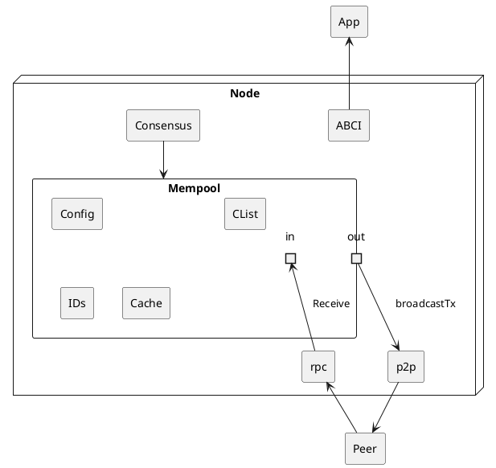

```plantuml
@startuml
skinparam componentStyle rectangle
component Peer
component App
node Node {
   component "ABCI" 
   component "Mempool" {
        [Config]
        [CList]
        [IDs]
        [Cache] 
        portout in
        portout out
   }
   component "Consensus"
   component "p2p" 
   component "rpc"

   
   Consensus --> Mempool
}

ABCI -up-> App
Peer -up-> rpc
rpc -up-> in : Receive
out --> p2p : broadcastTx
p2p --> Peer

@enduml
```