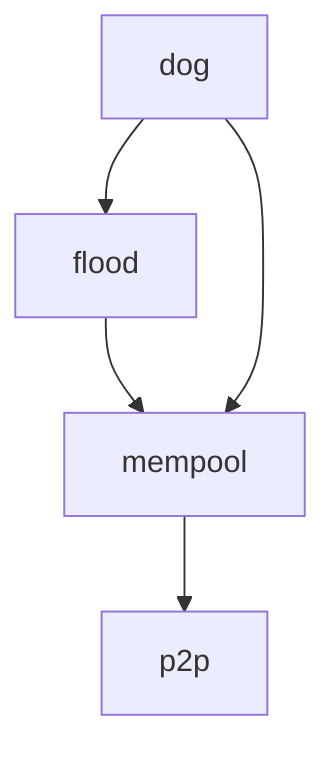

# Mempool Gossip

This directory contains specifications of gossip protocols used by the mempool to disseminate
transactions in the network.

## Protocols

- [Flood](flood.qnt). Currently implemented by CometBFT, Flood is a straightforward gossip protocol
  with a focus on rapid transaction propagation.
  - Pros:
    + Latency: nodes forward transactions to their peers as soon as they receive them, resulting in
      the minimum possible latency of decentralised P2P networks.
    + Byzantine Fault Tolerance (BFT): flooding the network with messages ensures malicious actors
      cannot easily prevent transaction dissemination, making it resilient to network disruptions
      and attacks.
  - Cons:
    - Bandwidth: the broadcast nature of Flood results in significant redundancy in message
      propagation, leading to exponential increases in bandwidth usage.

- [Dynamic Optimal Graph (DOG)](dog.qnt). Building on Flood, DOG introduces improvements that
  significantly reduces redundant messages, enhancing bandwidth efficiency while maintaining similar
  latency and resilience properties.
  - Pros:
    + Latency: DOG does not introduce delays or extra messages that add latency as in "pull"
      mechanisms. Instead, it selectively filters transactions messages before forwarding them to
      peers.
    + Byzantine Fault Tolerance (BFT): DOG keeps a minimum level of transaction redundancy for
      preserving the resilience needed to mitigate the impact of malicious attacks.
    + Bandwidth: DOG implements a routing mechanism that reduces bandwidth usage by orders of
      magnitude when compared to Flood.

## Quint specs

Specifications are written in the [Quint][quint] language. Protocols are mainly described in
comments of the Quint files, where the Quint code can be read as pseudo-code. Quint allows specs to
be executed, tested, and formally verified, but for the moment we use it here just to give structure
to the spec documentation and to type-check the definitions.

The Flood protocol is self-described in its own [flood](flood.qnt) module. Similarly, DOG is also
self-described in the [dog](dog.qnt) module, except that imports some definitions from Flood. Both
are built on top of two other modules, which are not strictly needed to understand the protocols:
- [mempool](mempool.qnt) with definitions of common data structures from the mempool, and 
- [p2p](p2p.qnt) with networking definitions, assumptions, and boilerplate.

[quint]: https://quint-lang.org/
