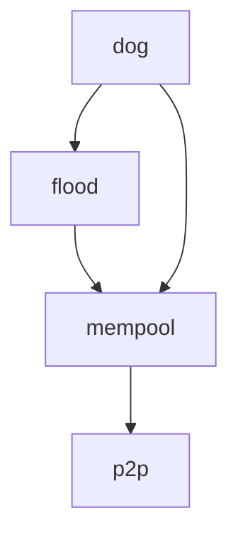

# Mempool gossip protocols

## Protocols

- [Flood](flood.qnt) protocol
  - Pros:
    + Optimal latency (given the constrains of the network topology).
    + BFT: it tolerates malicious behaviour.
  - Cons:
    - Bandwidth: exponential redundancy.

- [DOG](dog.qnt) protocol
  - Pros:
    + Optimal latency, as in Flood.
    + BFT
    + Significant bandwidth reduction compared to Flood.

## Quint module dependencies

