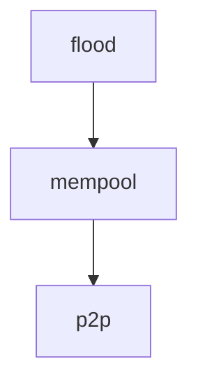

# Mempool Gossip

This directory contains specifications of gossip protocols used by the mempool to disseminate
transactions in the network.

## Protocols

- [Flood](flood.md). Currently implemented by CometBFT, Flood is a straightforward gossip protocol
  with a focus on rapid transaction propagation.
  - Pros:
    + Latency: nodes forward transactions to their peers as soon as they receive them, resulting in
      the minimum possible latency of decentralised P2P networks.
    + Byzantine Fault Tolerance (BFT): flooding the network with messages ensures malicious actors
      cannot easily prevent transaction dissemination (i.e., censoring), making it resilient to network disruptions
      and attacks.
  - Cons:
    - Bandwidth: the broadcast nature of Flood results in significant redundancy in message
      propagation, leading to exponential increases in bandwidth usage.

## Specifications with Quint snippets

These specifications are written in English with code snippets in the [Quint][quint] language,
following the [literature programming paradigm][lit]. The intention is that Quint snippets can be
read as pseudo-code. Moreover, we can automatically generate Quint files from the markdown files.

Quint allows specs to be executed, tested, and formally verified. For the moment we use it here just
to give structure to the spec documentation and to type-check the definitions.

To (re-)generate the Quint files:
1. install the [lmt tool][lmt] (see the prerequisites [here][lit]), and 
2. run `make`.

The Flood gossip protocol is self-described in its own [flood](flood.md) spec. It is built on top of
two other specs, which are not strictly needed to understand the protocol:
- [mempool](mempool.md) with definitions of common data structures from the mempool, and 
- [p2p](p2p.md) with networking definitions, assumptions, and boilerplate.

Specs dependencies:

[quint]: https://quint-lang.org/
[lit]: https://quint-lang.org/docs/literate
[lmt]: https://github.com/driusan/lmt
