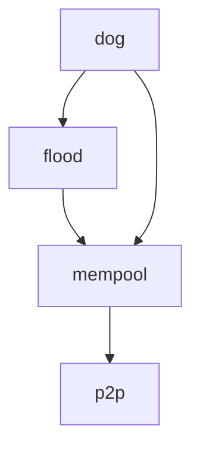

# Mempool Gossip

This directory contains specifications of gossip protocols used by the mempool to disseminate
transactions in the network.

## Protocols

- [Flood](flood.md). Currently implemented by CometBFT, Flood is a straightforward gossip protocol
  with a focus on rapid transaction propagation.
  - Pros:
    + Low Latency: nodes forward transactions to their peers as soon as they receive them, resulting
      in the minimum possible latency of decentralised P2P networks.
    + Byzantine Fault Tolerance (BFT): flooding the network with messages ensures malicious actors
      cannot easily prevent transaction dissemination (i.e., censoring), making it resilient to
      network disruptions and attacks.
  - Cons:
    - Exponential Bandwidth Usage: the broadcast nature of Flood results in significant redundancy
      in message propagation, leading to exponential increases in bandwidth usage.

- [Dynamic Optimal Graph (DOG)](dog.md). Building on Flood, DOG introduces improvements that
  significantly reduces redundant transactions, enhancing bandwidth efficiency while maintaining
  similar latency and resilience properties.
  - Pros:
    + Efficient Bandwidth Usage: DOG implements a routing mechanism that significantly reduces
      bandwidth usage when compared to Flood.
    + Low Latency: DOG does not introduce delays or extra communication steps that add latency, as
      in "pull" gossip protocols. Instead, it selectively filters transactions before forwarding
      them to peers.
    + Byzantine Fault Tolerance (BFT): DOG keeps a minimum level of transaction redundancy for
      preserving the resilience needed to mitigate the impact of Byzantine attacks.
  - Cons:
    - Convergence Time for Redundancy: Reaching the optimal routes for the desired levels of
      transaction redundancy may take each node a time proportional to the number of peers it has,
      though typically in the order of a few minutes.
    - Traffic Fairness: Nodes with high-speed connections and a large number of peers may end up
      handling higher traffic load compared to other nodes. However, as the network topology evolves
      dynamically, this imbalance changes over time.

## Specifications with Quint snippets

These specifications are written in English with code snippets in the [Quint][quint] language,
following the [literature programming paradigm][lit]. The intention is that Quint snippets can be
read as pseudo-code. Moreover, we can automatically generate Quint files from the markdown files.

Quint allows specs to be executed, tested, and formally verified. For the moment we use it here just
to give structure to the spec documentation and to type-check the definitions.

To (re-)generate the Quint files:
1. install the [lmt tool][lmt] (see the prerequisites [here][lit]), and 
2. run `make`.

The Flood gossip protocol is self-described in its own [flood](flood.md) spec. Similarly, DOG is
also self-described in the [dog](dog.md) spec, except that imports some definitions from Flood.
Both are built on top of two other specs, which are not strictly needed to understand the protocol:
- [mempool](mempool.md) with definitions of common data structures from the mempool, and 
- [p2p](p2p.md) with networking definitions, assumptions, and boilerplate.

Specs dependencies:

[quint]: https://quint-lang.org/
[lit]: https://quint-lang.org/docs/literate
[lmt]: https://github.com/driusan/lmt
