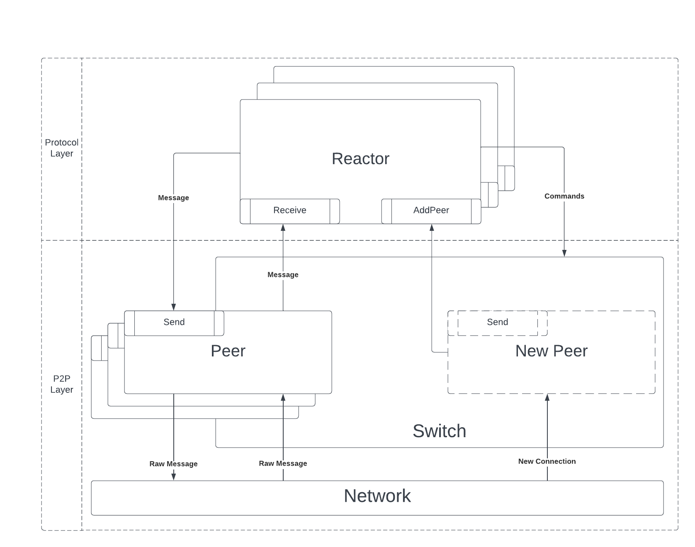

# Reactors

Reactor is the generic name for a component that employs the p2p communication layer.

This section documents the interaction of the p2p communication layer with the
reactors.
The diagram below summarizes this interaction, namely the **northbound interface**
of the p2p communication layer, representing some relevant event flows:

Each of the protocols running a CometBFT node implements a reactor and registers
the implementation with the p2p layer.
The p2p layer provides network events to the registered reactors, the main
two being new connections with peers and received messages.
The reactors provide to the p2p layer messages to be sent to
peers and commands to control the operation of the p2p layer.

It is worth noting that the components depicted in the diagram below run
multiple routines and that the illustrated actions happen in parallel.
For instance, the connection establishment routines run in parallel, invoking
the depicted `AddPeer` method concurrently.
Once a connection is fully established, each `Peer` instance runs a send and a
receive routines.
The send routine collects messages from multiple reactors to a peer, packaging
then into raw messages which are transmitted to the peer.
The receive routine processes incoming messages and forwards them to the
destination reactors, invoking the depicted `Receive` methods.
In addition, the reactors run multiple routines for interacting
with the peers (for example, to send messages to them) or with the `Switch`.

The remaining of the documentation is organized as follows:

- [Reactor API](./reactor.md): documents the [`p2p.Reactor`][reactor-interface]
  interface and specifies the behaviour of the p2p layer when interacting with
  a reactor.
  In other words, the interaction of the p2p layer with the protocol layer (bottom-up).

- [P2P API](./p2p-api.md): documents the interface provided by the p2p
  layer to the reactors, through the `Switch` and `Peer` abstractions.
  In other words, the interaction of the protocol layer with the p2p layer (top-down).

[reactor-interface]: https://github.com/cometbft/cometbft/blob/v0.38.x/p2p/base_reactor.go
