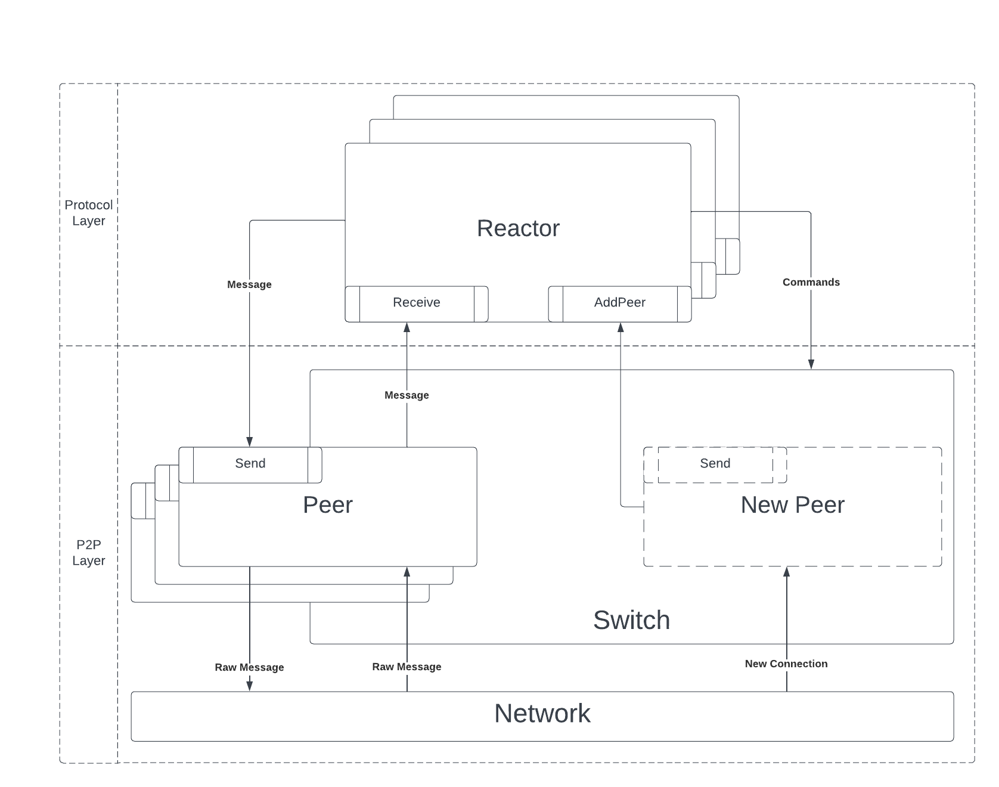

# Reactors

Reactor is the generic name for a component that employs the p2p communication layer.

This section documents this **northbound interface** of the p2p layer,
or the interaction of the p2p layer with reactors.
The diagram below summarizes this interaction, representing some relevant event
flows:

Each of the protocols running a CometBFT node implements a reactor and registers
the implementation with the p2p layer.
The p2p layer then provides network events to the registered reactors, the main
two being new connections with peers and received messages.
The reactors provide to the p2p layer messages to be sent to
peers and commands to control the operation of the p2p layer.

The remaining of the documentation is organized as follows:

- [Reactor API](./reactor.md): documents the [`p2p.Reactor`][reactor-interface]
  interface and specifies the behaviour of the p2p layer when interacting with
  a reactor.
  In other words, the interaction of the p2p layer with the protocol layer (bottom-up).

- [API for Reactors](./p2p-api.md): documents the interface provided by the p2p
  layer to the reactors, through the `Switch` and `Peer` abstractions.
  In other words, the interaction of the protocol layer with the p2p layer (top-down).

> This is a work in progress, tracked by [issue #599](https://github.com/cometbft/cometbft/issues/599).

[reactor-interface]: ../../../p2p/base_reactor.go
